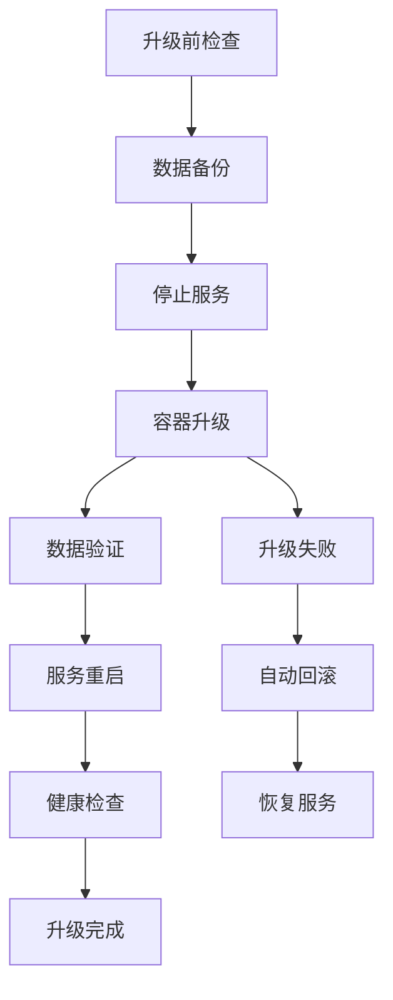

# MySQL数据库升级专业指南

## 📋 概述

本指南提供LJWX系统MySQL数据库的专业升级方案，确保数据安全、最小化停机时间、支持快速回滚。

### 🎯 升级策略



## 🛠️ 升级工具

### 1. 升级预检查器
```bash
# 执行升级前检查
./mysql-upgrade-checker.sh [目标版本]

# 示例：检查升级到1.2.15版本
./mysql-upgrade-checker.sh 1.2.15
```

### 2. 升级管理器
```bash
# 执行数据库升级
./mysql-upgrade-manager.sh [目标版本]

# 示例：升级到1.2.15版本
./mysql-upgrade-manager.sh 1.2.15
```

## 📚 升级流程详解

### 阶段1: 升级前准备
```bash
# 1. 执行预检查
./mysql-upgrade-checker.sh 1.2.15

# 2. 验证系统状态
docker-compose ps
docker exec ljwx-mysql mysqladmin ping -uroot -p123456

# 3. 确认备份空间
df -h backup/
```

### 阶段2: 数据备份
- **SQL逻辑备份**: 兼容性强，恢复灵活
- **数据卷备份**: 完整性好，恢复快速
- **关键表导出**: 核心数据安全

### 阶段3: 服务协调
```bash
# 停止顺序：前端 → 后端 → 数据库
ljwx-admin → ljwx-bigscreen → ljwx-boot → mysql
```

### 阶段4: 容器升级
- 更新镜像版本
- 保持数据卷不变
- 验证配置兼容性

### 阶段5: 数据完整性验证
- 表结构检查
- 数据量统计
- 关键表验证
- 索引完整性

### 阶段6: 服务恢复
```bash
# 启动顺序：数据库 → 后端 → 前端
mysql → ljwx-boot → ljwx-bigscreen → ljwx-admin
```

## ⚠️ 风险控制

### 🔒 安全保障
- **多重备份**: SQL备份 + 数据卷备份 + 关键表导出
- **版本验证**: 检查升级路径和兼容性
- **回滚机制**: 升级失败自动回滚到原版本
- **数据验证**: 多层次数据完整性检查

### ⏱️ 停机时间优化
| 数据库大小 | 预估停机时间 | 优化建议 |
|-----------|-------------|----------|
| < 1GB     | 5-10分钟    | 标准流程 |
| 1-5GB     | 10-20分钟   | 增加备份并行度 |
| 5-20GB    | 20-40分钟   | 考虑增量备份 |
| > 20GB    | 40分钟以上  | 分批升级策略 |

### 🎛️ 资源要求
- **磁盘空间**: 数据大小的3倍
- **内存**: 最少2GB可用内存
- **CPU**: 2核心以上推荐
- **网络**: 稳定的镜像仓库连接

## 📋 升级检查清单

### 升级前确认
- [ ] **业务通知**: 已通知用户系统维护窗口
- [ ] **预检查通过**: `./mysql-upgrade-checker.sh` 无失败项
- [ ] **备份验证**: 确认备份空间和权限
- [ ] **版本确认**: 目标版本与当前版本不同
- [ ] **网络检查**: 镜像仓库连接正常
- [ ] **权限确认**: Docker和文件系统权限正确

### 升级中监控
- [ ] **备份进度**: 备份文件生成和大小
- [ ] **容器状态**: 新容器启动和健康检查
- [ ] **日志监控**: 升级过程日志记录
- [ ] **资源监控**: CPU、内存、磁盘使用情况

### 升级后验证
- [ ] **数据完整性**: 表数量和关键表记录数
- [ ] **服务健康**: 所有服务响应正常
- [ ] **功能测试**: 关键业务功能验证
- [ ] **性能检查**: 响应时间和查询性能
- [ ] **日志检查**: 无错误日志产生

## 🚨 故障处理

### 常见问题及解决方案

#### 1. 镜像拉取失败
```bash
# 检查网络连接
ping registry-host

# 手动拉取镜像
docker pull crpi-yilnm6upy4pmbp67.cn-shenzhen.personal.cr.aliyuncs.com/ljwx/ljwx-mysql:1.2.15

# 使用代理或镜像站
export HTTP_PROXY=http://proxy:8080
```

#### 2. 容器启动失败
```bash
# 查看容器日志
docker logs ljwx-mysql

# 检查配置文件
docker exec ljwx-mysql cat /etc/mysql/my.cnf

# 验证数据卷
docker volume inspect client-deployment_mysql_data
```

#### 3. 数据库连接失败
```bash
# 检查MySQL进程
docker exec ljwx-mysql ps aux | grep mysql

# 验证网络连接
docker exec ljwx-mysql netstat -ln | grep 3306

# 重置密码
docker exec ljwx-mysql mysql -uroot -e "ALTER USER 'root'@'%' IDENTIFIED BY '123456';"
```

#### 4. 服务启动超时
```bash
# 增加启动等待时间
sed -i 's/wait-for-it.sh mysql:3306 -t 60/wait-for-it.sh mysql:3306 -t 120/' docker-compose.yml

# 手动重启服务
docker-compose restart ljwx-boot
```

### 🔄 回滚流程

#### 自动回滚
升级过程中出现错误时，系统会自动执行回滚：
1. 恢复docker-compose.yml配置
2. 重启旧版本MySQL容器
3. 恢复数据库备份
4. 验证回滚结果

#### 手动回滚
```bash
# 1. 停止新版本容器
docker-compose down

# 2. 恢复配置文件
mv docker-compose.yml.bak docker-compose.yml

# 3. 恢复数据备份
./backup-restore-manager.sh restore mysql

# 4. 重启服务
docker-compose up -d
```

## 📈 性能优化建议

### 升级前优化
```bash
# 清理无用数据
docker exec ljwx-mysql mysql -uroot -p123456 -e "OPTIMIZE TABLE table_name;"

# 更新统计信息
docker exec ljwx-mysql mysql -uroot -p123456 -e "ANALYZE TABLE table_name;"

# 清理二进制日志
docker exec ljwx-mysql mysql -uroot -p123456 -e "PURGE BINARY LOGS BEFORE NOW() - INTERVAL 7 DAY;"
```

### 升级后优化
```bash
# 重建索引统计
docker exec ljwx-mysql mysql_upgrade -uroot -p123456

# 检查表状态
docker exec ljwx-mysql mysqlcheck -uroot -p123456 --all-databases --check
```

## 📞 支持联系

### 技术支持
- **升级问题**: 查看 `logs/upgrade-*.log`
- **数据问题**: 使用备份恢复工具
- **性能问题**: 执行性能分析脚本

### 紧急联系
- 升级过程中遇到问题立即停止操作
- 保留所有日志文件用于问题分析
- 必要时执行回滚恢复服务

---

**重要提醒**: 生产环境升级请在维护窗口内进行，建议先在测试环境验证升级流程。 