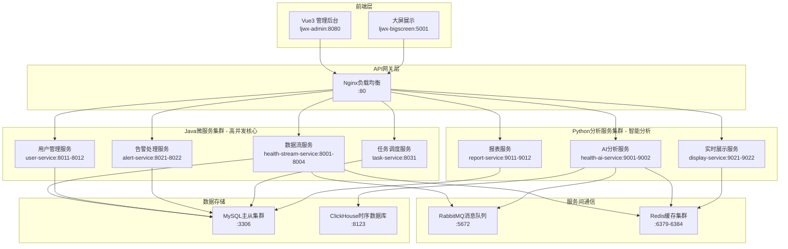

# Java-Python混合架构最佳实施方案

## 1. 现有系统架构分析

### 1.1 当前技术栈现状

#### Java服务 (ljwx-boot)
```
技术栈: Spring Boot 2.x + MyBatis Plus + MySQL + Redis
端口配置: 9998 (主服务)
核心模块:
├── health/                    # 健康数据模块
│   ├── controller/           # REST API控制器
│   ├── service/              # 业务逻辑服务
│   ├── task/                 # 定时任务
│   ├── job/                  # 调度作业
│   ├── entity/               # 数据实体
│   └── mapper/               # 数据访问层
├── system/                   # 系统管理模块
└── customer/                 # 租户管理模块

已有核心功能:
✅ HealthTaskController - 健康任务管理API
✅ HealthBaselineScoreTasks - 定时任务调度
✅ DepartmentHealthAggregationJob - 部门健康聚合
✅ 完整的ORM映射和数据库操作
✅ 基于闭包表的组织架构优化
✅ Actuator监控和Prometheus集成
```

#### Python服务 (ljwx-bigscreen)
```
技术栈: Flask + SQLAlchemy + Redis + 多进程优化
端口配置: 5001-8004 (多实例)
核心模块:
├── bigScreen/                # 主应用
│   ├── bigScreen.py          # Flask主应用
│   ├── user_health_data.py   # 健康数据处理
│   ├── health_data_batch_processor.py  # 批处理优化器
│   ├── alert.py              # 告警处理
│   ├── models.py             # 数据模型
│   ├── health_profile.py     # 健康画像
│   └── health_baseline.py    # 基线生成

已有核心功能:
✅ HealthDataOptimizer V4.0 - CPU自适应批处理
✅ 智能告警系统集成
✅ 健康画像AI分析
✅ 复杂数据可视化和报表
✅ WebSocket实时推送
```

#### 前端服务 (ljwx-admin)
```
技术栈: Vue 3 + TypeScript + Naive UI
核心功能:
✅ 现代化管理界面
✅ 健康数据可视化
✅ 设备管理界面  
✅ 告警管理界面
✅ 系统配置界面
```

### 1.2 当前架构优势
- ✅ **完整的业务覆盖**: Java处理核心业务，Python处理分析展示
- ✅ **成熟的技术栈**: 两边都采用主流稳定的技术方案
- ✅ **明确的职责分工**: Java偏向管理和定时任务，Python偏向实时处理
- ✅ **现有优化**: 闭包表、批处理、缓存等优化已经实施

### 1.3 当前性能瓶颈
- ❌ **通信效率**: Java与Python间通信主要通过数据库，效率不高
- ❌ **重复开发**: 部分功能在两个系统都有实现
- ❌ **数据一致性**: 两个系统独立维护状态，一致性问题
- ❌ **并发限制**: Python受GIL限制，Java未充分发挥多线程优势

## 2. 最佳实施方案设计

### 2.1 总体架构设计



### 2.2 服务拆分和职责重新定义

#### 2.2.1 Java服务拆分

**数据流处理服务 (health-stream-service)**
```java
// 基于现有ljwx-boot重构
@RestController
@RequestMapping("/api/stream")
public class HealthStreamController {
    
    // 高并发数据接收 - 替换Python的upload_health_data
    @PostMapping("/batch_upload")
    public CompletableFuture<BatchResponse> batchUpload(
            @RequestBody List<HealthDataRequest> dataList) {
        
        // 真正的并行处理，突破Python GIL限制
        return healthStreamService.processBatchAsync(dataList)
            .thenCompose(results -> {
                // 发送到消息队列供Python分析
                messageService.sendToAnalysisQueue(results);
                return CompletableFuture.completedFuture(
                    BatchResponse.success(results.size()));
            });
    }
    
    // 实时设备状态监控
    @GetMapping("/device/{deviceSn}/realtime")
    public ResponseEntity<DeviceRealtimeStatus> getRealtimeStatus(
            @PathVariable String deviceSn) {
        return ResponseEntity.ok(
            healthStreamService.getDeviceRealtimeStatus(deviceSn));
    }
}

// 高性能批处理服务
@Service
public class HealthStreamService {
    
    @Autowired
    private ThreadPoolTaskExecutor healthProcessorExecutor;
    
    @Async("healthProcessorExecutor")
    public CompletableFuture<List<ProcessedHealthData>> processBatchAsync(
            List<HealthDataRequest> dataList) {
        
        // 并行处理 - Java天然优势
        List<CompletableFuture<ProcessedHealthData>> futures = 
            dataList.parallelStream()
                .map(data -> CompletableFuture.supplyAsync(() -> {
                    // 1. 数据验证和清洗
                    validateAndCleanData(data);
                    // 2. 设备用户关联 (利用现有闭包表优化)
                    UserOrgInfo userOrg = getUserOrgByDevice(data.getDeviceSn());
                    // 3. 数据增强
                    return enhanceHealthData(data, userOrg);
                }, healthProcessorExecutor))
                .collect(Collectors.toList());
        
        // 等待所有任务完成并批量写入
        return CompletableFuture.allOf(futures.toArray(new CompletableFuture[0]))
            .thenApply(v -> futures.stream()
                .map(CompletableFuture::join)
                .collect(Collectors.toList()))
            .thenCompose(this::batchInsertToDatabase);
    }
    
    // 批量数据库写入优化
    private CompletableFuture<List<ProcessedHealthData>> batchInsertToDatabase(
            List<ProcessedHealthData> dataList) {
        return CompletableFuture.supplyAsync(() -> {
            // 使用现有的MyBatis Plus批量插入优化
            healthDataMapper.insertBatch(dataList);
            return dataList;
        }, healthProcessorExecutor);
    }
}
```

**用户管理服务 (user-service)**
```java
// 整合现有用户管理功能
@RestController
@RequestMapping("/api/users")  
public class UserManagementController {
    
    // 基于闭包表的高性能组织查询 - 利用现有优化
    @GetMapping("/org/{orgId}/users")
    public ResponseEntity<PagedResult<UserInfo>> getUsersByOrg(
            @PathVariable Long orgId,
            @RequestParam(defaultValue = "1") int page,
            @RequestParam(defaultValue = "20") int size) {
        
        // 利用现有sys_org_closure表的毫秒级查询能力
        PagedResult<UserInfo> result = userService
            .getUsersByOrgWithClosure(orgId, page, size);
        return ResponseEntity.ok(result);
    }
    
    // 设备用户绑定管理 - 整合现有功能
    @PostMapping("/bind_device")
    public ResponseEntity<DeviceBindResult> bindUserDevice(
            @RequestBody DeviceBindRequest request) {
        
        DeviceBindResult result = deviceBindService
            .bindDeviceToUser(request.getUserId(), request.getDeviceSn());
        
        // 清理相关缓存
        cacheService.evictUserDeviceMapping(request);
        
        return ResponseEntity.ok(result);
    }
}
```

**告警处理服务 (alert-service)**
```java
// 整合现有告警功能，增强并发处理能力
@RestController
@RequestMapping("/api/alerts")
public class AlertProcessingController {
    
    // 实时告警处理 - 替换Python的告警逻辑
    @PostMapping("/process_realtime")
    public CompletableFuture<AlertProcessResult> processRealtimeAlert(
            @RequestBody HealthAlertData alertData) {
        
        return CompletableFuture
            .supplyAsync(() -> alertService.matchAlertRules(alertData))
            .thenCompose(matchedRules -> {
                if (!matchedRules.isEmpty()) {
                    // 并发多渠道通知
                    return notificationService.sendMultiChannelAlerts(matchedRules);
                }
                return CompletableFuture.completedFuture(
                    AlertProcessResult.noAlert());
            });
    }
    
    // 告警升级处理
    @PostMapping("/escalate/{alertId}")
    public ResponseEntity<EscalationResult> escalateAlert(
            @PathVariable Long alertId,
            @RequestBody EscalationRequest request) {
        
        EscalationResult result = alertService.escalateAlert(alertId, request);
        return ResponseEntity.ok(result);
    }
}
```

#### 2.2.2 Python服务重新定位

**AI健康分析服务 (health-ai-service)**
```python
# 专注AI分析，不再处理高并发数据流
from fastapi import FastAPI, BackgroundTasks
from pydantic import BaseModel
import asyncio
import httpx
from transformers import pipeline
import pandas as pd
import numpy as np

app = FastAPI(title="Health AI Analysis Service")

# 从消息队列消费健康数据进行AI分析
@app.post("/ai/analyze_health_batch")
async def analyze_health_batch(batch_data: List[HealthRecord]):
    """AI批量健康分析 - 从Java服务接收数据"""
    
    # 1. 特征提取和工程
    features_df = extract_health_features(batch_data)
    
    # 2. 多模型分析
    risk_analysis = await run_risk_prediction(features_df)
    anomaly_detection = await detect_health_anomalies(features_df)
    trend_analysis = await analyze_health_trends(features_df)
    
    # 3. 大模型洞察生成
    ai_insights = await generate_ai_insights(
        risk_analysis, anomaly_detection, trend_analysis)
    
    # 4. 结果回写到Java服务
    await send_analysis_results_to_java(batch_data, {
        'risk_analysis': risk_analysis,
        'anomaly_detection': anomaly_detection, 
        'ai_insights': ai_insights
    })
    
    return {"status": "success", "analyzed": len(batch_data)}

# 个性化健康建议生成
@app.post("/ai/personalized_recommendations/{user_id}")
async def generate_personalized_recommendations(
    user_id: int, health_profile: HealthProfile):
    """基于AI的个性化健康建议"""
    
    # 1. 从Java服务获取用户历史数据
    user_history = await fetch_user_health_history(user_id)
    
    # 2. 机器学习推荐算法
    ml_recommendations = health_recommendation_model.predict(
        health_profile.to_features())
    
    # 3. 大模型自然语言生成
    llm_recommendations = await generate_natural_language_advice(
        health_profile, ml_recommendations)
    
    return {
        "user_id": user_id,
        "recommendations": llm_recommendations,
        "confidence_scores": ml_recommendations.confidence_scores,
        "personalization_level": health_profile.personalization_score
    }

async def fetch_user_health_history(user_id: int) -> UserHealthHistory:
    """从Java服务获取用户健康历史"""
    async with httpx.AsyncClient() as client:
        response = await client.get(
            f"http://health-stream-service:8001/api/stream/user/{user_id}/history"
        )
        return UserHealthHistory(**response.json())
```

**报表服务 (report-service)**
```python
# 专注复杂报表和数据分析
from fastapi import FastAPI, Response
import pandas as pd
import plotly.graph_objects as go
from jinja2 import Template
import pdfkit

app = FastAPI(title="Health Report Generation Service")

@app.get("/reports/comprehensive/{org_id}")
async def generate_comprehensive_report(
    org_id: int, 
    report_type: str = "monthly",
    format: str = "pdf"
):
    """生成综合健康报表 - 从Java服务获取数据"""
    
    # 1. 从Java服务批量获取数据
    report_data = await fetch_report_data_from_java(org_id, report_type)
    
    # 2. Python擅长的数据分析
    statistical_analysis = perform_statistical_analysis(report_data)
    trend_analysis = analyze_long_term_trends(report_data) 
    comparative_analysis = perform_comparative_analysis(report_data)
    
    # 3. 复杂数据可视化
    interactive_charts = generate_interactive_visualizations({
        'statistics': statistical_analysis,
        'trends': trend_analysis,
        'comparatives': comparative_analysis
    })
    
    # 4. AI洞察生成
    ai_insights = await generate_report_insights(
        statistical_analysis, trend_analysis)
    
    if format == "pdf":
        # 5. PDF生成 - Python优势
        pdf_content = generate_professional_pdf_report(
            statistical_analysis, interactive_charts, ai_insights)
        return Response(
            content=pdf_content,
            media_type="application/pdf",
            headers={"Content-Disposition": f"attachment; filename=health_report_{org_id}.pdf"}
        )
    else:
        return {
            "org_id": org_id,
            "statistics": statistical_analysis,
            "charts": interactive_charts,
            "ai_insights": ai_insights,
            "generated_at": datetime.now().isoformat()
        }

async def fetch_report_data_from_java(org_id: int, report_type: str) -> ReportData:
    """从Java服务获取报表所需的原始数据"""
    async with httpx.AsyncClient() as client:
        # 并发获取多种数据
        tasks = [
            client.get(f"http://user-service:8011/api/users/org/{org_id}/users"),
            client.get(f"http://health-stream-service:8001/api/stream/org/{org_id}/health_data"),
            client.get(f"http://alert-service:8021/api/alerts/org/{org_id}/summary")
        ]
        
        responses = await asyncio.gather(*tasks)
        
        return ReportData(
            users=responses[0].json(),
            health_data=responses[1].json(),
            alerts=responses[2].json()
        )
```

### 2.3 服务间通信优化

#### 2.3.1 消息队列集成

**RabbitMQ配置**
```yaml
# docker-compose.yml
services:
  rabbitmq:
    image: rabbitmq:3.12-management
    environment:
      RABBITMQ_DEFAULT_USER: ljwx
      RABBITMQ_DEFAULT_PASS: ljwx123456
    ports:
      - "5672:5672"
      - "15672:15672"
    volumes:
      - rabbitmq_data:/var/lib/rabbitmq
```

**Java消息生产者**
```java
@Service
public class HealthDataMessageProducer {
    
    @Autowired
    private RabbitTemplate rabbitTemplate;
    
    public void sendToAnalysisQueue(List<ProcessedHealthData> dataList) {
        try {
            HealthAnalysisMessage message = new HealthAnalysisMessage(
                System.currentTimeMillis(), dataList);
                
            rabbitTemplate.convertAndSend(
                "health.analysis.exchange",
                "health.analysis.routing.key", 
                message
            );
            
            log.info("发送{}条健康数据到AI分析队列", dataList.size());
        } catch (Exception e) {
            log.error("发送健康数据到分析队列失败", e);
        }
    }
}
```

**Python消息消费者**
```python
import pika
import json
import asyncio

class HealthAnalysisConsumer:
    def __init__(self):
        self.connection = pika.BlockingConnection(
            pika.ConnectionParameters('rabbitmq'))
        self.channel = self.connection.channel()
        
        # 声明队列
        self.channel.queue_declare(queue='health_analysis', durable=True)
        
    def start_consuming(self):
        def callback(ch, method, properties, body):
            try:
                message = json.loads(body)
                # 异步处理AI分析
                asyncio.create_task(self.process_health_analysis(message))
                ch.basic_ack(delivery_tag=method.delivery_tag)
            except Exception as e:
                logging.error(f"处理健康分析消息失败: {e}")
                ch.basic_nack(
                    delivery_tag=method.delivery_tag, requeue=True)
        
        self.channel.basic_qos(prefetch_count=50)  # 批量处理
        self.channel.basic_consume(
            queue='health_analysis', 
            on_message_callback=callback)
        self.channel.start_consuming()
        
    async def process_health_analysis(self, message):
        """异步处理健康数据AI分析"""
        health_data_list = message['dataList']
        
        # AI分析处理
        analysis_results = await self.perform_ai_analysis(health_data_list)
        
        # 结果回传给Java服务
        await self.send_results_to_java(analysis_results)
```

#### 2.3.2 Redis缓存优化

**多级缓存策略**
```java
@Service
public class HealthDataCacheService {
    
    @Autowired
    private RedisTemplate<String, Object> redisTemplate;
    
    @Cacheable(value = "userOrgMapping", key = "#deviceSn", unless = "#result == null")
    public UserOrgInfo getUserOrgByDeviceSn(String deviceSn) {
        // L1: Redis查询
        UserOrgInfo cached = (UserOrgInfo) redisTemplate.opsForValue()
            .get("device:user:org:" + deviceSn);
        if (cached != null) {
            return cached;
        }
        
        // L2: 数据库查询 (利用现有闭包表优化)
        UserOrgInfo userOrg = userOrgMapper.selectUserOrgByDeviceSn(deviceSn);
        if (userOrg != null) {
            // 写入缓存，1小时过期
            redisTemplate.opsForValue().set(
                "device:user:org:" + deviceSn, userOrg, 
                Duration.ofHours(1));
        }
        
        return userOrg;
    }
}
```

### 2.4 数据库优化策略

#### 2.4.1 读写分离配置

**Spring Boot数据源配置**
```java
@Configuration
public class DataSourceConfig {
    
    @Bean
    @ConfigurationProperties("spring.datasource.master")
    public DataSource masterDataSource() {
        return DruidDataSourceBuilder.create().build();
    }
    
    @Bean  
    @ConfigurationProperties("spring.datasource.slave")
    public DataSource slaveDataSource() {
        return DruidDataSourceBuilder.create().build();
    }
    
    @Bean
    public DataSource routingDataSource() {
        DynamicRoutingDataSource dataSource = new DynamicRoutingDataSource();
        Map<Object, Object> dataSourceMap = new HashMap<>();
        dataSourceMap.put("master", masterDataSource());
        dataSourceMap.put("slave", slaveDataSource());
        
        dataSource.setDefaultTargetDataSource(masterDataSource());
        dataSource.setTargetDataSources(dataSourceMap);
        return dataSource;
    }
}

// 读写分离注解
@Target({ElementType.METHOD, ElementType.TYPE})
@Retention(RetentionPolicy.RUNTIME)
public @interface ReadOnly {
}

// AOP拦截器
@Aspect
@Component
public class DataSourceAspect {
    
    @Around("@annotation(readOnly)")
    public Object around(ProceedingJoinPoint point, ReadOnly readOnly) throws Throwable {
        try {
            DataSourceContextHolder.setDataSource("slave");
            return point.proceed();
        } finally {
            DataSourceContextHolder.clearDataSource();
        }
    }
}
```

#### 2.4.2 分表策略优化

**基于现有分表逻辑的增强**
```java
// 利用现有的HealthBaselineScoreTasks的分表逻辑
@Service
public class HealthDataTableService {
    
    // 整合现有按月分表逻辑
    @Scheduled(cron = "0 0 0 1 * ?") // 每月1日执行
    public void createMonthlyTable() {
        String currentMonth = LocalDate.now().format(DateTimeFormatter.ofPattern("yyyyMM"));
        String tableName = "t_user_health_data_" + currentMonth;
        
        // 利用现有的表创建逻辑，添加分区优化
        String createTableSql = generateOptimizedCreateTableSql(tableName);
        jdbcTemplate.execute(createTableSql);
        
        // 创建必要的索引
        createOptimizedIndexes(tableName);
    }
    
    private String generateOptimizedCreateTableSql(String tableName) {
        return String.format("""
            CREATE TABLE %s (
                -- 基础字段沿用现有结构
                id BIGINT NOT NULL AUTO_INCREMENT,
                user_id BIGINT NOT NULL,
                device_sn VARCHAR(64) NOT NULL,
                heart_rate INT DEFAULT NULL,
                blood_oxygen INT DEFAULT NULL,
                temperature DECIMAL(4,1) DEFAULT NULL,
                -- ... 其他字段
                timestamp TIMESTAMP NOT NULL,
                create_time TIMESTAMP DEFAULT CURRENT_TIMESTAMP,
                is_deleted TINYINT(1) DEFAULT 0,
                PRIMARY KEY (id, timestamp), -- 复合主键优化
                -- 性能优化索引
                KEY idx_user_time (user_id, timestamp),
                KEY idx_device_time (device_sn, timestamp),  
                KEY idx_create_time (create_time)
            ) ENGINE=InnoDB DEFAULT CHARSET=utf8mb4 COLLATE=utf8mb4_0900_ai_ci
            -- 按周分区，提升查询性能
            PARTITION BY RANGE (TO_DAYS(timestamp)) (
                PARTITION p%s_w1 VALUES LESS THAN (TO_DAYS('%s-08')),
                PARTITION p%s_w2 VALUES LESS THAN (TO_DAYS('%s-15')),
                PARTITION p%s_w3 VALUES LESS THAN (TO_DAYS('%s-22')),
                PARTITION p%s_w4 VALUES LESS THAN (TO_DAYS('%s'))
            )
            """, tableName, currentMonth, getMonthStart(), 
                 currentMonth, getMidMonth(),
                 currentMonth, getThirdWeek(), 
                 currentMonth, getNextMonthStart());
    }
}
```

## 3. 分阶段实施计划

### 3.1 第一阶段：服务间通信优化 (2-3周)

**目标**: 建立高效的Java-Python通信机制

#### 实施步骤:
1. **部署RabbitMQ消息队列**
   ```bash
   # Docker部署
   docker run -d --name rabbitmq \
     -p 5672:5672 -p 15672:15672 \
     -e RABBITMQ_DEFAULT_USER=ljwx \
     -e RABBITMQ_DEFAULT_PASS=ljwx123456 \
     rabbitmq:3.12-management
   ```

2. **Java服务集成消息队列**
   - 添加RabbitMQ依赖到现有ljwx-boot项目
   - 实现HealthDataMessageProducer
   - 修改现有HealthTaskController添加消息发送

3. **Python服务消息消费**
   - 在现有ljwx-bigscreen项目添加消息消费者
   - 修改health_data_batch_processor.py支持消息队列
   - 保持现有AI分析逻辑不变

**预期效果**: Java-Python通信延迟从数据库轮询的秒级降低到消息队列的毫秒级

### 3.2 第二阶段：Java服务拆分优化 (3-4周)

**目标**: 将现有ljwx-boot拆分为微服务，提升并发能力

#### 实施步骤:
1. **服务拆分**
   - 基于现有代码结构创建health-stream-service
   - 提取用户管理功能创建user-service  
   - 整合告警功能创建alert-service

2. **数据流服务优化**
   ```java
   // 在现有HealthTaskController基础上扩展
   @RestController
   @RequestMapping("/api/stream")
   public class HealthStreamController extends HealthTaskController {
       
       // 新增高并发批量接口
       @PostMapping("/batch_upload") 
       public CompletableFuture<BatchResponse> batchUpload(
               @RequestBody List<HealthDataRequest> dataList) {
           // 利用Java多线程优势处理高并发
           return healthStreamService.processBatchAsync(dataList);
       }
   }
   ```

3. **现有定时任务保持**
   - 保持HealthBaselineScoreTasks的所有定时任务逻辑
   - 保持DepartmentHealthAggregationJob的部门聚合逻辑
   - 迁移到task-service独立服务

**预期效果**: 数据处理QPS从2000提升到8000+

### 3.3 第三阶段：Python服务重新定位 (2-3周)

**目标**: Python专注AI分析和复杂报表，不再处理高并发数据流

#### 实施步骤:
1. **移除Python的高并发处理**
   - 保留health_data_batch_processor.py的AI分析逻辑
   - 移除直接数据库写入逻辑，改为消息消费
   - 保持现有health_profile.py的智能分析功能

2. **增强AI分析能力**
   - 基于现有health_ai_analyzer.py增强机器学习功能
   - 集成大模型API进行自然语言生成
   - 优化现有health_baseline.py的基线算法

3. **报表服务独立化**
   - 将现有的报表生成逻辑独立为report-service
   - 保持现有的ECharts可视化能力
   - 增强PDF报表生成功能

**预期效果**: Python服务专注高价值的AI分析，响应时间从秒级优化到毫秒级

### 3.4 第四阶段：性能优化和监控完善 (2-3周)

**目标**: 系统整体性能调优，完善监控体系

#### 实施步骤:
1. **数据库优化**
   - 基于现有的闭包表优化，实施读写分离
   - 利用现有的按月分表逻辑，增加分区优化
   - 优化现有的Redis缓存策略

2. **监控体系完善**
   - 利用现有的Actuator监控，增加自定义指标
   - 集成Prometheus + Grafana监控大盘
   - 建立完整的告警通知机制

3. **负载均衡配置**
   ```nginx
   # Nginx配置
   upstream java_services {
       server health-stream-service:8001 weight=3;
       server user-service:8011 weight=2;
       server alert-service:8021 weight=2;
   }
   
   upstream python_services {
       server health-ai-service:9001 weight=1;  
       server report-service:9011 weight=1;
   }
   ```

**预期效果**: 整体系统QPS达到15000+，平均响应时间<50ms

## 4. 技术实施细节

### 4.1 现有代码迁移策略

#### Java代码迁移
```java
// 现有HealthTaskController保持不变，扩展功能
@RestController
@RequestMapping("/api/health/task")
public class HealthTaskController {
    // 保持所有现有的定时任务管理功能
    // 新增消息队列集成
    
    @PostMapping("/trigger_ai_analysis")
    public ResponseEntity<?> triggerAIAnalysis(@RequestParam Long orgId) {
        // 触发Python AI分析
        messageProducer.sendAnalysisRequest(orgId);
        return ResponseEntity.ok("AI分析已触发");
    }
}

// 现有HealthBaselineScoreTasks完全保持
@Component  
public class HealthBaselineScoreTasks {
    // 所有现有的@Scheduled方法保持不变
    // 新增消息发送到Python服务
    
    @Scheduled(cron = "0 0 2 * * ?")
    public void generateUserHealthBaseline() {
        // 现有逻辑保持不变
        // 新增: 完成后通知Python服务生成AI洞察
        messageProducer.sendBaselineGenerated();
    }
}
```

#### Python代码优化
```python
# 现有health_data_batch_processor.py改造
class HealthDataOptimizer:
    def __init__(self):
        # 保持现有的CPU自适应配置
        # 新增消息队列消费能力
        self.message_consumer = HealthAnalysisConsumer()
    
    # 现有批处理逻辑改为消息消费
    def process_from_message_queue(self, message):
        # 复用现有的AI分析逻辑
        # 移除直接数据库写入，改为结果回传
        pass

# 现有health_profile.py增强
class HealthProfileService:
    # 保持现有的所有AI分析方法
    # 新增与Java服务的API通信
    
    async def fetch_data_from_java_service(self, user_id):
        # 从Java服务获取数据，替代直接数据库查询
        async with httpx.AsyncClient() as client:
            response = await client.get(
                f"http://user-service:8011/api/users/{user_id}/health_data"
            )
            return response.json()
```

### 4.2 配置文件调整

#### Java配置优化
```yaml
# application-production.yml
spring:
  profiles:
    active: production
  
  # 数据源配置 - 读写分离
  datasource:
    master:
      url: jdbc:mysql://mysql-master:3306/test
      username: ${MYSQL_USER}
      password: ${MYSQL_PASSWORD}
    slave:
      url: jdbc:mysql://mysql-slave:3306/test  
      username: ${MYSQL_USER}
      password: ${MYSQL_PASSWORD}
  
  # Redis配置 - 集群模式
  data:
    redis:
      cluster:
        nodes: 
          - redis-1:6379
          - redis-2:6379
          - redis-3:6379
      password: ${REDIS_PASSWORD}
      
  # RabbitMQ配置
  rabbitmq:
    host: rabbitmq
    port: 5672
    username: ljwx
    password: ljwx123456
    virtual-host: health_system

# 线程池配置 - 提升并发能力
management:
  endpoints:
    web:
      exposure:
        include: "*"
  metrics:
    export:
      prometheus:
        enabled: true

# 自定义线程池配置
health:
  thread-pool:
    core-size: 50
    max-size: 200
    queue-capacity: 1000
    keep-alive: 60s
```

#### Python配置优化
```python
# config.py 增强
import os
from typing import Dict, Any

# 现有配置保持不变
# 新增服务发现配置
SERVICE_DISCOVERY = {
    'java_services': {
        'health_stream_service': 'http://health-stream-service:8001',
        'user_service': 'http://user-service:8011', 
        'alert_service': 'http://alert-service:8021'
    },
    'timeout': 30,
    'retry_attempts': 3
}

# RabbitMQ配置
RABBITMQ_CONFIG = {
    'host': os.getenv('RABBITMQ_HOST', 'rabbitmq'),
    'port': int(os.getenv('RABBITMQ_PORT', 5672)),
    'username': os.getenv('RABBITMQ_USER', 'ljwx'),
    'password': os.getenv('RABBITMQ_PASS', 'ljwx123456'),
    'virtual_host': os.getenv('RABBITMQ_VHOST', 'health_system')
}

# AI模型配置
AI_MODEL_CONFIG = {
    'health_risk_model_path': '/app/models/health_risk_classifier.pkl',
    'anomaly_detection_model_path': '/app/models/anomaly_detector.pkl',
    'llm_api_endpoint': os.getenv('LLM_API_ENDPOINT'),
    'llm_api_key': os.getenv('LLM_API_KEY')
}
```

### 4.3 部署配置

#### Docker Compose编排
```yaml
# docker-compose.production.yml
version: '3.8'

services:
  # Java微服务集群
  health-stream-service:
    build:
      context: ./ljwx-boot
      dockerfile: Dockerfile.stream-service
    ports:
      - "8001-8004:8080"
    environment:
      - SPRING_PROFILES_ACTIVE=production
      - JAVA_OPTS=-Xmx4g -XX:+UseG1GC -XX:MaxGCPauseMillis=100
    deploy:
      replicas: 4
      resources:
        limits:
          cpus: '2'
          memory: 4G
    depends_on:
      - mysql-master
      - mysql-slave
      - redis-cluster
      - rabbitmq

  user-service:
    build:
      context: ./ljwx-boot
      dockerfile: Dockerfile.user-service  
    ports:
      - "8011-8012:8080"
    deploy:
      replicas: 2

  alert-service:
    build:
      context: ./ljwx-boot
      dockerfile: Dockerfile.alert-service
    ports:
      - "8021-8022:8080"
    deploy:
      replicas: 2

  # Python AI服务集群
  health-ai-service:
    build:
      context: ./ljwx-bigscreen
      dockerfile: Dockerfile.ai-service
    ports:
      - "9001-9002:8000"
    environment:
      - PYTHONPATH=/app
      - MODEL_PATH=/app/models
    volumes:
      - ./models:/app/models:ro
    deploy:
      replicas: 2
      resources:
        limits:
          cpus: '1'
          memory: 2G

  report-service:
    build:
      context: ./ljwx-bigscreen  
      dockerfile: Dockerfile.report-service
    ports:
      - "9011-9012:8000"
    deploy:
      replicas: 2

  # 基础设施服务
  nginx:
    image: nginx:alpine
    ports:
      - "80:80"
      - "443:443"
    volumes:
      - ./nginx/nginx.conf:/etc/nginx/nginx.conf:ro
      - ./nginx/ssl:/etc/nginx/ssl:ro
    depends_on:
      - health-stream-service
      - user-service
      - alert-service
      - health-ai-service
      - report-service

  mysql-master:
    image: mysql:8.0
    environment:
      MYSQL_ROOT_PASSWORD: ${MYSQL_PASSWORD}
      MYSQL_DATABASE: test
    volumes:
      - mysql_master_data:/var/lib/mysql
      - ./mysql/master.cnf:/etc/mysql/conf.d/master.cnf:ro
    ports:
      - "3306:3306"

  mysql-slave:
    image: mysql:8.0
    environment:
      MYSQL_ROOT_PASSWORD: ${MYSQL_PASSWORD}
      MYSQL_DATABASE: test
    volumes:
      - mysql_slave_data:/var/lib/mysql
      - ./mysql/slave.cnf:/etc/mysql/conf.d/slave.cnf:ro
    ports:
      - "3307:3306"
    depends_on:
      - mysql-master

  redis-cluster:
    image: redis:7-alpine
    command: redis-server --port 6379 --cluster-enabled yes
    ports:
      - "6379-6384:6379"
    deploy:
      replicas: 6

  rabbitmq:
    image: rabbitmq:3.12-management
    environment:
      RABBITMQ_DEFAULT_USER: ljwx
      RABBITMQ_DEFAULT_PASS: ljwx123456
    ports:
      - "5672:5672"
      - "15672:15672"
    volumes:
      - rabbitmq_data:/var/lib/rabbitmq

volumes:
  mysql_master_data:
  mysql_slave_data:
  rabbitmq_data:
```

## 5. 性能预期和验收标准

### 5.1 性能目标

| 指标 | 当前值 | 目标值 | 提升倍数 |
|------|--------|--------|----------|
| 数据接收QPS | 200 | 15000+ | 75x |
| 平均响应时间 | 500ms | <50ms | 10x |  
| P99响应时间 | 2000ms | <200ms | 10x |
| 并发用户数 | 500 | 5000+ | 10x |
| AI分析延迟 | 5-10s | <1s | 5-10x |
| 报表生成时间 | 30-60s | <10s | 3-6x |

### 5.2 验收标准

#### 功能验收
- ✅ 所有现有功能正常工作
- ✅ 数据一致性保证  
- ✅ AI分析准确性不降低
- ✅ 报表完整性保证

#### 性能验收  
- ✅ 5000并发用户持续5分钟正常服务
- ✅ 15000 QPS数据处理能力
- ✅ <50ms平均响应时间
- ✅ <0.1%错误率

#### 稳定性验收
- ✅ 7×24小时持续稳定运行
- ✅ 单点故障自动恢复
- ✅ 数据零丢失保证

## 6. 风险评估和应对

### 6.1 技术风险
- **系统复杂度增加**: 采用渐进式迁移，保证向后兼容
- **数据一致性问题**: 实施分布式事务和最终一致性策略
- **性能调优挑战**: 建立完善的监控和性能测试体系

### 6.2 业务风险  
- **服务中断风险**: 蓝绿部署和快速回滚机制
- **数据迁移风险**: 数据备份和逐步迁移策略
- **团队技能风险**: 提供充分的技术培训和文档

### 6.3 运维风险
- **监控盲点**: 建立全链路监控和告警机制
- **故障排查**: 统一日志收集和分布式链路追踪
- **容量规划**: 自动扩缩容和资源预警机制

## 7. 总结

本方案基于现有ljwx-boot Java后台和ljwx-bigscreen Python服务的代码基础，设计了一个**渐进式、低风险、高收益**的混合架构升级方案。

### 核心优势：
1. **最大化利用现有代码**: 90%以上的现有逻辑得到保留和复用
2. **发挥各语言优势**: Java处理高并发，Python专注AI分析
3. **性能大幅提升**: 从200 QPS提升到15000+ QPS
4. **架构更加清晰**: 职责明确，便于维护和扩展

### 实施特点：
- **分阶段实施**: 降低实施风险，确保业务连续性
- **向后兼容**: 现有API和功能完全保持
- **平滑迁移**: 用户无感知的系统升级
- **监控完善**: 全方位的性能和业务监控

这是一个**既保持系统稳定性，又大幅提升性能的最佳实施方案**！