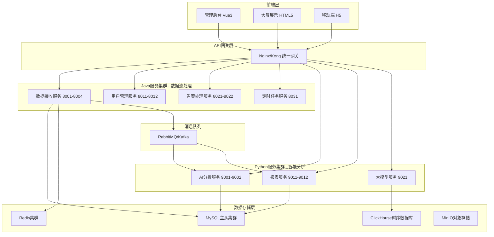

# Java-Python 混合架构设计方案

## 1. 架构总览



## 2. 服务职责划分

### 2.1 Java服务集群 (高并发数据流)

#### 数据接收服务 (health-data-stream-service)
```java
@RestController
@RequestMapping("/api/stream")
public class HealthDataStreamController {
    
    @Autowired
    private HealthDataStreamService streamService;
    
    @Autowired
    private AsyncTaskExecutor taskExecutor;
    
    // 高并发数据接收 - 5000+ QPS
    @PostMapping("/upload_batch")
    public CompletableFuture<BatchUploadResponse> uploadHealthDataBatch(
            @Valid @RequestBody BatchUploadRequest request) {
        
        return CompletableFuture
            .supplyAsync(() -> streamService.processBatch(request.getData()), taskExecutor)
            .thenCompose(results -> {
                // 发送到消息队列进行异步分析
                notificationService.sendToAnalysisQueue(results);
                return CompletableFuture.completedFuture(
                    new BatchUploadResponse(results.size(), "accepted"));
            });
    }
    
    // 实时数据验证和清洗
    @PostMapping("/validate")
    public ResponseEntity<ValidationResult> validateHealthData(
            @RequestBody HealthDataRequest data) {
        
        ValidationResult result = streamService.validateAndCleanData(data);
        return ResponseEntity.ok(result);
    }
    
    // 设备状态实时监控
    @GetMapping("/device/{deviceSn}/status")
    public ResponseEntity<DeviceStatus> getDeviceRealtimeStatus(
            @PathVariable String deviceSn) {
        
        DeviceStatus status = streamService.getRealtimeDeviceStatus(deviceSn);
        return ResponseEntity.ok(status);
    }
}

// 高性能批处理服务
@Service
@Transactional
public class HealthDataStreamService {
    
    @Async
    public CompletableFuture<List<ProcessedData>> processBatch(List<HealthData> dataList) {
        // 并行处理每条数据
        List<CompletableFuture<ProcessedData>> futures = dataList.parallelStream()
            .map(data -> CompletableFuture.supplyAsync(() -> {
                // 1. 数据验证
                validateHealthData(data);
                // 2. 设备用户关联查询 (缓存优化)
                UserInfo user = userService.getUserByDeviceSn(data.getDeviceSn());
                // 3. 数据增强
                return enhanceHealthData(data, user);
            }, taskExecutor))
            .collect(Collectors.toList());
            
        // 等待所有任务完成
        return CompletableFuture.allOf(futures.toArray(new CompletableFuture[0]))
            .thenApply(v -> futures.stream()
                .map(CompletableFuture::join)
                .collect(Collectors.toList()))
            .thenCompose(processedData -> {
                // 批量数据库写入
                return batchInsertService.insertBatch(processedData);
            });
    }
}
```

#### 用户管理服务 (user-management-service)
```java
@RestController
@RequestMapping("/api/users")
public class UserManagementController {
    
    // 基于闭包表的高性能组织查询
    @GetMapping("/org/{orgId}/users")
    public ResponseEntity<PageResult<UserInfo>> getUsersByOrg(
            @PathVariable Long orgId,
            @RequestParam(defaultValue = "1") int page,
            @RequestParam(defaultValue = "20") int size) {
        
        // 利用闭包表实现毫秒级查询
        PageResult<UserInfo> users = userService.getUsersByOrgWithClosure(orgId, page, size);
        return ResponseEntity.ok(users);
    }
    
    // 设备用户绑定管理
    @PostMapping("/bind-device")
    public ResponseEntity<BindResult> bindUserDevice(
            @RequestBody DeviceBindRequest request) {
        
        BindResult result = userService.bindDeviceToUser(
            request.getUserId(), request.getDeviceSn());
        
        // 清理相关缓存
        cacheService.evictDeviceUserMapping(request.getDeviceSn());
        
        return ResponseEntity.ok(result);
    }
}
```

#### 告警处理服务 (alert-processing-service) 
```java
@RestController
@RequestMapping("/api/alerts")
public class AlertProcessingController {
    
    // 实时告警规则匹配
    @PostMapping("/process")
    public CompletableFuture<AlertProcessingResult> processHealthAlert(
            @RequestBody HealthAlertData alertData) {
        
        return CompletableFuture
            .supplyAsync(() -> alertService.matchAlertRules(alertData))
            .thenCompose(matchedRules -> {
                if (!matchedRules.isEmpty()) {
                    // 并行发送多渠道通知
                    return notificationService.sendMultiChannelAlert(matchedRules);
                }
                return CompletableFuture.completedFuture(
                    new AlertProcessingResult("no_alert", 0));
            });
    }
    
    // 告警升级处理
    @PostMapping("/escalate/{alertId}")
    public ResponseEntity<EscalationResult> escalateAlert(
            @PathVariable Long alertId,
            @RequestBody EscalationRequest request) {
        
        EscalationResult result = alertService.escalateAlert(alertId, request);
        return ResponseEntity.ok(result);
    }
}
```

### 2.2 Python服务集群 (智能分析)

#### AI分析服务 (health-ai-service)
```python
from fastapi import FastAPI, BackgroundTasks
from pydantic import BaseModel
import pandas as pd
import numpy as np
from typing import List, Optional
import asyncio
import httpx
from transformers import pipeline
import joblib

app = FastAPI(title="Health AI Analysis Service")

# 加载预训练模型
health_risk_model = joblib.load('models/health_risk_classifier.pkl')
anomaly_detector = joblib.load('models/anomaly_detection_model.pkl') 
llm_analyzer = pipeline("text-classification", model="chinese-health-bert")

class HealthProfile(BaseModel):
    user_id: int
    age: int
    gender: str
    health_metrics: dict
    historical_data: List[dict]

# ✅ 健康风险AI分析
@app.post("/ai/health_risk_analysis")
async def analyze_health_risk(profile: HealthProfile):
    """使用多种AI模型进行健康风险综合分析"""
    
    # 1. 获取用户历史数据 (从Java服务)
    async with httpx.AsyncClient() as client:
        response = await client.get(
            f"http://user-service:8011/api/users/{profile.user_id}/health_history"
        )
        historical_data = response.json()
    
    # 2. 特征工程
    features = extract_health_features(profile.health_metrics, historical_data)
    
    # 3. 机器学习风险预测
    risk_probability = health_risk_model.predict_proba([features])[0]
    
    # 4. 异常检测
    anomaly_score = anomaly_detector.decision_function([features])[0]
    
    # 5. 大模型文本分析
    health_text = generate_health_description(profile)
    llm_insights = llm_analyzer(health_text)
    
    # 6. 综合风险评估
    comprehensive_risk = calculate_comprehensive_risk(
        risk_probability, anomaly_score, llm_insights
    )
    
    return {
        "user_id": profile.user_id,
        "risk_level": comprehensive_risk["level"],
        "risk_score": comprehensive_risk["score"],
        "risk_factors": comprehensive_risk["factors"],
        "ai_insights": llm_insights,
        "recommendations": generate_personalized_recommendations(comprehensive_risk),
        "confidence": comprehensive_risk["confidence"]
    }

# ✅ 部门健康趋势分析
@app.get("/ai/department_trends/{dept_id}")
async def analyze_department_health_trends(
    dept_id: int,
    days: int = 30,
    background_tasks: BackgroundTasks
):
    """部门级健康趋势AI分析"""
    
    # 1. 异步获取部门所有用户健康数据
    async with httpx.AsyncClient() as client:
        users_response = await client.get(
            f"http://user-service:8011/api/users/org/{dept_id}/users"
        )
        users = users_response.json()
        
        # 并发获取所有用户的健康数据
        health_data_tasks = [
            client.get(f"http://data-stream-service:8001/api/health_data/user/{user['id']}?days={days}")
            for user in users["data"]
        ]
        health_responses = await asyncio.gather(*health_data_tasks)
        
    # 2. 数据聚合和清洗
    all_health_data = []
    for response in health_responses:
        all_health_data.extend(response.json())
    
    df = pd.DataFrame(all_health_data)
    
    # 3. 时间序列分析
    trends_analysis = perform_time_series_analysis(df)
    
    # 4. 异常模式检测
    anomaly_patterns = detect_department_anomalies(df)
    
    # 5. 健康风险热点分析
    risk_hotspots = identify_risk_hotspots(df)
    
    # 6. AI生成洞察报告
    ai_insights = generate_department_insights(
        trends_analysis, anomaly_patterns, risk_hotspots
    )
    
    # 异步生成详细报告
    background_tasks.add_task(
        generate_detailed_department_report, 
        dept_id, df, ai_insights
    )
    
    return {
        "department_id": dept_id,
        "analysis_period": f"{days} days",
        "total_users": len(users["data"]),
        "data_points": len(df),
        "trends": trends_analysis,
        "anomalies": anomaly_patterns,
        "risk_hotspots": risk_hotspots,
        "ai_insights": ai_insights,
        "report_status": "generating"
    }

# ✅ 个性化健康建议生成
@app.post("/ai/personalized_recommendations")
async def generate_personalized_health_recommendations(
    user_id: int,
    current_metrics: dict,
    goals: List[str]
):
    """基于AI的个性化健康建议生成"""
    
    # 1. 获取用户画像
    user_profile = await get_user_comprehensive_profile(user_id)
    
    # 2. 生成基于ML的建议
    ml_recommendations = health_recommendation_model.predict(
        user_profile.features
    )
    
    # 3. 使用大模型生成自然语言建议
    prompt = f"""
    用户健康档案: {user_profile}
    当前指标: {current_metrics} 
    健康目标: {goals}
    
    请生成个性化的健康改善建议，包括：
    1. 运动计划
    2. 饮食建议  
    3. 生活习惯调整
    4. 定期检查提醒
    """
    
    llm_recommendations = await call_large_language_model(prompt)
    
    # 4. 建议可行性评分
    feasibility_scores = calculate_recommendation_feasibility(
        ml_recommendations, user_profile
    )
    
    return {
        "user_id": user_id,
        "recommendations": {
            "exercise": llm_recommendations["exercise"],
            "diet": llm_recommendations["diet"], 
            "lifestyle": llm_recommendations["lifestyle"],
            "monitoring": llm_recommendations["monitoring"]
        },
        "feasibility_scores": feasibility_scores,
        "priority_actions": extract_priority_actions(llm_recommendations),
        "expected_outcomes": predict_health_improvements(user_profile, ml_recommendations)
    }

def extract_health_features(metrics: dict, historical_data: List[dict]) -> List[float]:
    """健康数据特征工程"""
    features = []
    
    # 当前指标特征
    features.extend([
        metrics.get('heart_rate', 0),
        metrics.get('blood_oxygen', 0),
        metrics.get('temperature', 0),
        metrics.get('pressure_high', 0),
        metrics.get('pressure_low', 0)
    ])
    
    # 历史趋势特征
    if historical_data:
        df = pd.DataFrame(historical_data)
        
        # 趋势特征
        features.append(df['heart_rate'].mean())
        features.append(df['heart_rate'].std())
        features.append(df['blood_oxygen'].mean())
        features.append(df['blood_oxygen'].std())
        
        # 变异性特征
        features.append(calculate_heart_rate_variability(df['heart_rate']))
        features.append(calculate_trend_slope(df['heart_rate']))
    else:
        features.extend([0] * 6)  # 填充默认值
    
    return features

def calculate_comprehensive_risk(ml_risk: np.ndarray, anomaly_score: float, llm_insights: dict) -> dict:
    """综合风险评估算法"""
    
    # ML模型风险权重
    ml_risk_score = ml_risk[1]  # 高风险概率
    
    # 异常检测权重 
    anomaly_risk_score = 1 / (1 + np.exp(-anomaly_score))  # Sigmoid转换
    
    # LLM洞察权重
    llm_risk_score = llm_insights.get('risk_score', 0.5)
    
    # 加权综合评分
    final_score = (
        ml_risk_score * 0.5 + 
        anomaly_risk_score * 0.3 + 
        llm_risk_score * 0.2
    )
    
    # 风险等级划分
    if final_score > 0.8:
        level = "high"
        factors = ["multiple_indicators_abnormal", "trend_deteriorating"]
    elif final_score > 0.6:
        level = "medium"  
        factors = ["some_indicators_abnormal"]
    elif final_score > 0.4:
        level = "low"
        factors = ["minor_indicators_attention"]
    else:
        level = "normal"
        factors = []
    
    return {
        "level": level,
        "score": round(final_score, 3),
        "factors": factors,
        "confidence": calculate_prediction_confidence(ml_risk, anomaly_score)
    }
```

#### 报表服务 (health-report-service)
```python
from fastapi import FastAPI, Response
import pandas as pd
import matplotlib.pyplot as plt
import seaborn as sns
from jinja2 import Template
import pdfkit
from io import BytesIO
import base64
import plotly.graph_objects as go
import plotly.express as px
from plotly.subplots import make_subplots

app = FastAPI(title="Health Report Generation Service")

# ✅ 综合健康报表生成
@app.get("/reports/comprehensive_health_report/{org_id}")
async def generate_comprehensive_health_report(
    org_id: int,
    report_type: str = "monthly",
    format: str = "pdf"
):
    """生成综合健康分析报表"""
    
    # 1. 多数据源数据获取
    report_data = await collect_multi_source_data(org_id, report_type)
    
    # 2. 数据统计分析
    statistics = perform_comprehensive_statistics(report_data)
    
    # 3. 生成交互式图表
    charts = generate_interactive_charts(statistics)
    
    # 4. 生成AI洞察
    ai_insights = await generate_ai_insights(statistics)
    
    if format == "pdf":
        # 5. PDF报表生成
        pdf_content = generate_pdf_report(statistics, charts, ai_insights)
        return Response(
            content=pdf_content,
            media_type="application/pdf",
            headers={"Content-Disposition": "attachment; filename=health_report.pdf"}
        )
    else:
        # 6. 交互式网页报表
        return {
            "org_id": org_id,
            "report_type": report_type,
            "statistics": statistics,
            "charts": charts,
            "ai_insights": ai_insights,
            "generated_at": datetime.now().isoformat()
        }

async def collect_multi_source_data(org_id: int, report_type: str) -> dict:
    """从多个Java服务收集数据"""
    
    time_range = get_time_range_for_report_type(report_type)
    
    async with httpx.AsyncClient() as client:
        # 并发获取各种数据
        tasks = {
            "users": client.get(f"http://user-service:8011/api/users/org/{org_id}/users"),
            "health_data": client.get(f"http://data-stream-service:8001/api/health_data/org/{org_id}?{time_range}"),
            "alerts": client.get(f"http://alert-service:8021/api/alerts/org/{org_id}?{time_range}"),
            "devices": client.get(f"http://user-service:8011/api/devices/org/{org_id}")
        }
        
        responses = await asyncio.gather(*tasks.values())
        
        return {
            "users": responses[0].json(),
            "health_data": responses[1].json(), 
            "alerts": responses[2].json(),
            "devices": responses[3].json()
        }

def generate_interactive_charts(statistics: dict) -> dict:
    """生成交互式图表 (Plotly)"""
    
    charts = {}
    
    # 1. 健康趋势时间序列图
    health_trends_fig = create_health_trends_chart(statistics["trends"])
    charts["health_trends"] = health_trends_fig.to_json()
    
    # 2. 部门健康评分雷达图
    radar_fig = create_department_health_radar(statistics["department_scores"])
    charts["department_radar"] = radar_fig.to_json()
    
    # 3. 告警分布热力图
    heatmap_fig = create_alert_heatmap(statistics["alert_distribution"])
    charts["alert_heatmap"] = heatmap_fig.to_json()
    
    # 4. 用户健康风险分布
    risk_dist_fig = create_risk_distribution_chart(statistics["risk_distribution"])
    charts["risk_distribution"] = risk_dist_fig.to_json()
    
    return charts

def create_health_trends_chart(trends_data: dict) -> go.Figure:
    """创建健康趋势图表"""
    
    fig = make_subplots(
        rows=2, cols=2,
        subplot_titles=("心率趋势", "血氧趋势", "体温趋势", "血压趋势"),
        specs=[[{"secondary_y": True}, {"secondary_y": True}],
               [{"secondary_y": True}, {"secondary_y": True}]]
    )
    
    # 心率趋势
    fig.add_trace(
        go.Scatter(
            x=trends_data["dates"],
            y=trends_data["avg_heart_rate"],
            mode="lines+markers",
            name="平均心率",
            line=dict(color="red", width=2)
        ),
        row=1, col=1
    )
    
    # 血氧趋势
    fig.add_trace(
        go.Scatter(
            x=trends_data["dates"],
            y=trends_data["avg_blood_oxygen"],
            mode="lines+markers", 
            name="平均血氧",
            line=dict(color="blue", width=2)
        ),
        row=1, col=2
    )
    
    # 体温趋势
    fig.add_trace(
        go.Scatter(
            x=trends_data["dates"],
            y=trends_data["avg_temperature"],
            mode="lines+markers",
            name="平均体温",
            line=dict(color="green", width=2)
        ),
        row=2, col=1
    )
    
    # 血压趋势 (双轴)
    fig.add_trace(
        go.Scatter(
            x=trends_data["dates"],
            y=trends_data["avg_pressure_high"],
            mode="lines+markers",
            name="收缩压",
            line=dict(color="purple", width=2)
        ),
        row=2, col=2
    )
    
    fig.add_trace(
        go.Scatter(
            x=trends_data["dates"],
            y=trends_data["avg_pressure_low"],
            mode="lines+markers",
            name="舒张压",
            line=dict(color="orange", width=2, dash="dash")
        ),
        row=2, col=2
    )
    
    fig.update_layout(
        title="组织健康指标趋势分析",
        showlegend=True,
        height=600
    )
    
    return fig

def generate_pdf_report(statistics: dict, charts: dict, ai_insights: dict) -> bytes:
    """生成PDF格式报表"""
    
    # HTML模板
    template = Template("""
    <!DOCTYPE html>
    <html>
    <head>
        <meta charset="utf-8">
        <title>健康管理综合分析报表</title>
        <style>
            body { font-family: SimHei, Arial, sans-serif; margin: 40px; }
            .header { text-align: center; border-bottom: 2px solid #333; padding-bottom: 20px; }
            .section { margin: 30px 0; }
            .chart { text-align: center; margin: 20px 0; }
            .insights { background: #f5f5f5; padding: 15px; border-radius: 5px; }
            table { width: 100%; border-collapse: collapse; margin: 20px 0; }
            th, td { border: 1px solid #ddd; padding: 8px; text-align: left; }
            th { background-color: #f2f2f2; }
        </style>
    </head>
    <body>
        <div class="header">
            <h1>健康管理综合分析报表</h1>
            <p>报表生成时间: {{ report_date }}</p>
            <p>组织ID: {{ org_id }} | 数据周期: {{ report_period }}</p>
        </div>
        
        <div class="section">
            <h2>📊 数据概览</h2>
            <table>
                <tr><th>指标</th><th>数值</th><th>说明</th></tr>
                <tr><td>总用户数</td><td>{{ statistics.total_users }}</td><td>组织内用户总数</td></tr>
                <tr><td>活跃设备数</td><td>{{ statistics.active_devices }}</td><td>有数据上报的设备数</td></tr>
                <tr><td>健康数据条数</td><td>{{ statistics.total_records }}</td><td>统计期内健康数据总数</td></tr>
                <tr><td>告警总数</td><td>{{ statistics.total_alerts }}</td><td>触发的健康告警数</td></tr>
            </table>
        </div>
        
        <div class="section">
            <h2>📈 健康指标分析</h2>
            <div class="chart">
                
            </div>
            
            <h3>关键发现:</h3>
            <ul>
                
                <li>{{ finding }}</li>
                
            </ul>
        </div>
        
        <div class="section">
            <h2>🎯 部门健康评分</h2>
            <div class="chart">
                
            </div>
            
            <table>
                <tr><th>部门</th><th>健康评分</th><th>风险等级</th><th>主要问题</th></tr>
                
                <tr>
                    <td>{{ dept.name }}</td>
                    <td>{{ dept.score }}</td>
                    <td>{{ dept.risk_level }}</td>
                    <td>{{ dept.main_issues|join(', ') }}</td>
                </tr>
                
            </table>
        </div>
        
        <div class="section">
            <h2>🚨 告警分析</h2>
            <div class="chart">
                
            </div>
            
            <h3>告警统计:</h3>
            <ul>
                <li>高危告警: {{ statistics.alerts.critical }} 次</li>
                <li>重要告警: {{ statistics.alerts.major }} 次</li>
                <li>一般告警: {{ statistics.alerts.minor }} 次</li>
                <li>平均响应时间: {{ statistics.alerts.avg_response_time }} 分钟</li>
            </ul>
        </div>
        
        <div class="section">
            <h2>🤖 AI洞察分析</h2>
            <div class="insights">
                <h3>智能分析结果:</h3>
                <p>{{ ai_insights.summary }}</p>
                
                <h3>风险预警:</h3>
                <ul>
                    
                    <li><strong>{{ risk.type }}:</strong> {{ risk.description }} (置信度: {{ risk.confidence }}%)</li>
                    
                </ul>
                
                <h3>改进建议:</h3>
                <ol>
                    
                    <li>{{ recommendation }}</li>
                    
                </ol>
            </div>
        </div>
        
        <div class="section">
            <h2>📋 总结与建议</h2>
            <p>{{ ai_insights.conclusion }}</p>
        </div>
    </body>
    </html>
    """)
    
    # 渲染HTML
    html_content = template.render(
        statistics=statistics,
        charts=charts,
        ai_insights=ai_insights,
        report_date=datetime.now().strftime("%Y-%m-%d %H:%M:%S"),
        org_id=statistics.get("org_id"),
        report_period=statistics.get("report_period", "近30天")
    )
    
    # 转换为PDF
    pdf_options = {
        'page-size': 'A4',
        'margin-top': '0.75in',
        'margin-right': '0.75in',
        'margin-bottom': '0.75in',
        'margin-left': '0.75in',
        'encoding': "UTF-8",
        'no-outline': None
    }
    
    pdf_content = pdfkit.from_string(html_content, False, options=pdf_options)
    return pdf_content
```

## 3. 服务间通信机制

### 3.1 同步API调用
```java
// Java调用Python AI服务
@Service
public class HealthAIIntegrationService {
    
    @Autowired
    private WebClient webClient;
    
    public CompletableFuture<HealthRiskAnalysis> analyzeHealthRisk(Long userId) {
        return webClient.post()
            .uri("http://health-ai-service:9001/ai/health_risk_analysis")
            .bodyValue(new HealthAnalysisRequest(userId))
            .retrieve()
            .bodyToMono(HealthRiskAnalysis.class)
            .toFuture();
    }
}
```

### 3.2 异步消息队列
```python
# Python订阅Java发送的消息
import pika

def setup_message_consumer():
    connection = pika.BlockingConnection(pika.ConnectionParameters('rabbitmq'))
    channel = connection.channel()
    
    # 订阅健康数据处理队列
    channel.queue_declare(queue='health_data_analysis', durable=True)
    
    def process_health_data(ch, method, properties, body):
        data = json.loads(body)
        # 异步AI分析
        asyncio.create_task(perform_ai_analysis(data))
        ch.basic_ack(delivery_tag=method.delivery_tag)
    
    channel.basic_consume(queue='health_data_analysis', on_message_callback=process_health_data)
    channel.start_consuming()
```

## 4. 部署和监控

### 4.1 Docker Compose 编排
```yaml
version: '3.8'
services:
  # Java服务集群
  health-data-stream:
    image: health-data-stream-service:latest
    ports: 
      - "8001-8004:8080"
    environment:
      - SPRING_PROFILES_ACTIVE=production
      - JAVA_OPTS=-Xmx2g -XX:+UseG1GC
    scale: 4
      
  user-management:
    image: user-management-service:latest
    ports:
      - "8011-8012:8080" 
    scale: 2
    
  alert-processing:
    image: alert-processing-service:latest
    ports:
      - "8021-8022:8080"
    scale: 2
    
  # Python服务集群
  health-ai-service:
    image: health-ai-service:latest
    ports:
      - "9001-9002:8000"
    environment:
      - PYTHONPATH=/app
      - MODEL_PATH=/app/models
    volumes:
      - ./models:/app/models
    scale: 2
    
  health-report-service:
    image: health-report-service:latest
    ports:
      - "9011-9012:8000"
    scale: 2
    
  # 统一网关
  api-gateway:
    image: nginx:alpine
    ports:
      - "80:80"
    volumes:
      - ./nginx.conf:/etc/nginx/nginx.conf
```

## 5. 性能预期

### 5.1 整体系统性能目标
- **并发处理能力**: 15000+ QPS
- **平均响应时间**: <50ms (数据接收), <200ms (AI分析)  
- **P99响应时间**: <200ms (数据接收), <1s (AI分析)
- **可用性**: 99.9%
- **数据一致性**: 最终一致性

### 5.2 各服务性能指标

| 服务类型 | 服务名 | 目标QPS | 平均延迟 | 主要职责 |
|---------|--------|--------|--------|----------|
| Java | health-data-stream | 8000 | 30ms | 数据接收处理 |
| Java | user-management | 2000 | 20ms | 用户组织管理 |
| Java | alert-processing | 3000 | 40ms | 实时告警处理 |
| Python | health-ai-service | 500 | 150ms | AI健康分析 |
| Python | health-report-service | 100 | 2s | 报表生成 |

这种架构**充分发挥了两种语言的优势**：
- **Java**：承担高并发、高性能的数据流处理
- **Python**：专注AI分析、数据科学和复杂报表

是目前**最优的企业级健康数据处理架构**！