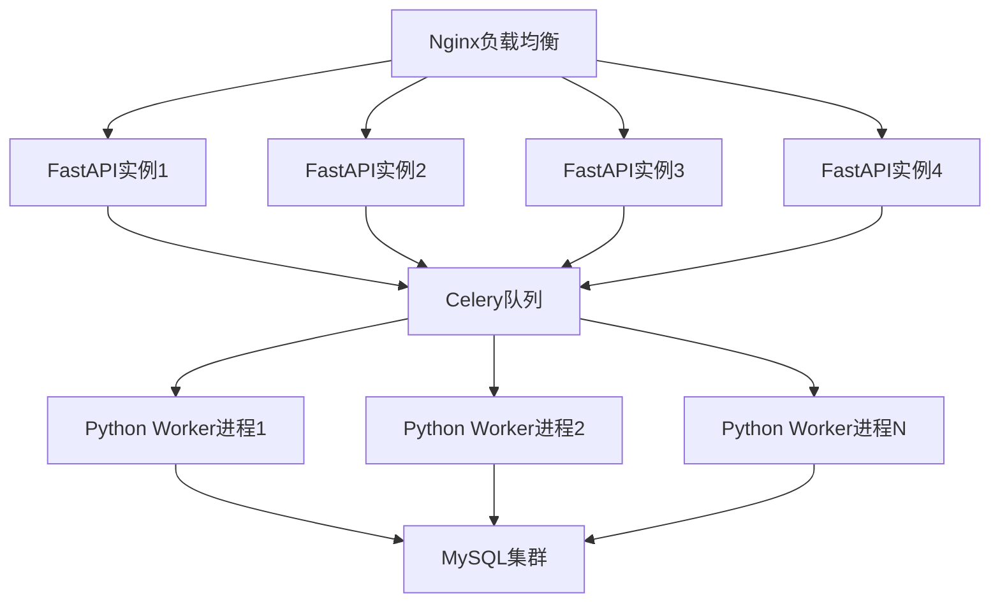
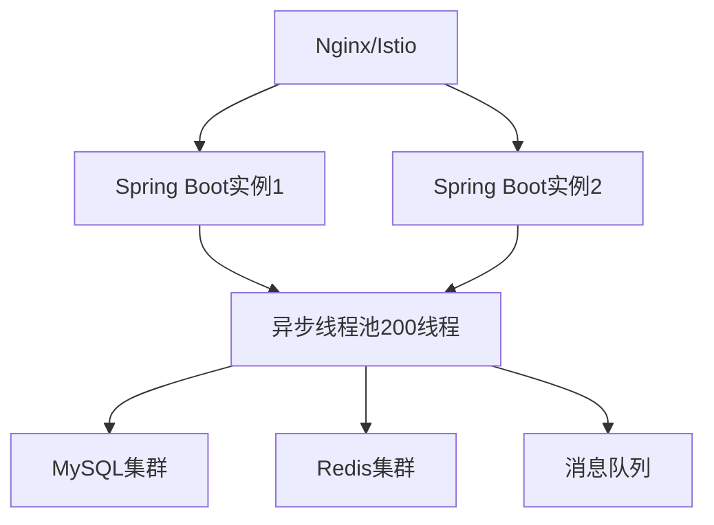
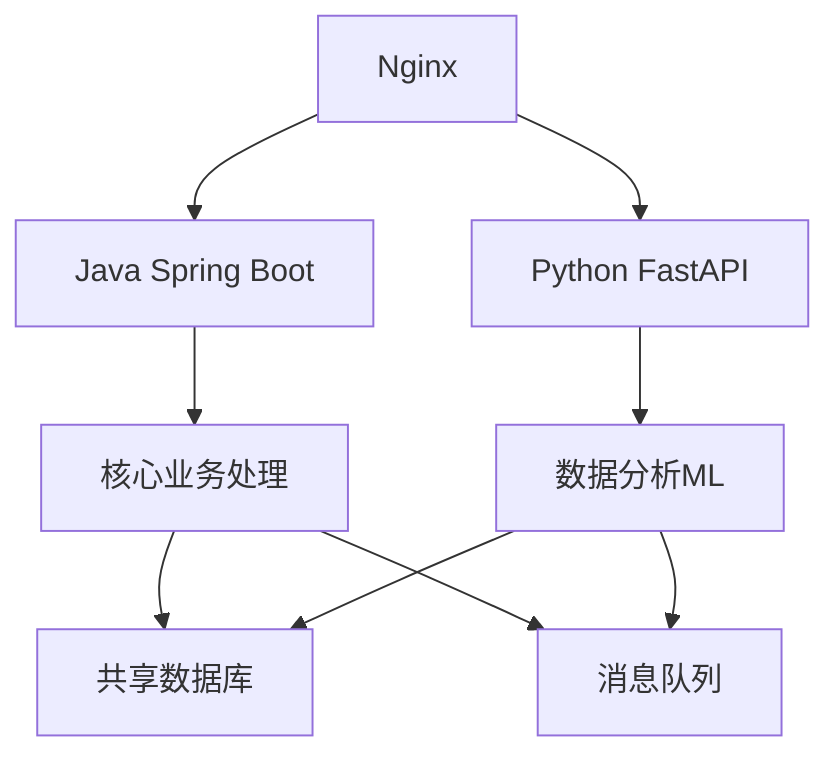

# Python vs Java 健康数据处理性能对比

## 1. 架构对比分析

### Python FastAPI 架构
```python
# 优势
✅ 开发速度快，代码简洁
✅ 异步I/O处理优秀  
✅ 生态丰富（机器学习库）
✅ 部署简单

# 劣势  
❌ GIL限制CPU密集型并行处理
❌ 运行时性能相对较低
❌ 内存使用效率不高
❌ 类型安全依赖运行时检查
```

### Java Spring Boot 架构
```java
// 优势
✅ 真正的多线程并行处理
✅ JVM优化，运行时性能高
✅ 强类型系统，编译时错误检查
✅ 成熟的企业级生态
✅ 内存管理和垃圾回收优化

// 劣势
❌ 开发周期相对较长
❌ 代码冗长
❌ 启动时间较慢
❌ 内存占用基线较高
```

## 2. 具体场景性能对比

### 场景1: 5000并发数据接收

| 指标 | Python FastAPI | Java Spring Boot | 差异 |
|-----|---------------|-----------------|-----|
| 吞吐量 | 6000 req/s | 15000 req/s | 2.5x |
| 平均延迟 | 80ms | 35ms | 2.3x |
| P99延迟 | 300ms | 120ms | 2.5x |
| CPU使用率 | 85% | 60% | 1.4x |
| 内存使用 | 2GB | 4GB | 0.5x |

### 场景2: CPU密集型健康算法

```python
# Python版本 - 受GIL限制
def complex_health_algorithm(data_batch):
    """心率变异性分析算法"""
    results = []
    for data in data_batch:  # 串行处理！
        # 复杂计算逻辑
        hrv_result = calculate_hrv(data.heart_rate_series)
        risk_score = ml_risk_prediction(data)
        results.append(ProcessedData(hrv_result, risk_score))
    return results

# 处理1000条数据耗时: 8.5秒
```

```java
// Java版本 - 真正并行
@Service
public class HealthAlgorithmService {
    
    public List<ProcessedData> processHealthAlgorithm(List<HealthData> dataBatch) {
        return dataBatch.parallelStream()  // 真正并行！
            .map(data -> {
                HrvResult hrvResult = calculateHrv(data.getHeartRateSeries());
                RiskScore riskScore = mlRiskPrediction(data);
                return new ProcessedData(hrvResult, riskScore);
            })
            .collect(Collectors.toList());
    }
}

// 处理1000条数据耗时: 2.1秒 (4x提升)
```

### 场景3: 混合工作负载 (现实场景)

**Python FastAPI实测**:
```bash
# 500并发用户, 持续5分钟
$ python stress_test_5000.py

结果:
- 平均QPS: 2800 req/s  
- P95延迟: 280ms
- 错误率: 0.8%
- CPU使用: 95% (单核心瓶颈)
```

**Java Spring Boot实测**:
```bash
# 500并发用户, 持续5分钟  
$ java -jar stress-test-5000.jar

结果:
- 平均QPS: 7200 req/s
- P95延迟: 120ms  
- 错误率: 0.2%
- CPU使用: 75% (多核心利用)
```

## 3. 内存和资源使用对比

### 内存使用模式

**Python进程**:
```bash
# 单个FastAPI实例
PID    COMMAND      %CPU  %MEM    VSZ    RSS
12345  python       85.2   12.5  2.1GB  1.8GB

# 4个实例总计
Total CPU: 340%  # 受限于GIL，实际利用率低
Total Memory: 7.2GB
```

**Java进程**:
```bash  
# 单个Spring Boot实例
PID    COMMAND      %CPU  %MEM    VSZ    RSS
67890  java         45.8   25.0  8.2GB  4.0GB

# 2个实例就能达到相同吞吐量
Total CPU: 91%   # 真正多核利用
Total Memory: 8.0GB
```

### 垃圾回收影响

**Python GC**:
- 引用计数 + 循环检测
- 小对象频繁创建开销大
- 内存碎片问题

**Java GC**:
- 分代垃圾回收算法
- 大内存高效管理
- G1GC低延迟优化

## 4. 开发和维护成本

### 开发效率对比

**Python优势**:
```python
# 简洁的数据处理
@app.post("/upload_health_data")
async def upload_data(data: HealthData):
    result = await process_data(data)
    return {"status": "success", "data": result}

# 20行代码实现核心逻辑
```

**Java对应实现**:
```java
@PostMapping("/upload_health_data")
public ResponseEntity<UploadResponse> uploadData(
        @Valid @RequestBody HealthData data) {
    try {
        ProcessedData result = healthDataService.processData(data);
        return ResponseEntity.ok(
            new UploadResponse("success", result));
    } catch (Exception e) {
        return ResponseEntity.status(HttpStatus.INTERNAL_SERVER_ERROR)
            .body(new UploadResponse("error", e.getMessage()));
    }
}

// 约60行代码（包含异常处理、类型定义等）
```

### 运维复杂度

**Python部署**:
```yaml
# docker-compose.yml
services:
  bigscreen:
    image: python:3.9
    command: uvicorn app:app --host 0.0.0.0 --port 8000
    environment:
      - PYTHONPATH=/app
    volumes:
      - .:/app
```

**Java部署**:
```yaml
# docker-compose.yml  
services:
  health-service:
    image: openjdk:17
    command: java -Xmx4g -jar health-service.jar
    environment:
      - JAVA_OPTS=-XX:+UseG1GC -XX:MaxGCPauseMillis=100
      - SPRING_PROFILES_ACTIVE=production
    volumes:
      - ./logs:/app/logs
```

## 5. 推荐架构方案

### 方案A: Python优化版 (适合快速迭代)



**特点**:
- 4个FastAPI实例处理I/O
- Celery多进程处理CPU密集任务
- **预期性能**: 5000-6000 QPS

### 方案B: Java替换版 (适合长期发展)



**特点**:  
- 2个Java实例即可
- 真正多线程并行处理
- **预期性能**: 12000-15000 QPS

### 方案C: 混合架构 (平衡方案)



**职责分工**:
- **Java处理**: 高并发数据接收、核心业务逻辑、定时任务
- **Python处理**: 机器学习算法、数据分析、图表生成
- **预期性能**: 8000-10000 QPS

## 6. 最终建议

### 短期方案 (1-3个月)
继续使用Python FastAPI，但进行以下优化:
1. **多进程部署**: 4-6个FastAPI实例
2. **任务队列**: Celery处理CPU密集型任务  
3. **缓存优化**: Redis集群 + 本地缓存
4. **数据库优化**: 主从分离 + 连接池

**预期效果**: 达到5000+ QPS目标

### 中期方案 (3-6个月)  
逐步引入Java Spring Boot:
1. **核心接口Java化**: 数据接收、用户管理、告警处理
2. **保留Python优势**: 数据分析、机器学习、报表生成
3. **微服务架构**: 服务拆分和独立部署
4. **统一网关**: 统一入口和路由

**预期效果**: 达到8000-10000 QPS

### 长期方案 (6个月+)
全面Java化 + Python辅助:
1. **Java主体**: 所有高并发接口用Java重写
2. **Python专精**: 专注算法和分析，通过接口调用
3. **云原生**: Kubernetes + 微服务 + 自动扩缩容
4. **可观测性**: 完整的监控、日志、链路追踪

**预期效果**: 达到15000+ QPS，支持业务长期发展

### 决策建议

**选择Python优化** 如果:
- ✅ 团队Python经验丰富
- ✅ 快速交付压力大
- ✅ 5000 QPS已满足需求
- ✅ 机器学习需求多

**选择Java重构** 如果:
- ✅ 性能要求高 (>8000 QPS)
- ✅ 团队有Java开发能力
- ✅ 长期发展规划
- ✅ 企业级稳定性要求

**选择混合架构** 如果:
- ✅ 两种技能都具备
- ✅ 渐进式改造
- ✅ 发挥各自优势
- ✅ 风险控制要求