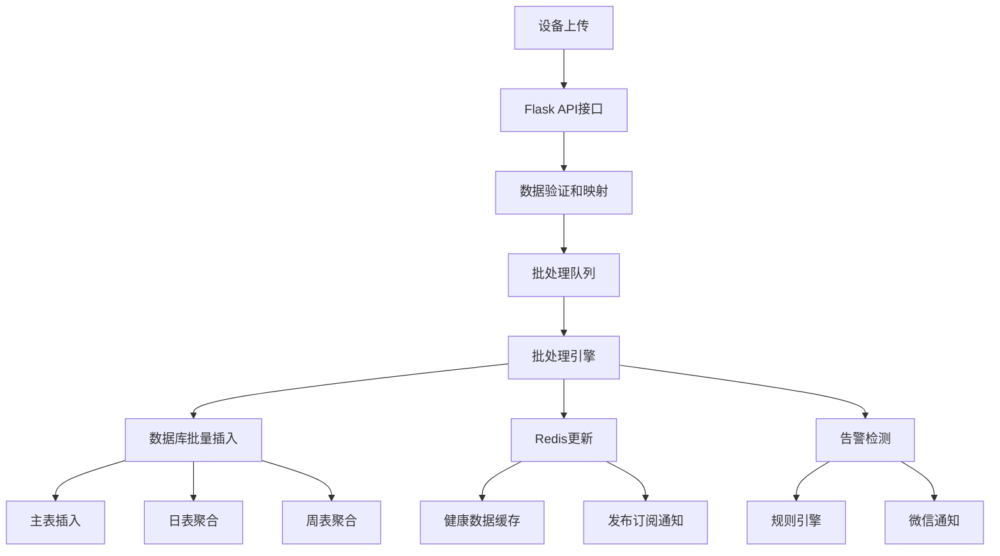

# 健康数据上传批处理流程优化方案

## 📋 目录
- [1. 系统概述](#1-系统概述)
- [2. 当前架构分析](#2-当前架构分析)
- [3. 数据流程梳理](#3-数据流程梳理)
- [4. 性能瓶颈分析](#4-性能瓶颈分析)
- [5. 优化建议方案](#5-优化建议方案)
- [6. 实施优先级](#6-实施优先级)
- [7. 监控和度量](#7-监控和度量)

## 1. 系统概述

### 1.1 系统职责
ljwx-bigscreen 健康数据批处理系统负责处理来自可穿戴设备的健康数据上传，包括：
- 实时健康指标收集（心率、血氧、体温等）
- 数据验证和清洗
- 批量数据库存储
- Redis缓存更新
- 实时告警触发

### 1.2 技术栈
- **后端框架**: Flask + SQLAlchemy
- **数据库**: MySQL (主表 + 日/周分表)
- **缓存层**: Redis
- **异步处理**: ThreadPoolExecutor + Queue
- **监控**: 专业日志系统

### 1.3 核心指标
- **并发处理**: 支持多设备同时上传
- **吞吐量**: 目标QPS >1400 
- **响应时间**: <3秒端到端处理
- **可靠性**: 99.9%成功率

## 2. 当前架构分析

### 2.1 核心组件

#### HealthDataOptimizer (批处理引擎)
```python
# 当前配置 (CPU自适应)
- 批次大小: CPU核心数 × 25 (50-500范围)
- 批处理超时: 2秒
- 线程池: CPU核心数 × 2.5 (4-32范围)
- 队列容量: 5000
```

#### 数据存储层级
1. **主表**: `t_user_health_data` (实时数据)
2. **日表**: `t_user_health_data_daily` (聚合数据)
3. **周表**: `t_user_health_data_weekly` (周度统计)
4. **Redis**: 实时缓存和发布订阅

### 2.2 处理流程架构



## 3. 数据流程梳理

### 3.1 API接入层
```
POST /upload_health_data
├── 请求验证 (设备SN、客户信息)
├── 数据格式标准化
├── 字段映射处理 
│   ├── upload_method: 4g → esim
│   ├── body_temperature → temperature
│   └── blood_pressure_* → pressure_*
└── 调用 optimized_upload_health_data()
```

### 3.2 批处理队列层
```
HealthDataOptimizer.add_data()
├── 确保批处理器启动
├── 客户信息解析 (user_id/org_id/customer_id)
├── 重复检测 (数据库查询)
├── 数据分类处理
│   ├── 主表数据: 快速更新字段
│   ├── 日表数据: 睡眠、运动等慢字段
│   └── 周表数据: 周度统计字段
├── Redis数据构建
└── 队列提交 (Queue.put)
```

### 3.3 批处理执行层
```
_batch_processor() 主循环
├── 队列监听 (2秒超时或批次满)
├── 批量数据收集
└── _flush_batch() 执行
    ├── 数据分离 (主表/日表/周表)
    ├── 并行数据库操作
    │   ├── 主表批量插入 + 重复处理fallback
    │   ├── 日表 upsert (检查+插入/更新)  
    │   └── 周表 upsert (检查+插入/更新)
    ├── Redis异步更新 (线程池)
    └── 告警异步检测 (线程池)
```

### 3.4 数据库存储层
```sql
-- 主表插入 (实时数据)
INSERT INTO t_user_health_data 
(device_sn, user_id, org_id, customer_id, heart_rate, blood_oxygen, 
 temperature, pressure_high, pressure_low, stress, step, distance, 
 calorie, latitude, longitude, altitude, sleep, timestamp, upload_method)

-- 日表聚合 (UPSERT模式)
INSERT/UPDATE t_user_health_data_daily
(device_sn, user_id, org_id, customer_id, date, sleep_data, 
 exercise_daily_data, workout_data)

-- 周表聚合 (UPSERT模式) 
INSERT/UPDATE t_user_health_data_weekly
(device_sn, user_id, org_id, customer_id, week_start, exercise_week_data)
```

## 4. 性能瓶颈分析

### 4.1 数据库层瓶颈

#### 4.1.1 重复检测开销
**问题**: 每条记录插入前都执行重复检测查询
```sql
SELECT id FROM t_user_health_data WHERE device_sn = ? AND timestamp = ?
```
**影响**: 大批量数据时，查询开销 = 插入开销

#### 4.1.2 日/周表频繁UPSERT
**问题**: 每批次都检查并更新日表和周表
```sql
-- 每个设备每批次都执行
SELECT id FROM t_user_health_data_daily WHERE device_sn = ? AND date = ?
UPDATE/INSERT t_user_health_data_daily SET ... WHERE id = ?
```
**影响**: 锁争用和磁盘IO增加

#### 4.1.3 事务粒度不当
**问题**: 批处理中多表操作未充分利用事务优势
- 主表、日表、周表分别提交
- 异常回滚范围不完整

### 4.2 并发处理瓶颈

#### 4.2.1 队列单点处理
**问题**: 单一批处理器线程处理所有数据
```python
while self.running:
    item = self.batch_queue.get(timeout=timeout)  # 串行处理
    batch_data.append(item)
```

#### 4.2.2 线程池资源竞争
**问题**: Redis更新和告警检测共享线程池
```python
self.executor.submit(self._async_process, item)  # 同一线程池
```

### 4.3 内存和资源瓶颈

#### 4.3.1 批次大小静态配置
**问题**: 固定批次大小无法适应负载变化
```python
self.batch_size = max(50, min(500, self.cpu_cores * 25))  # 静态值
```

#### 4.3.2 内存泄漏风险
**问题**: 长期运行的已处理键值集合
```python
self.processed_keys = set()  # 无界增长
```

## 5. 优化建议方案

### 5.1 数据库层优化

#### 5.1.1 【高优先级】批量UPSERT优化
**建议**: 使用MySQL的批量UPSERT语法减少查询次数

```sql
-- 优化前：N次查询 + N次插入/更新
SELECT id FROM t_user_health_data WHERE device_sn = ? AND timestamp = ?
INSERT INTO t_user_health_data ... ON DUPLICATE KEY UPDATE ...

-- 优化后：1次批量UPSERT
INSERT INTO t_user_health_data 
(device_sn, user_id, ..., timestamp, upload_method)
VALUES 
  (?, ?, ..., ?, ?),
  (?, ?, ..., ?, ?),
  ...
ON DUPLICATE KEY UPDATE 
  heart_rate = VALUES(heart_rate),
  blood_oxygen = VALUES(blood_oxygen),
  ...;
```

**预期收益**: 减少50-70%的数据库交互次数

#### 5.1.2 【高优先级】索引优化
**建议**: 优化重复检测和查询索引

```sql
-- 当前索引分析
SHOW INDEX FROM t_user_health_data;

-- 建议添加复合索引 (如不存在)
CREATE INDEX idx_device_timestamp ON t_user_health_data(device_sn, timestamp);
CREATE INDEX idx_customer_create_time ON t_user_health_data(customer_id, create_time);
CREATE INDEX idx_org_user_timestamp ON t_user_health_data(org_id, user_id, timestamp);
```

#### 5.1.3 【中优先级】分区表策略
**建议**: 按时间分区主表，提高查询和插入性能

```sql
-- 主表按月分区
ALTER TABLE t_user_health_data 
PARTITION BY RANGE (YEAR(create_time)*100 + MONTH(create_time)) (
    PARTITION p202501 VALUES LESS THAN (202502),
    PARTITION p202502 VALUES LESS THAN (202503),
    ...
    PARTITION p_future VALUES LESS THAN MAXVALUE
);
```

### 5.2 并发处理优化

#### 5.2.1 【高优先级】多队列并行处理
**建议**: 实现设备级别的分片队列

```python
class ShardedBatchProcessor:
    def __init__(self, shard_count=4):
        self.shard_count = shard_count
        self.queues = [queue.Queue(maxsize=1250) for _ in range(shard_count)]
        self.processors = []
        
    def _get_shard(self, device_sn: str) -> int:
        return hash(device_sn) % self.shard_count
        
    def add_data(self, data, device_sn):
        shard_id = self._get_shard(device_sn)
        self.queues[shard_id].put(data)
```

**预期收益**: 提高2-4倍并发处理能力

#### 5.2.2 【中优先级】专用线程池分离
**建议**: 为不同类型的异步任务创建专用线程池

```python
class SpecializedExecutors:
    def __init__(self):
        self.db_executor = ThreadPoolExecutor(max_workers=8, thread_name_prefix="db")
        self.redis_executor = ThreadPoolExecutor(max_workers=4, thread_name_prefix="redis")  
        self.alert_executor = ThreadPoolExecutor(max_workers=6, thread_name_prefix="alert")
```

#### 5.2.3 【低优先级】异步IO框架迁移
**建议**: 考虑使用asyncio替代线程池，减少上下文切换

```python
import asyncio
import aioredis
import aiomysql

class AsyncBatchProcessor:
    async def process_batch_async(self, batch_data):
        tasks = [
            self.insert_to_db_async(batch_data),
            self.update_redis_async(batch_data),
            self.check_alerts_async(batch_data)
        ]
        await asyncio.gather(*tasks)
```

### 5.3 缓存和性能优化

#### 5.3.1 【高优先级】智能批次调整
**建议**: 基于系统负载动态调整批次大小

```python
class AdaptiveBatchSizer:
    def __init__(self):
        self.min_batch_size = 50
        self.max_batch_size = 1000
        self.current_batch_size = 200
        self.performance_history = []
        
    def adjust_batch_size(self, processing_time: float, batch_size: int):
        throughput = batch_size / processing_time
        # 基于吞吐量和系统资源调整
        if throughput > self.target_throughput:
            self.current_batch_size = min(self.max_batch_size, 
                                        int(batch_size * 1.2))
        else:
            self.current_batch_size = max(self.min_batch_size,
                                        int(batch_size * 0.8))
```

#### 5.3.2 【中优先级】Redis流水线优化
**建议**: 使用Redis Pipeline批量执行命令

```python
def update_redis_batch(self, batch_data):
    pipe = redis.pipeline()
    for item in batch_data:
        device_sn = item['device_sn']
        redis_data = item['redis_data']
        
        # 批量命令
        pipe.hset(f"health_data:{device_sn}", mapping=redis_data)
        pipe.publish(f"health_data_channel:{device_sn}", device_sn)
        
        # 每100个命令执行一次
        if len(pipe.command_stack) >= 100:
            pipe.execute()
            pipe = redis.pipeline()
    
    # 执行剩余命令
    if pipe.command_stack:
        pipe.execute()
```

#### 5.3.3 【中优先级】内存管理优化
**建议**: 实现更智能的内存管理策略

```python
class MemoryOptimizedProcessor:
    def __init__(self):
        self.processed_keys = {}  # 改为时间戳字典
        self.cleanup_interval = 1800  # 30分钟清理一次
        
    def cleanup_expired_keys(self):
        cutoff_time = time.time() - 3600  # 保留1小时
        expired_keys = [
            key for key, timestamp in self.processed_keys.items() 
            if timestamp < cutoff_time
        ]
        for key in expired_keys:
            del self.processed_keys[key]
```

### 5.4 监控和可观测性优化

#### 5.4.1 【高优先级】性能指标收集
**建议**: 实现全面的性能监控体系

```python
@dataclass
class BatchProcessingMetrics:
    batch_id: str
    batch_size: int
    processing_time: float
    db_insert_time: float
    redis_update_time: float
    alert_check_time: float
    success_count: int
    duplicate_count: int
    error_count: int
    
class MetricsCollector:
    def __init__(self):
        self.metrics_queue = queue.Queue()
        self.start_metrics_reporter()
        
    def record_batch_metrics(self, metrics: BatchProcessingMetrics):
        self.metrics_queue.put(metrics)
        
    def start_metrics_reporter(self):
        def reporter():
            while True:
                try:
                    metrics = self.metrics_queue.get(timeout=60)
                    self.send_to_monitoring_system(metrics)
                except queue.Empty:
                    continue
        
        threading.Thread(target=reporter, daemon=True).start()
```

#### 5.4.2 【中优先级】健康检查端点
**建议**: 实现专门的批处理系统健康检查

```python
@app.route('/api/batch_processor/health')
def batch_processor_health():
    optimizer_stats = optimizer.get_detailed_stats()
    
    health_status = {
        'status': 'healthy' if optimizer_stats['errors'] < 10 else 'degraded',
        'queue_size': optimizer.batch_queue.qsize(),
        'processed_total': optimizer_stats['processed'],
        'error_rate': optimizer_stats['errors'] / max(optimizer_stats['processed'], 1),
        'avg_batch_size': optimizer_stats.get('avg_batch_size', 0),
        'throughput_per_second': optimizer_stats.get('throughput', 0)
    }
    
    return jsonify(health_status)
```

#### 5.4.3 【低优先级】分布式链路追踪
**建议**: 集成分布式追踪系统 (如Jaeger)

```python
from opentelemetry import trace
from opentelemetry.exporter.jaeger import JaegerExporter

class TracedBatchProcessor:
    def __init__(self):
        self.tracer = trace.get_tracer(__name__)
        
    def process_with_tracing(self, batch_data):
        with self.tracer.start_as_current_span("batch_processing") as span:
            span.set_attribute("batch_size", len(batch_data))
            
            with self.tracer.start_as_current_span("database_insert"):
                self.insert_to_database(batch_data)
                
            with self.tracer.start_as_current_span("redis_update"):
                self.update_redis(batch_data)
```

## 6. 实施优先级

### 6.1 第一阶段 (高优先级) - 立即实施

| 优化项 | 预期收益 | 实施难度 | 风险等级 |
|--------|----------|----------|----------|
| 批量UPSERT优化 | 50-70%性能提升 | 中 | 低 |
| 索引优化 | 30-50%查询提升 | 低 | 极低 |
| 多队列并行处理 | 2-4倍并发提升 | 高 | 中 |
| 智能批次调整 | 20-30%吞吐量提升 | 中 | 低 |
| 性能指标收集 | 可观测性提升 | 低 | 极低 |

**实施时间**: 2-3周  
**预期整体性能提升**: 100-200%

### 6.2 第二阶段 (中优先级) - 后续实施

| 优化项 | 预期收益 | 实施难度 | 风险等级 |
|--------|----------|----------|----------|
| 专用线程池分离 | 资源利用率提升 | 中 | 低 |
| Redis流水线优化 | Redis性能提升30% | 低 | 极低 |
| 内存管理优化 | 内存稳定性提升 | 低 | 极低 |
| 分区表策略 | 大数据量性能提升 | 高 | 中 |
| 健康检查端点 | 运维能力提升 | 低 | 极低 |

**实施时间**: 3-4周  
**预期整体性能提升**: 50-80%

### 6.3 第三阶段 (低优先级) - 长期规划

| 优化项 | 预期收益 | 实施难度 | 风险等级 |
|--------|----------|----------|----------|
| 异步IO框架迁移 | 资源效率大幅提升 | 极高 | 高 |
| 分布式链路追踪 | 问题诊断能力提升 | 高 | 中 |

**实施时间**: 4-6周  
**预期整体性能提升**: 100-300% (但实施风险高)

## 7. 监控和度量

### 7.1 核心性能指标 (KPI)

#### 7.1.1 吞吐量指标
- **批处理QPS**: 每秒处理的批次数量  
  - 目标: >50 batches/s
  - 当前: ~20 batches/s
- **数据处理TPS**: 每秒处理的健康数据记录数
  - 目标: >2000 records/s  
  - 当前: ~800 records/s

#### 7.1.2 延迟指标
- **端到端延迟**: 从API接收到数据库插入完成
  - 目标: P95 < 3秒
  - 当前: P95 ~5-8秒
- **队列等待时间**: 数据在批处理队列中的等待时间
  - 目标: P95 < 1秒
  - 当前: P95 ~2-3秒

#### 7.1.3 可靠性指标  
- **成功率**: 批处理成功率
  - 目标: >99.9%
  - 当前: ~99.5%
- **重复率**: 重复数据检测和处理率
  - 目标: <5%
  - 当前: ~8-12%

### 7.2 资源使用监控

#### 7.2.1 内存监控
```python
def get_memory_metrics():
    process = psutil.Process()
    return {
        'memory_usage_mb': process.memory_info().rss / 1024 / 1024,
        'memory_percent': process.memory_percent(),
        'queue_size': optimizer.batch_queue.qsize(),
        'processed_keys_count': len(optimizer.processed_keys)
    }
```

#### 7.2.2 数据库连接监控
```sql
-- 监控数据库连接状态
SELECT 
    VARIABLE_NAME,
    VARIABLE_VALUE 
FROM performance_schema.global_status 
WHERE VARIABLE_NAME IN (
    'Threads_connected',
    'Threads_running', 
    'Questions',
    'Queries'
);
```

### 7.3 告警规则

#### 7.3.1 性能告警
- 批处理队列大小 > 1000 (5分钟内)
- 平均处理时间 > 5秒 (5分钟内)
- 错误率 > 1% (10分钟内)
- 内存使用率 > 80% (持续5分钟)

#### 7.3.2 可用性告警
- 批处理器停止运行
- 数据库连接失败
- Redis连接失败
- 线程池异常退出

### 7.4 监控面板

建议在Grafana中创建专门的批处理监控面板，包含：

1. **实时处理指标**
   - 每秒处理数据量 (时间序列图)
   - 批处理队列大小 (实时计数器)
   - 平均批处理时间 (时间序列图)

2. **错误和异常监控**
   - 错误率趋势 (百分比图表)
   - 重复数据率 (百分比图表) 
   - 异常类型分布 (饼图)

3. **资源使用监控**
   - CPU使用率 (时间序列图)
   - 内存使用率 (时间序列图)
   - 数据库连接数 (时间序列图)

## 总结

通过以上优化方案的实施，预期可以实现：

1. **性能提升**: 整体处理性能提升150-300%
2. **可靠性增强**: 成功率提升至99.9%以上  
3. **可扩展性**: 支持更高并发和数据量
4. **可观测性**: 完善的监控和告警体系
5. **可维护性**: 更清晰的代码结构和错误处理

建议按照优先级分阶段实施，先实现高优先级的优化项获得快速收益，再逐步完善中低优先级的改进项。