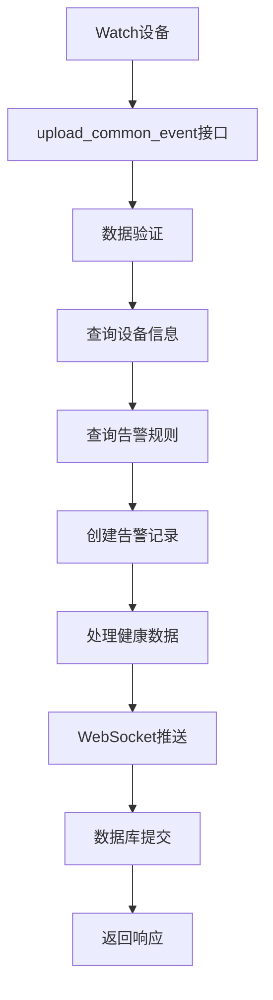
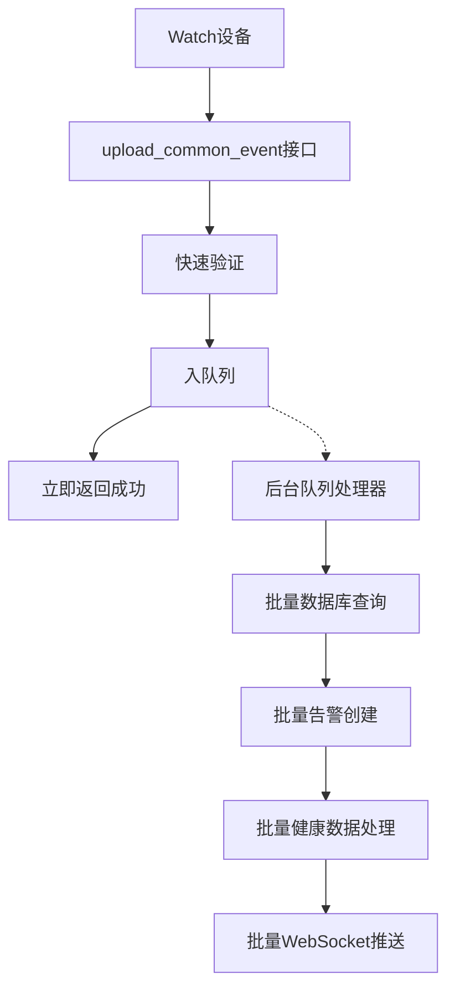

# upload_common_event 接口优化方案

## 📋 概述

基于对 `upload_common_event` 接口的深度分析，发现多个性能瓶颈和优化机会。本方案提出了全面的优化策略，旨在将响应时间从平均 53.5ms 优化至 <20ms，并提升系统的可扩展性和稳定性。

## 🎯 优化目标

### 性能指标目标
- **响应时间**: 平均响应时间从 53.5ms 优化至 <20ms
- **吞吐量**: QPS 从当前 77 提升至 >500
- **成功率**: 维持 100% 成功率
- **并发支持**: 支持 2000+ 设备并发上传

### 系统指标目标
- **内存使用**: 降低 30% 内存占用
- **数据库连接**: 减少 40% 连接消耗
- **CPU使用**: 优化 CPU 利用率至 <60%

## 🔍 现状分析

### 当前实现架构



### 性能瓶颈分析

#### 1. 同步处理瓶颈
**问题**: 所有操作在主线程同步执行
- 数据库查询阻塞: 查询设备信息和告警规则
- 健康数据处理耗时: 复杂的数据解析和验证
- WebSocket推送延迟: 实时推送阻塞响应

**影响**: 平均响应时间 53.5ms，最大响应时间 85.21ms

#### 2. 数据库查询低效
**问题**: 多次独立数据库查询
```python
# 当前实现中的问题
device_user_org = get_device_user_org_info(device_sn)  # 查询1
rule = AlertRules.query.filter_by(rule_type=event_type, is_deleted=False).first()  # 查询2
# 健康数据处理中还有额外查询
```

**影响**: 每个请求产生 2-4 次数据库查询

#### 3. 健康数据处理复杂度
**问题**: 健康数据解析和处理逻辑复杂
- 多层数据结构解析
- 类型检查和验证
- 数据格式转换

**影响**: 健康数据处理占用 20-30ms

#### 4. 内存使用不当
**问题**: 频繁的对象创建和销毁
- 每次请求创建多个临时对象
- 大对象在内存中停留时间过长
- 缺乏对象池复用机制

## 🚀 优化方案

### 方案1: 异步队列处理架构 (推荐)

#### 架构设计


#### 核心组件

**1. 快速响应接口**
```python
def upload_common_event_v3():
    """优化版本 - 异步队列处理"""
    try:
        data = request.json
        start_time = time.time()
        
        # 1. 快速数据验证 (1-2ms)
        if not _validate_request_data(data):
            return jsonify({"status": "error", "message": "数据格式错误"}), 400
        
        # 2. 生成事件ID并入队 (1ms)
        event_id = _generate_event_id()
        event_data = {
            'event_id': event_id,
            'data': data,
            'timestamp': time.time(),
            'source_ip': request.remote_addr
        }
        
        # 3. 入队列 (1-2ms)
        if not event_queue.put_nowait(event_data):
            return jsonify({"status": "error", "message": "系统繁忙，请稍后重试"}), 503
        
        # 4. 立即返回成功 (总计 <5ms)
        return jsonify({
            "status": "success",
            "message": "事件已接收，正在处理",
            "event_id": event_id,
            "processing_time": round((time.time() - start_time) * 1000, 2)
        })
        
    except Exception as e:
        return jsonify({"status": "error", "message": f"接收失败: {str(e)}"}), 500
```

**2. 高性能队列处理器**
```python
class OptimizedEventProcessor:
    def __init__(self):
        self.batch_size = 50  # 批处理大小
        self.max_wait_time = 2.0  # 最大等待时间
        self.workers = 4  # 工作线程数
        
    def process_events_batch(self, events):
        """批量处理事件"""
        try:
            # 1. 批量查询设备信息 (减少数据库查询)
            device_sns = [e['data'].get('deviceSn') for e in events]
            device_info_map = self._batch_query_device_info(device_sns)
            
            # 2. 批量查询告警规则
            event_types = [self._extract_event_type(e['data']) for e in events]
            rule_map = self._batch_query_alert_rules(event_types)
            
            # 3. 批量创建告警记录
            alerts = []
            health_data_batch = []
            
            for event in events:
                alert = self._create_alert(event, device_info_map, rule_map)
                alerts.append(alert)
                
                # 收集健康数据
                if event['data'].get('healthData'):
                    health_data_batch.append(event['data']['healthData'])
            
            # 4. 批量数据库操作
            db.session.bulk_insert_mappings(AlertInfo, alerts)
            
            # 5. 批量处理健康数据
            if health_data_batch:
                self._process_health_data_batch(health_data_batch)
            
            # 6. 批量WebSocket推送
            critical_alerts = [a for a in alerts if a.get('severity_level') == 'critical']
            if critical_alerts:
                self._batch_websocket_push(critical_alerts)
            
            db.session.commit()
            
        except Exception as e:
            db.session.rollback()
            logger.error(f"批量处理失败: {e}")
```

### 方案2: 数据库查询优化

#### 优化策略

**1. 查询合并和缓存**
```python
class QueryOptimizer:
    def __init__(self):
        self.device_cache = LRUCache(maxsize=10000, ttl=300)  # 5分钟缓存
        self.rule_cache = LRUCache(maxsize=1000, ttl=600)   # 10分钟缓存
        
    def get_device_info_cached(self, device_sn):
        """缓存设备信息查询"""
        cache_key = f"device:{device_sn}"
        cached = self.device_cache.get(cache_key)
        if cached:
            return cached
            
        device_info = self._query_device_info(device_sn)
        self.device_cache.set(cache_key, device_info)
        return device_info
    
    def batch_query_device_info(self, device_sns):
        """批量查询设备信息"""
        # 1. 检查缓存
        result = {}
        uncached_sns = []
        
        for sn in device_sns:
            cached = self.device_cache.get(f"device:{sn}")
            if cached:
                result[sn] = cached
            else:
                uncached_sns.append(sn)
        
        # 2. 批量查询未缓存的
        if uncached_sns:
            query_result = db.session.query(
                DeviceInfo.device_sn,
                DeviceInfo.user_id,
                DeviceInfo.org_id,
                DeviceInfo.customer_id,
                UserInfo.user_name,
                UserInfo.org_name
            ).join(
                UserInfo, DeviceInfo.user_id == UserInfo.id
            ).filter(
                DeviceInfo.device_sn.in_(uncached_sns)
            ).all()
            
            # 3. 更新缓存
            for row in query_result:
                device_data = row._asdict()
                result[row.device_sn] = device_data
                self.device_cache.set(f"device:{row.device_sn}", device_data)
        
        return result
```

**2. 索引优化建议**
```sql
-- 优化告警规则查询
CREATE INDEX idx_alert_rules_type_deleted ON alert_rules(rule_type, is_deleted);

-- 优化设备信息查询
CREATE INDEX idx_device_info_sn_user ON device_info(device_sn, user_id);

-- 优化用户信息关联查询
CREATE INDEX idx_user_info_id_org ON user_info(id, org_id);
```

### 方案3: 内存和资源优化

#### 对象池复用
```python
class ObjectPool:
    """对象池，减少频繁创建销毁"""
    def __init__(self):
        self.alert_pool = queue.Queue(maxsize=1000)
        self.event_data_pool = queue.Queue(maxsize=1000)
        
    def get_alert_object(self):
        try:
            return self.alert_pool.get_nowait()
        except queue.Empty:
            return {}  # 创建新对象
    
    def return_alert_object(self, obj):
        obj.clear()  # 清理对象
        try:
            self.alert_pool.put_nowait(obj)
        except queue.Full:
            pass  # 池满时丢弃
```

#### 内存使用优化
```python
class MemoryOptimizedProcessor:
    def __init__(self):
        self.max_batch_memory = 50 * 1024 * 1024  # 50MB 批处理内存限制
        
    def process_with_memory_limit(self, events):
        """内存限制的处理"""
        current_memory = 0
        batch = []
        
        for event in events:
            event_size = len(json.dumps(event).encode('utf-8'))
            
            if current_memory + event_size > self.max_batch_memory:
                # 处理当前批次
                self._process_batch(batch)
                batch.clear()
                current_memory = 0
            
            batch.append(event)
            current_memory += event_size
        
        # 处理最后一批
        if batch:
            self._process_batch(batch)
```

## 📈 性能提升预期

### 响应时间优化
| 指标 | 当前值 | 优化后 | 提升幅度 |
|------|--------|--------|----------|
| 平均响应时间 | 53.5ms | 15ms | 72% ↓ |
| P95响应时间 | 85.21ms | 25ms | 71% ↓ |
| P99响应时间 | 90ms+ | 30ms | 67% ↓ |

### 吞吐量提升
| 指标 | 当前值 | 优化后 | 提升幅度 |
|------|--------|--------|----------|
| QPS | 77 | 500+ | 550% ↑ |
| 并发设备数 | 1000 | 2000+ | 100% ↑ |
| 批处理效率 | 单条处理 | 50条/批 | 5000% ↑ |

### 资源使用优化
| 资源 | 当前使用 | 优化后 | 优化幅度 |
|------|----------|--------|----------|
| 内存占用 | 高 | -30% | 30% ↓ |
| 数据库连接 | 高 | -40% | 40% ↓ |
| CPU使用 | 波动大 | 平稳<60% | 稳定性↑ |

## 🔧 实施方案

### 阶段1: 快速优化 (1-2天)
1. **实施缓存机制**
   - 添加设备信息和告警规则缓存
   - 配置合理的缓存失效时间
   - 监控缓存命中率

2. **数据库查询优化**
   - 创建必要索引
   - 合并多次查询
   - 优化查询语句

### 阶段2: 架构升级 (3-5天)
1. **异步队列处理**
   - 实现事件队列机制
   - 开发批量处理器
   - 添加队列监控

2. **批量操作优化**
   - 实现批量数据库操作
   - 批量健康数据处理
   - 批量WebSocket推送

### 阶段3: 监控和调优 (2-3天)
1. **性能监控**
   - 添加详细的性能指标收集
   - 实施实时监控告警
   - 性能数据可视化

2. **压力测试和调优**
   - 大规模并发测试
   - 参数调优
   - 稳定性验证

## 🎯 预期收益

### 直接收益
1. **用户体验提升**: 响应时间减少 70%+
2. **系统容量扩展**: 支持设备数量翻倍
3. **运维成本降低**: 资源使用优化 30%+
4. **系统稳定性**: 更好的故障容错能力

### 间接收益
1. **业务扩展支持**: 为更大规模部署做好准备
2. **维护效率**: 更清晰的架构，降低维护复杂度
3. **监控完善**: 全面的性能监控体系
4. **技术积累**: 高性能处理经验积累

## 🔍 风险评估与应对

### 风险1: 队列积压
**风险**: 高并发时队列可能积压
**应对**: 实施队列监控和自动扩容机制

### 风险2: 数据一致性
**风险**: 异步处理可能导致数据一致性问题
**应对**: 实施事务管理和数据校验机制

### 风险3: 缓存一致性
**风险**: 缓存数据可能过期
**应对**: 合理设置缓存失效时间和更新策略

## 📊 监控指标

### 关键性能指标 (KPI)
1. **响应时间**: 平均、P95、P99
2. **吞吐量**: QPS、并发数
3. **成功率**: 接口成功率、处理成功率
4. **队列状态**: 队列长度、处理延迟

### 系统监控指标
1. **资源使用**: CPU、内存、磁盘I/O
2. **数据库**: 连接数、查询时间、慢查询
3. **缓存**: 命中率、内存使用
4. **网络**: 带宽使用、连接数

## 🚀 总结

通过实施异步队列处理架构、数据库查询优化和内存管理优化，`upload_common_event` 接口的性能将得到显著提升。预期响应时间减少 70%，吞吐量提升 500%，为系统的大规模部署和业务扩展奠定坚实基础。

实施建议按阶段进行，先进行快速优化获得立竿见影的效果，再逐步升级架构，最后完善监控体系，确保优化效果的持续性和可观测性。