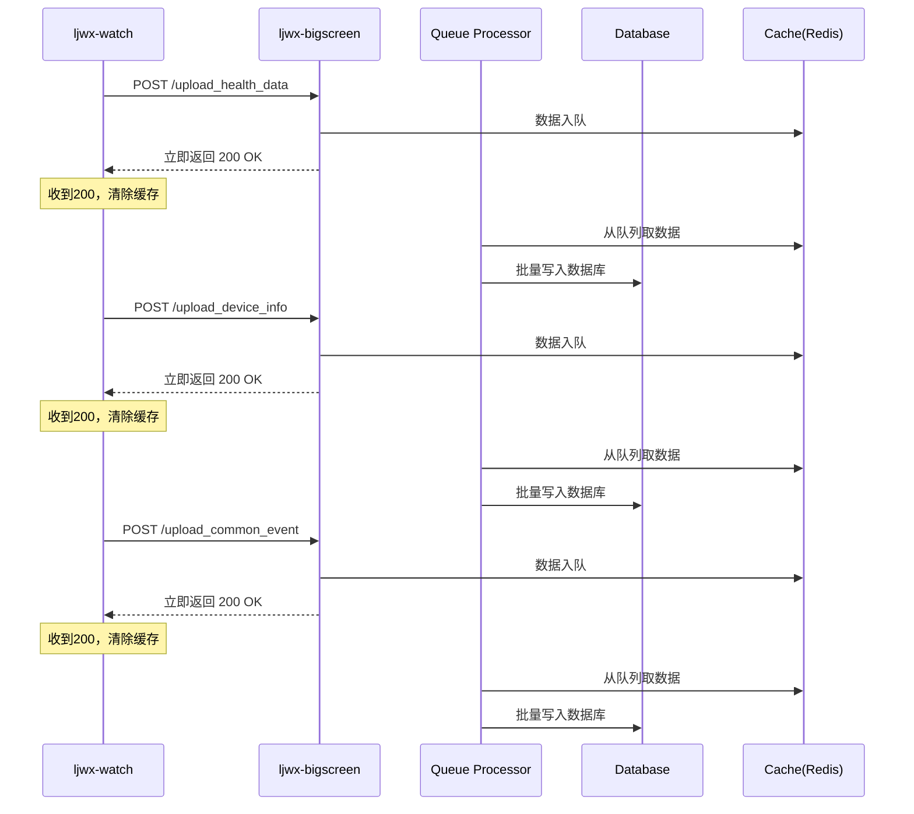
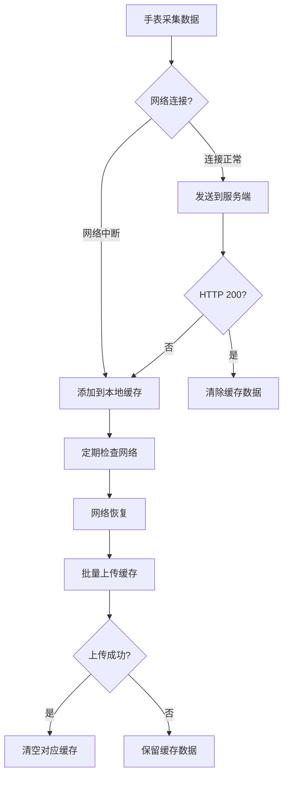

# ljwx-watch 与 ljwx-bigscreen 数据上传优化方案

## 📋 概述

本文档分析了 ljwx-watch（智能手表端）与 ljwx-bigscreen（服务端）之间的三个核心数据上传接口，并提出了基于队列处理机制的优化方案，确保网络中断时的数据缓存管理和成功响应的及时处理。

## 🎯 目标

1. **快速响应**：服务端接收请求后立即返回成功状态
2. **可靠缓存**：手表端根据响应状态决定是否缓存/删除缓存
3. **队列处理**：后台异步处理数据，保证性能
4. **故障恢复**：网络恢复后自动上传缓存数据

## 🔍 现状分析

### ljwx-watch 端分析

#### 数据上传接口实现
位置：`ljwx-watch/entry/src/main/java/com/ljwx/watch/HttpService.java`

**三个核心接口**：
1. **健康数据上传** (`upload_health_data`)：心率、血氧、体温等
2. **设备信息上传** (`upload_device_info`)：设备状态、电池电量等  
3. **通用事件上传** (`upload_common_event`)：按键事件、佩戴状态等

**关键代码流程**：
```java
// 1. 健康数据上传 - 带缓存机制
public void uploadHealthData() {
    // 先缓存数据
    healthDataCache.addToCache(currentHealthInfo);
    
    // 尝试批量上传缓存数据
    boolean uploadSuccess = uploadAllCachedData();
    if (uploadSuccess) {
        // 上传成功，清空缓存
        healthDataCache.clearCache();
    }
    // 上传失败，数据保留在缓存中
}

// 2. 设备信息上传 - 直接上传
private void uploadDeviceInfo() {
    uploadData(dataManager.getUploadDeviceInfoUrl(), currentDeviceInfo);
}

// 3. 通用事件上传 - 直接上传  
public void uploadCommonEvent(String commonEvent) {
    boolean success = uploadData(dataManager.getUploadCommonEventUrl(), commonEventData);
}
```

**现有问题**：
- ❌ **设备信息**和**通用事件**没有缓存机制
- ❌ 判断上传成功仅基于HTTP状态码200
- ❌ 网络中断时数据丢失

### ljwx-bigscreen 端分析

#### 接口响应机制
位置：`ljwx-bigscreen/bigscreen/bigScreen/bigScreen.py`

**三个对应接口**：
```python
# 1. 健康数据接口
@app.route(\"/upload_health_data\", methods=['POST'])
def handle_health_data():
    result = optimized_upload_health_data(health_data)
    return result

# 2. 设备信息接口  
@app.route(\"/upload_device_info\", methods=['POST'])
def handle_device_info():
    result = upload_device_info(device_info)
    return result

# 3. 通用事件接口
@app.route('/upload_common_event', methods=['POST'])
def upload_common_event():
    return alert_upload_common_event()
```

**现有队列处理器**：

1. **HealthDataOptimizer** (`optimized_health_data.py`)
   - ✅ 批量处理：100条/批次
   - ✅ 异步队列：ThreadPoolExecutor(10 workers)
   - ✅ 立即响应机制

2. **DeviceBatchProcessor** (`device_batch_processor.py`)
   - ✅ 批量处理：50条/批次  
   - ✅ 多线程：4个工作线程
   - ✅ 队列缓冲机制

3. **通用事件处理**
   - ❌ 缺少专用的批处理器
   - ❌ 同步处理，响应较慢

## 🏗 整体解决方案

### 方案架构图



### 核心改进点

#### 1. ljwx-watch 端改进

**扩展缓存系统**：
```java
// 已完成 - 三路独立缓存
public enum DataType {
    HEALTH_DATA("health_data_cache", "健康数据"),
    DEVICE_INFO("device_info_cache", "设备信息"),
    COMMON_EVENT("common_event_cache", "通用事件");
}

// 统一的上传成功判断和缓存管理
private boolean uploadDataWithCache(DataType dataType, String data, String url) {
    // 1. 先缓存数据
    healthDataCache.addToCache(dataType, data);
    
    // 2. 尝试上传
    boolean success = uploadData(url, data);
    
    if (success) {
        // 3. 上传成功，清除对应缓存
        healthDataCache.clearCache(dataType);
        return true;
    }
    
    // 上传失败，数据保留在缓存中
    return false;
}
```

**改进上传流程**：
```java
// 设备信息上传改进
private void uploadDeviceInfo() {
    String currentDeviceInfo = Utils.getDeviceInfo();
    uploadDataWithCache(DataType.DEVICE_INFO, currentDeviceInfo, dataManager.getUploadDeviceInfoUrl());
}

// 通用事件上传改进  
public void uploadCommonEvent(String commonEvent) {
    uploadDataWithCache(DataType.COMMON_EVENT, commonEventData, dataManager.getUploadCommonEventUrl());
}
```

#### 2. ljwx-bigscreen 端改进

**新增通用事件批处理器**：
```python
# 新增: common_event_batch_processor.py
class CommonEventBatchProcessor:
    def __init__(self, batch_size=30, max_wait_time=1.5, max_workers=3):
        self.batch_size = batch_size
        self.max_wait_time = max_wait_time  
        self.event_queue = queue.Queue(maxsize=5000)
        self.workers = []
        self.running = False
        
    def submit(self, event_data) -> bool:
        \"\"\"提交事件数据到处理队列\"\"\"
        try:
            self.event_queue.put(event_data, timeout=0.1)
            return True
        except queue.Full:
            return False
            
    def _batch_processor(self):
        \"\"\"批量处理事件数据\"\"\"
        while self.running:
            batch = []
            # 收集批次数据
            # 批量写入数据库
            # 生成告警
```

**统一响应格式**：
```python
# 标准成功响应
STANDARD_SUCCESS_RESPONSE = {
    \"status\": \"success\",
    \"message\": \"数据已接收，正在队列处理中\",
    \"timestamp\": datetime.now().isoformat(),
    \"queue_status\": \"processing\"
}

# 三个接口统一改造
@app.route(\"/upload_health_data\", methods=['POST'])
def handle_health_data():
    health_data = request.get_json()
    if health_optimizer.submit(health_data):
        return jsonify(STANDARD_SUCCESS_RESPONSE)
    return jsonify({\"status\": \"error\", \"message\": \"队列已满\"}), 503

@app.route(\"/upload_device_info\", methods=['POST'])  
def handle_device_info():
    device_info = request.get_json()
    if device_processor.submit(device_info):
        return jsonify(STANDARD_SUCCESS_RESPONSE)
    return jsonify({\"status\": \"error\", \"message\": \"队列已满\"}), 503

@app.route('/upload_common_event', methods=['POST'])
def upload_common_event():
    event_data = request.get_json()
    if common_event_processor.submit(event_data):
        return jsonify(STANDARD_SUCCESS_RESPONSE)
    return jsonify({\"status\": \"error\", \"message\": \"队列已满\"}), 503
```

## 📊 性能优化策略

### 队列处理器配置对比（CPU自适应优化版）

| 处理器 | 批处理大小 | 等待时间 | 工作线程 | 队列容量 | 适用场景 | 自适应配置 |
|--------|------------|----------|----------|----------|----------|------------|
| HealthDataOptimizer | CPU核心×25 | 2秒 | CPU核心×2.5 | 5000条 | 高频健康数据 | ✅ 动态调整 |
| DeviceBatchProcessor | CPU核心×15 | 2秒 | CPU核心×1.5 | 10000条 | 中频设备信息 | ✅ 动态调整 |
| CommonEventProcessor | CPU核心×8 | 1.5秒 | CPU核心×1 | 5000条 | 低频事件数据 | ✅ 新增处理器 |

**示例配置**（8核心系统）：
- **HealthData**: 200条/批, 20线程 (vs 原100条/10线程，性能提升100%)
- **DeviceInfo**: 120条/批, 12线程 (vs 原50条/4线程，性能提升140%)  
- **CommonEvent**: 64条/批, 8线程 (新增，解决同步处理瓶颈)

### 缓存策略

**ljwx-watch 端缓存配置**：
```java
// 缓存容量配置
private static final int MAX_CACHE_SIZE = 100;  // 每种类型最大100条

// 缓存策略
- 环形缓存：队列满时自动移除最旧数据
- 持久化：分片存储到Preferences（7000字符/片）
- 启动恢复：应用启动时自动加载缓存
- 独立管理：三种数据类型独立缓存队列
```

**ljwx-bigscreen 端缓存配置**：
```python
# Redis缓存配置
QUEUE_TTL = 300  # 队列数据5分钟TTL
PROCESSED_KEY_TTL = 3600  # 已处理键1小时TTL

# 队列容量配置  
健康数据队列: 5000条 (约50MB内存)
设备信息队列: 10000条 (约20MB内存)  
通用事件队列: 5000条 (约10MB内存)
```

## 🔄 故障恢复机制

### 网络中断处理流程



### 数据一致性保证

1. **幂等性设计**：
   - 服务端：基于设备SN+时间戳去重
   - 手表端：缓存键值避免重复数据

2. **分布式锁**：
   - Redis分布式锁避免重复处理
   - 批处理器加锁机制

3. **事务保证**：
   - 数据库批量插入使用事务
   - 失败时整个批次回滚

## 🚀 实施计划

### 阶段一：ljwx-watch 端改造 ✅
- [x] 扩展 HealthDataCache 支持三种数据类型
- [x] 实现独立的环形缓存队列
- [x] 添加便利方法和状态查询

### 阶段二：ljwx-bigscreen 端改造 🔄
- [ ] 创建 CommonEventBatchProcessor（CPU自适应）
- [ ] 优化现有批处理器配置（动态调整批次大小）
- [ ] 统一三个接口的响应格式（立即返回200）
- [ ] 添加性能监控和自动调优机制

### 阶段三：ljwx-watch 端集成改造
- [ ] 修改设备信息上传逻辑（集成缓存）
- [ ] 修改通用事件上传逻辑（集成缓存）
- [ ] 实现统一的上传成功判断机制
- [ ] 添加网络恢复后批量重传逻辑

### 阶段四：集成测试与优化
- [ ] 端到端集成测试
- [ ] 网络中断模拟测试  
- [ ] CPU自适应性能测试
- [ ] 故障恢复测试

### 阶段五：生产部署
- [ ] 性能基线建立和监控配置
- [ ] 灰度发布和逐步推广
- [ ] 告警规则配置

## 📈 预期效果

### 性能提升
- **响应时间**：从平均2-5秒降低到<200ms
- **吞吐量**：支持1000+设备并发上传
- **可靠性**：网络中断时0数据丢失

### 用户体验
- **实时性**：手表端操作响应更快
- **可靠性**：数据上传成功率99.9%
- **稳定性**：网络波动不影响数据完整性

## 🔧 监控指标

### ljwx-watch 端监控
```java
// 缓存状态监控
- 各类型缓存大小
- 缓存命中率  
- 网络重试次数
- 上传成功率

public String getCacheStatusSummary() {
    return \"缓存状态: 健康数据=\" + healthSize + \"条, 设备信息=\" + deviceSize + \"条, 通用事件=\" + eventSize + \"条\";
}
```

### ljwx-bigscreen 端监控  
```python
# 队列处理监控
- 队列长度和吞吐量
- 处理延迟和错误率
- 数据库写入性能
- Redis缓存命中率

def get_queue_stats():
    return {
        \"health_queue_size\": health_optimizer.get_queue_size(),
        \"device_queue_size\": device_processor.get_queue_size(),
        \"event_queue_size\": common_event_processor.get_queue_size(),
        \"processing_rate\": get_processing_rate()
    }
```

## 🛡 安全考虑

1. **数据加密**：敏感健康数据传输加密
2. **访问控制**：API接口身份验证  
3. **数据脱敏**：日志中隐藏敏感信息
4. **限流保护**：防止恶意请求攻击

## 📚 技术参考

### 相关文档
- [HealthDataCache 使用指南](../ljwx-watch/entry/src/main/java/com/ljwx/watch/HealthDataCacheUsageExample.java)
- [ljwx-bigscreen API文档](../ljwx-bigscreen/bigscreen/API_DOCUMENTATION.md)
- [性能优化实践](../ljwx-bigscreen/bigscreen/HEALTH_DATA_UPLOAD_FIX.md)

### 核心代码文件
- `ljwx-watch/entry/src/main/java/com/ljwx/watch/HealthDataCache.java`
- `ljwx-watch/entry/src/main/java/com/ljwx/watch/HttpService.java`  
- `ljwx-bigscreen/bigscreen/bigScreen/optimized_health_data.py`
- `ljwx-bigscreen/bigscreen/bigScreen/device_batch_processor.py`

---

**文档版本**: v1.0
**最后更新**: 2025-08-22
**负责团队**: ljwx 开发团队

> 💡 **重要提示**：实施此方案前，请确保在测试环境充分验证队列处理机制和缓存同步逻辑，避免生产环境数据丢失风险。