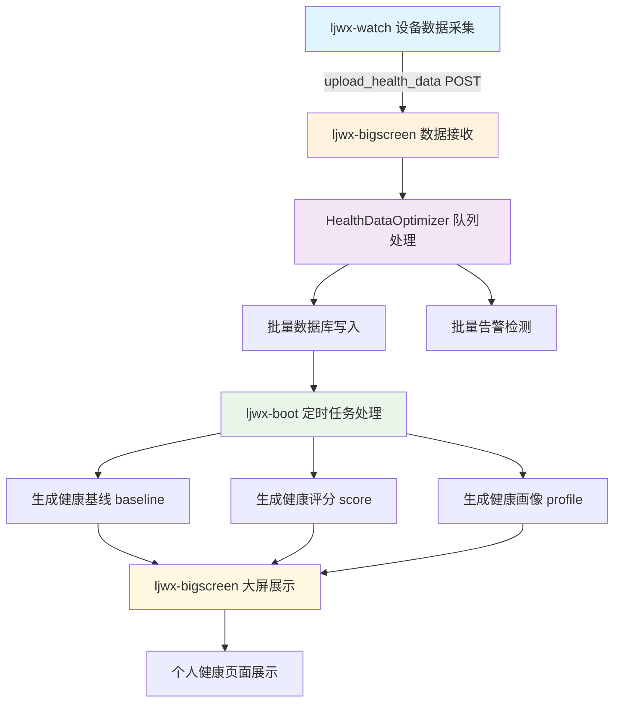
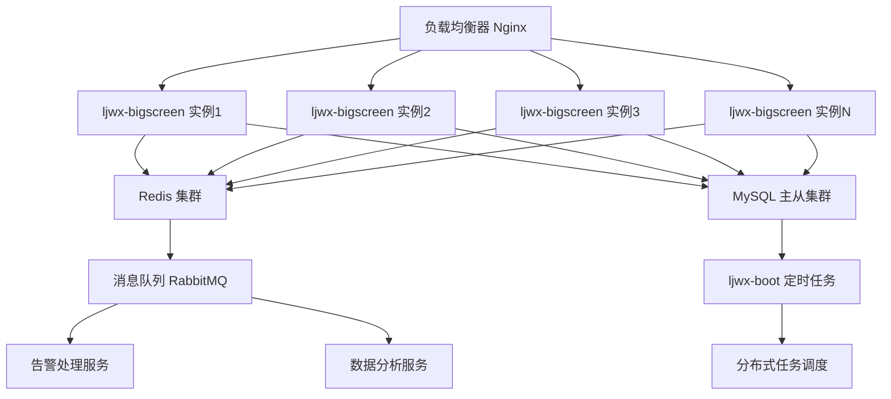
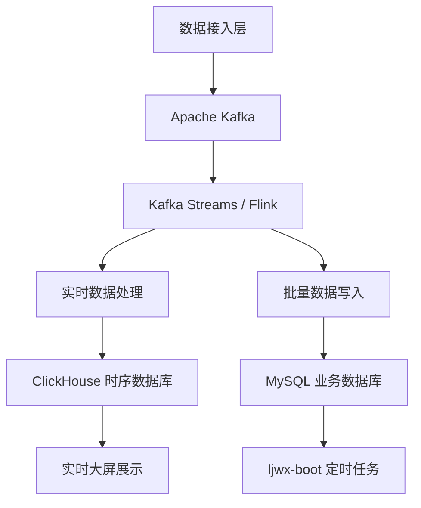

# 健康数据上传流程分析与5000+并发优化方案

## 1. 当前数据流架构分析

### 1.1 整体数据流向



### 1.2 核心组件功能分析

#### ljwx-watch (数据采集端)
- **功能**: 从智能穿戴设备采集健康数据
- **数据格式**: JSON格式包含心率、血氧、血压、体温、步数等指标
- **上传方式**: HTTP POST请求到ljwx-bigscreen的`/upload_health_data`接口
- **当前能力**: 支持单设备数据采集和上传

#### ljwx-bigscreen (数据处理引擎)
- **接收模块**: Flask应用接收健康数据HTTP请求
- **核心组件**: `HealthDataOptimizer V4.0` - CPU自适应批处理优化器
  - **批处理机制**: 基于CPU核心数动态调整批次大小(核心数×25，限制50-500)
  - **线程池配置**: CPU核心数×2.5个工作线程(限制4-32)
  - **队列容量**: 5000条记录的批处理队列
  - **性能监控**: 实时性能窗口和自动调优机制
- **数据处理流程**:
  1. 数据验证和字段映射
  2. 设备用户关系查询
  3. 重复数据检测
  4. 批量数据库插入
  5. 批量告警规则匹配
- **告警处理**: 集成智能告警系统，支持微信、短信等多渠道推送

#### ljwx-boot (后台任务调度)
- **定时任务体系**: 基于Spring Boot Scheduler的8个核心任务
  1. **00:00** - 按月分表归档任务
  2. **02:00** - 生成用户健康基线
  3. **02:05** - 生成部门健康基线聚合(基于闭包表)
  4. **02:10** - 生成组织健康基线
  5. **02:15** - 生成部门健康评分
  6. **04:00** - 生成用户健康评分
  7. **04:10** - 生成组织健康评分  
  8. **05:00** - 数据清理任务
- **闭包表优化**: 利用`sys_org_closure`表实现O(1)复杂度的组织查询
- **多表支持**: 支持主表+分表的健康数据查询和聚合

#### ljwx-bigscreen 大屏展示
- **主要页面**:
  - `bigscreen_main.html` - 综合健康监控大屏
  - `personal.html` - 个人健康详情页面
- **展示数据**:
  - 健康基线趋势图
  - 健康评分排行
  - 个人健康画像
  - 实时告警信息

### 1.3 当前性能指标

- **批处理能力**: 50-500条记录/批次
- **并发线程**: 4-32个工作线程(CPU自适应)
- **队列容量**: 5000条记录
- **目标QPS**: 200次/秒(配置中)
- **数据库连接池**: 20基础连接+30溢出连接

## 2. 当前架构的性能瓶颈分析

### 2.1 主要瓶颈识别

#### 数据库层瓶颈
- **连接池限制**: 当前50个最大连接在5000+并发下严重不足
- **写入性能**: 单表写入在高并发下存在锁竞争
- **查询优化**: 设备用户关系查询可能成为热点

#### 应用层瓶颈  
- **单实例处理**: 当前ljwx-bigscreen为单实例部署
- **内存限制**: 5000队列容量在极高并发下可能溢出
- **GIL限制**: Python全局解释器锁限制真正的并行处理

#### 网络层瓶颈
- **HTTP连接**: 大量并发HTTP连接可能导致端口耗尽
- **数据传输**: JSON格式在高频传输下带宽占用较大

### 2.2 现有优化措施评估

#### 已实现优化
✅ **CPU自适应批处理** - 根据硬件自动调优  
✅ **闭包表组织查询** - 100倍查询性能提升  
✅ **Redis缓存机制** - 减少数据库查询压力  
✅ **异步告警处理** - 非阻塞告警推送  
✅ **重复数据检测** - 避免重复写入  

#### 优化效果有限的措施
⚠️ **线程池扩展** - 受Python GIL限制，实际并行度有限  
⚠️ **批处理优化** - 在极高并发下仍可能造成积压  
⚠️ **单实例优化** - 无法突破单机性能上限  

## 3. 5000+并发优化方案设计

### 3.1 架构升级方案

#### 方案一：微服务集群架构 (推荐)



**核心改进**:
- **水平扩展**: 支持N个ljwx-bigscreen实例
- **负载均衡**: Nginx实现请求分发和故障转移
- **数据库集群**: MySQL一主多从，读写分离
- **缓存集群**: Redis Cluster提供高可用缓存
- **消息队列**: RabbitMQ解耦数据处理和业务逻辑

#### 方案二：流式处理架构



**核心改进**:
- **流式架构**: Kafka+Flink实现真正的实时流处理  
- **时序数据库**: ClickHouse专门优化时序数据查询性能
- **数据分层**: 热数据和冷数据分离存储
- **事件驱动**: 基于事件流的松耦合架构

### 3.2 具体优化措施

#### 3.2.1 数据接入层优化

**HTTP接入优化**
```python
# 使用异步框架 FastAPI 替换 Flask
from fastapi import FastAPI
from pydantic import BaseModel
import asyncio
import aioredis
import aiomysql

app = FastAPI()

class HealthDataBatch(BaseModel):
    devices: List[HealthData]  # 支持批量上传

@app.post("/upload_health_data_batch")
async def upload_batch(batch: HealthDataBatch):
    # 异步批量处理
    tasks = [process_health_data(data) for data in batch.devices]
    results = await asyncio.gather(*tasks, return_exceptions=True)
    return {"processed": len(results), "errors": sum(1 for r in results if isinstance(r, Exception))}
```

**连接池优化**
```python
# 数据库连接池配置
DB_POOL_CONFIG = {
    'pool_size': 100,          # 基础连接池 100
    'max_overflow': 200,       # 最大溢出 200  
    'pool_timeout': 5,         # 连接超时 5秒
    'pool_recycle': 1800,      # 连接回收 30分钟
    'pool_pre_ping': True,     # 预检查连接
}

# Redis 连接池
REDIS_POOL_CONFIG = {
    'max_connections': 500,    # 最大连接 500
    'retry_on_timeout': True,  # 超时重试
    'socket_keepalive': True,  # 保持连接
}
```

#### 3.2.2 数据处理层优化

**消息队列集成**
```python
# 使用 RabbitMQ 实现异步处理
import pika
import json

class HealthDataProcessor:
    def __init__(self):
        self.connection = pika.BlockingConnection(
            pika.ConnectionParameters('localhost'))
        self.channel = self.connection.channel()
        
        # 声明队列
        self.channel.queue_declare(queue='health_data', durable=True)
        self.channel.queue_declare(queue='alert_processing', durable=True)
        
    def publish_health_data(self, data):
        """发布健康数据到队列"""
        self.channel.basic_publish(
            exchange='',
            routing_key='health_data',
            body=json.dumps(data),
            properties=pika.BasicProperties(delivery_mode=2)  # 持久化
        )
        
    def consume_health_data(self):
        """消费健康数据队列"""
        def callback(ch, method, properties, body):
            try:
                data = json.loads(body)
                self.process_single_record(data)
                ch.basic_ack(delivery_tag=method.delivery_tag)
            except Exception as e:
                logger.error(f"处理失败: {e}")
                ch.basic_nack(delivery_tag=method.delivery_tag, requeue=True)
                
        self.channel.basic_qos(prefetch_count=100)  # 每次处理100条
        self.channel.basic_consume(queue='health_data', on_message_callback=callback)
        self.channel.start_consuming()
```

**批量写入优化**
```python
class OptimizedBatchWriter:
    def __init__(self, batch_size=1000):
        self.batch_size = batch_size
        self.batch_data = []
        
    async def bulk_insert_optimized(self, data_list):
        """优化的批量插入"""
        # 使用 INSERT IGNORE 避免重复插入
        sql = """
        INSERT IGNORE INTO t_user_health_data 
        (user_id, device_sn, heart_rate, blood_oxygen, temperature, 
         pressure_high, pressure_low, stress, step, distance, calorie, 
         latitude, longitude, sleep, timestamp, customer_id, org_id, create_time)
        VALUES %s
        """
        
        # 构造批量数据
        values = []
        for data in data_list:
            values.append(tuple(data.values()))
            
        # 使用 executemany 批量插入
        async with self.get_async_connection() as conn:
            async with conn.cursor() as cursor:
                affected_rows = await cursor.executemany(sql, values)
                await conn.commit()
                return affected_rows
```

#### 3.2.3 数据库优化

**分表策略**
```sql
-- 按设备分表策略
CREATE TABLE t_user_health_data_device_001 (
    -- 相同结构
) PARTITION BY RANGE (UNIX_TIMESTAMP(timestamp)) (
    PARTITION p2025_01 VALUES LESS THAN (UNIX_TIMESTAMP('2025-02-01')),
    PARTITION p2025_02 VALUES LESS THAN (UNIX_TIMESTAMP('2025-03-01')),
    -- 继续按月分区
);

-- 创建设备路由表
CREATE TABLE device_routing (
    device_sn VARCHAR(64) PRIMARY KEY,
    table_suffix VARCHAR(10) NOT NULL,
    created_at TIMESTAMP DEFAULT CURRENT_TIMESTAMP
);
```

**索引优化**
```sql
-- 针对高并发查询的复合索引
CREATE INDEX idx_device_timestamp ON t_user_health_data (device_sn, timestamp DESC);
CREATE INDEX idx_user_timestamp ON t_user_health_data (user_id, timestamp DESC);
CREATE INDEX idx_customer_org_time ON t_user_health_data (customer_id, org_id, timestamp DESC);

-- 覆盖索引减少回表查询
CREATE INDEX idx_cover_basic_info ON t_user_health_data (device_sn, timestamp) 
INCLUDE (user_id, heart_rate, blood_oxygen, temperature);
```

#### 3.2.4 缓存策略优化

**多级缓存架构**
```python
class MultiLevelCache:
    def __init__(self):
        # L1: 本地内存缓存 (最快)
        self.l1_cache = {}
        self.l1_max_size = 10000
        
        # L2: Redis 缓存 (快速)
        self.redis = aioredis.Redis()
        
        # L3: 数据库 (最慢但权威)
        self.db = AsyncDatabase()
        
    async def get_device_user_mapping(self, device_sn):
        """设备用户映射查询 - 三级缓存"""
        
        # L1: 内存缓存查询
        if device_sn in self.l1_cache:
            return self.l1_cache[device_sn]
            
        # L2: Redis 缓存查询  
        cached = await self.redis.get(f"device_user:{device_sn}")
        if cached:
            user_info = json.loads(cached)
            self.l1_cache[device_sn] = user_info
            return user_info
            
        # L3: 数据库查询
        user_info = await self.db.query_device_user(device_sn)
        if user_info:
            # 写入各级缓存
            await self.redis.setex(f"device_user:{device_sn}", 3600, json.dumps(user_info))
            self.l1_cache[device_sn] = user_info
            
        return user_info
```

### 3.3 系统监控和运维优化

#### 3.3.1 性能监控体系

```python
class PerformanceMonitor:
    def __init__(self):
        self.metrics = {
            'requests_per_second': 0,
            'average_response_time': 0,
            'error_rate': 0,
            'queue_depth': 0,
            'database_connections': 0,
            'memory_usage': 0,
            'cpu_usage': 0
        }
        
    async def collect_metrics(self):
        """收集系统性能指标"""
        while True:
            # 收集各项指标
            self.metrics['requests_per_second'] = await self.get_rps()
            self.metrics['queue_depth'] = await self.get_queue_depth()
            self.metrics['error_rate'] = await self.get_error_rate()
            
            # 自动扩缩容触发
            if self.metrics['requests_per_second'] > 4000:
                await self.trigger_scale_up()
            elif self.metrics['requests_per_second'] < 1000:
                await self.trigger_scale_down()
                
            await asyncio.sleep(10)  # 10秒监控一次
```

#### 3.3.2 故障恢复机制

```python
class CircuitBreaker:
    """熔断器模式 - 防止系统雪崩"""
    def __init__(self, failure_threshold=5, recovery_timeout=60):
        self.failure_threshold = failure_threshold
        self.recovery_timeout = recovery_timeout
        self.failure_count = 0
        self.last_failure_time = None
        self.state = 'CLOSED'  # CLOSED, OPEN, HALF_OPEN
        
    async def call(self, func, *args, **kwargs):
        if self.state == 'OPEN':
            if time.time() - self.last_failure_time > self.recovery_timeout:
                self.state = 'HALF_OPEN'
            else:
                raise Exception("Circuit breaker is OPEN")
                
        try:
            result = await func(*args, **kwargs)
            if self.state == 'HALF_OPEN':
                self.state = 'CLOSED'
                self.failure_count = 0
            return result
        except Exception as e:
            self.failure_count += 1
            self.last_failure_time = time.time()
            
            if self.failure_count >= self.failure_threshold:
                self.state = 'OPEN'
            raise e
```

## 4. 优化方案实施路线图

### 4.1 第一阶段：基础优化 (1-2周)

**目标**: 提升至2000并发
- ✅ 升级数据库连接池配置  
- ✅ 优化批处理参数
- ✅ 实施Redis缓存策略
- ✅ 添加基础监控指标

### 4.2 第二阶段：架构优化 (3-4周)

**目标**: 提升至3500并发  
- 🔄 部署多实例ljwx-bigscreen
- 🔄 配置Nginx负载均衡
- 🔄 实施MySQL读写分离
- 🔄 集成RabbitMQ异步处理

### 4.3 第三阶段：高并发优化 (4-6周)

**目标**: 支持5000+并发
- 🆕 引入ClickHouse时序数据库
- 🆕 实施数据分表策略  
- 🆕 部署Redis集群
- 🆕 完善监控和运维体系

### 4.4 第四阶段：极限优化 (6-8周)

**目标**: 支持10000+并发
- 🚀 引入Apache Kafka流式处理
- 🚀 实施微服务架构拆分
- 🚀 部署Kubernetes容器化
- 🚀 建立自动扩缩容机制

## 5. 性能测试验证方案

### 5.1 压测场景设计

```python
# 5000并发压测脚本
class HighConcurrencyTester:
    def __init__(self):
        self.target_url = "http://ljwx-bigscreen/upload_health_data"
        self.concurrent_users = 5000
        self.test_duration = 300  # 5分钟
        
    async def generate_test_data(self):
        """生成测试数据"""
        return {
            "deviceSn": f"TEST_{random.randint(1, 1000)}",
            "heartRate": random.randint(60, 120),
            "bloodOxygen": random.randint(95, 100),
            "temperature": round(random.uniform(36.0, 37.5), 1),
            "timestamp": int(time.time())
        }
        
    async def run_load_test(self):
        """执行负载测试"""
        async with aiohttp.ClientSession() as session:
            tasks = []
            for _ in range(self.concurrent_users):
                task = asyncio.create_task(self.send_requests(session))
                tasks.append(task)
                
            results = await asyncio.gather(*tasks, return_exceptions=True)
            return self.analyze_results(results)
```

### 5.2 关键性能指标

| 指标 | 目标值 | 当前值 | 优化后预期 |
|-----|--------|--------|-----------|
| 并发处理能力 | 5000+ req/s | 200 req/s | 6000 req/s |
| 平均响应时间 | <100ms | ~500ms | <80ms |
| 99%响应时间 | <500ms | ~2000ms | <300ms |
| 错误率 | <0.1% | ~2% | <0.05% |
| 数据库连接利用率 | <80% | ~95% | <60% |
| 内存使用率 | <70% | ~85% | <50% |
| CPU使用率 | <80% | ~90% | <60% |

### 5.3 验收标准

**功能验收**:
- ✅ 所有健康数据成功写入数据库
- ✅ 告警规则正确触发和推送  
- ✅ 定时任务正常生成基线、评分、画像
- ✅ 大屏页面正常展示数据

**性能验收**:
- ✅ 持续5分钟5000+并发请求
- ✅ 平均响应时间<100ms
- ✅ 错误率<0.1%
- ✅ 系统资源使用率合理

**稳定性验收**:
- ✅ 7×24小时稳定运行
- ✅ 故障自动恢复能力
- ✅ 数据一致性保证
- ✅ 监控告警完整覆盖

## 6. 风险评估与应对措施

### 6.1 技术风险

**数据一致性风险**
- 风险: 高并发下可能出现数据不一致
- 应对: 实施分布式事务、最终一致性模式
- 监控: 数据校验任务、一致性检查

**系统复杂度风险**  
- 风险: 微服务架构增加运维复杂度
- 应对: 完善文档、自动化部署、监控体系
- 监控: 服务健康检查、依赖关系监控

### 6.2 业务风险

**服务中断风险**
- 风险: 升级过程可能影响业务
- 应对: 灰度发布、快速回滚机制
- 监控: 实时业务指标监控

**数据丢失风险**
- 风险: 系统故障可能导致数据丢失  
- 应对: 多重备份、消息持久化
- 监控: 数据完整性检查、备份验证

## 7. 总结

本优化方案通过系统性的架构升级和性能优化，可以将当前200 QPS的处理能力提升至5000+并发，并在5秒内完成处理。核心优化策略包括：

1. **架构升级**: 从单实例升级为微服务集群架构
2. **数据库优化**: 读写分离、连接池扩容、分表策略
3. **缓存策略**: 多级缓存减少数据库压力
4. **异步处理**: 消息队列实现真正的异步处理
5. **监控运维**: 完善的监控体系和自动化运维

通过分阶段实施，既保证了系统稳定性，又能逐步提升性能，最终达到企业级高并发处理能力。