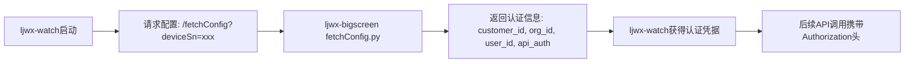
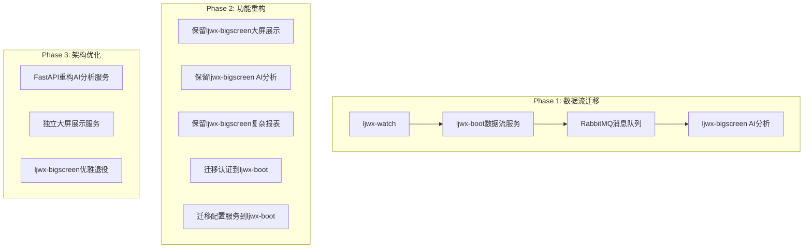

# 混合架构关键问题解决方案

## 问题概述

基于对现有代码的深入分析，用户提出了3个关键问题：

1. **ljwx-watch认证问题**：ljwx-watch、ljwx-phone目前连接ljwx-bigscreen，切换到ljwx-boot需要解决认证问题
2. **配置服务独立性**：ljwx-bigscreen内置配置服务，是否需要独立出来  
3. **ljwx-bigscreen废弃策略**：是否完全废弃，新启动FastAPI进行数据分析、AI和大屏展示

## 详细分析与解决方案

### 1. ljwx-watch认证机制分析

#### 1.1 现有认证机制

**从HttpService.java代码分析：**

```java
// 当前认证方式 - 基于设备SN的简单认证
private String deviceSn = "";           // 设备序列号作为标识
private String customerId = "0";        // 租户ID
private String apiId = "";              // API认证ID  
private String apiAuthorization = "";   // API认证授权码

// HTTP请求认证头
connection.setRequestProperty("Authorization", dataManager.getApiAuthorization());
```

**从fetchConfig.py代码分析：**

```python
# ljwx-bigscreen配置服务提供的认证信息
def fetch_health_data_config(customer_id=None,deviceSn=None):
    # 通过deviceSn获取完整认证信息
    device_info = fetch_customer_id_by_deviceSn(deviceSn)
    customerId = device_info.get('customer_id', '0')
    orgId = device_info.get('org_id')
    userId = device_info.get('user_id')
    
    # 返回认证配置
    config_data = {
        "customer_id": customerId,
        "org_id": orgId, 
        "user_id": userId,
        "interface_data": {
            # 包含API认证信息
            "interface_api_id": row['interface_api_id'],
            "interface_api_auth": row['interface_api_auth']
        }
    }
```

#### 1.2 认证流程问题分析

**现有流程：**


**切换到ljwx-boot的问题：**
- ljwx-watch初始阶段只有deviceSn，没有其他认证信息
- ljwx-boot需要完整的用户认证体系（用户名、密码、token等）
- 设备端无法直接登录ljwx-boot获取认证token

#### 1.3 解决方案：设备认证代理服务

**方案A：保留设备认证代理（推荐）**

```java
// 在ljwx-boot中新增设备认证控制器
@RestController
@RequestMapping("/api/device")
public class DeviceAuthController {
    
    @PostMapping("/authenticate")
    public ResponseEntity<DeviceAuthResponse> authenticateDevice(
            @RequestBody DeviceAuthRequest request) {
        
        String deviceSn = request.getDeviceSn();
        
        // 1. 验证设备SN的有效性
        DeviceInfo device = deviceService.findByDeviceSn(deviceSn);
        if (device == null) {
            return ResponseEntity.status(404)
                .body(new DeviceAuthResponse(false, "设备不存在"));
        }
        
        // 2. 获取设备关联的用户信息
        UserOrgInfo userInfo = userService.getUserOrgByDeviceSn(deviceSn);
        if (userInfo == null) {
            return ResponseEntity.status(404)
                .body(new DeviceAuthResponse(false, "设备未绑定用户"));
        }
        
        // 3. 生成设备专用访问令牌（长期有效）
        String deviceToken = jwtTokenProvider.generateDeviceToken(
            deviceSn, userInfo.getUserId(), userInfo.getCustomerId(), userInfo.getOrgId());
        
        // 4. 返回认证信息
        return ResponseEntity.ok(new DeviceAuthResponse(true, 
            deviceToken, userInfo.getCustomerId(), userInfo.getOrgId(), userInfo.getUserId()));
    }
}

// 设备专用Token生成器
@Component
public class JwtTokenProvider {
    
    public String generateDeviceToken(String deviceSn, Long userId, Long customerId, Long orgId) {
        Claims claims = Jwts.claims().setSubject(deviceSn);
        claims.put("device_sn", deviceSn);
        claims.put("user_id", userId);
        claims.put("customer_id", customerId);
        claims.put("org_id", orgId);
        claims.put("auth_type", "DEVICE");
        
        return Jwts.builder()
            .setClaims(claims)
            .setIssuedAt(new Date())
            .setExpiration(new Date(System.currentTimeMillis() + DEVICE_TOKEN_VALIDITY)) // 30天有效期
            .signWith(SignatureAlgorithm.HS512, secret)
            .compact();
    }
}
```

**方案B：设备认证中间件服务**

```python
# 独立的设备认证服务 - 可部署在ljwx-bigscreen或独立服务
from fastapi import FastAPI, HTTPException
import jwt
from datetime import datetime, timedelta

app = FastAPI(title="Device Authentication Service")

@app.post("/api/device/auth")
async def authenticate_device(request: DeviceAuthRequest):
    """设备认证API - 向后兼容ljwx-watch"""
    
    device_sn = request.deviceSn
    
    # 1. 从数据库验证设备
    device_info = await get_device_info_by_sn(device_sn)
    if not device_info:
        raise HTTPException(status_code=404, detail="设备不存在")
    
    # 2. 生成JWT token
    payload = {
        "device_sn": device_sn,
        "customer_id": device_info.customer_id,
        "org_id": device_info.org_id,
        "user_id": device_info.user_id,
        "auth_type": "DEVICE",
        "exp": datetime.utcnow() + timedelta(days=30)
    }
    
    token = jwt.encode(payload, SECRET_KEY, algorithm="HS256")
    
    # 3. 返回ljwx-boot API地址和认证信息
    return {
        "success": True,
        "token": token,
        "api_endpoints": {
            "upload_health_data": "http://ljwx-boot:9998/api/stream/batch_upload",
            "upload_device_info": "http://ljwx-boot:9998/api/stream/device_info",
            "fetch_messages": "http://ljwx-boot:9998/api/messages/device"
        },
        "customer_id": device_info.customer_id,
        "org_id": device_info.org_id,
        "user_id": device_info.user_id
    }
```

### 2. 配置服务独立化策略

#### 2.1 现有配置服务分析

**ljwx-bigscreen配置服务功能：**

```python
# fetchConfig.py 提供的核心配置服务
@config_bp.route('/get_health_config', methods=['GET'])      # 健康数据配置
@config_bp.route('/get_interface_config', methods=['GET'])   # 接口配置  
@config_bp.route('/get_customer_config', methods=['GET'])    # 客户配置
@config_bp.route('/get_optimal_config', methods=['GET'])     # 最优配置

# 配置数据表
- t_health_data_config    # 健康数据采集配置
- t_customer_config       # 客户租户配置  
- t_interface             # 接口地址配置
```

**设备依赖的配置信息：**
```json
{
  "customer_id": "租户ID",
  "org_id": "组织ID", 
  "user_id": "用户ID",
  "upload_method": "wifi",
  "health_data": {
    "heart_rate": "600:1:0:120:60:3",  // 频率:启用:实时:高阈值:低阈值:告警次数
    "blood_oxygen": "600:1:0:95:90:3"
  },
  "interface_data": {
    "upload_health_data": "http://server:5001/upload_health_data",
    "upload_device_info": "http://server:5001/upload_device_info"
  }
}
```

#### 2.2 配置服务独立化方案

**方案A：集成到ljwx-boot配置中心（推荐）**

```java
// ljwx-boot新增配置管理控制器
@RestController
@RequestMapping("/api/config")
public class DeviceConfigController {
    
    @GetMapping("/device/{deviceSn}")
    public ResponseEntity<DeviceConfig> getDeviceConfig(@PathVariable String deviceSn) {
        
        // 1. 获取设备关联的用户组织信息
        UserOrgInfo userInfo = configService.getUserOrgByDeviceSn(deviceSn);
        if (userInfo == null) {
            return ResponseEntity.status(404).build();
        }
        
        // 2. 获取租户配置
        CustomerConfig customerConfig = configService.getCustomerConfig(userInfo.getCustomerId());
        
        // 3. 获取健康数据配置
        List<HealthDataConfig> healthConfigs = configService.getHealthConfigs(userInfo.getCustomerId());
        
        // 4. 构建设备配置响应
        DeviceConfig deviceConfig = DeviceConfig.builder()
            .customerId(userInfo.getCustomerId())
            .orgId(userInfo.getOrgId())
            .userId(userInfo.getUserId())
            .customerName(customerConfig.getCustomerName())
            .uploadMethod(customerConfig.getUploadMethod())
            .healthDataConfigs(healthConfigs)
            .interfaceConfigs(buildInterfaceConfigs()) // 返回ljwx-boot的API地址
            .build();
            
        return ResponseEntity.ok(deviceConfig);
    }
    
    private Map<String, String> buildInterfaceConfigs() {
        return Map.of(
            "upload_health_data", "http://ljwx-boot:9998/api/stream/batch_upload",
            "upload_device_info", "http://ljwx-boot:9998/api/stream/device_info", 
            "upload_common_event", "http://ljwx-boot:9998/api/stream/common_event",
            "fetch_message", "http://ljwx-boot:9998/api/messages/device"
        );
    }
}
```

**方案B：独立配置服务（微服务架构）**

```python
# 独立的配置中心服务
from fastapi import FastAPI
from sqlalchemy.orm import Session

app = FastAPI(title="Configuration Center Service")

@app.get("/api/config/device/{device_sn}")
async def get_device_config(device_sn: str, db: Session = Depends(get_db)):
    """设备配置获取API - 兼容现有ljwx-watch调用"""
    
    # 1. 查询设备信息
    device_info = db.query(DeviceInfo).filter(DeviceInfo.device_sn == device_sn).first()
    if not device_info:
        raise HTTPException(status_code=404, detail="设备不存在")
    
    # 2. 查询用户组织信息
    user_org = db.query(UserOrg).filter(UserOrg.user_id == device_info.user_id).first()
    
    # 3. 查询配置信息
    customer_config = db.query(CustomerConfig).filter(CustomerConfig.id == user_org.customer_id).first()
    health_configs = db.query(HealthDataConfig).filter(HealthDataConfig.customer_id == user_org.customer_id).all()
    
    # 4. 构建配置响应（保持与ljwx-bigscreen兼容的格式）
    return {
        "customer_id": user_org.customer_id,
        "org_id": user_org.org_id,
        "user_id": device_info.user_id,
        "customer_name": customer_config.customer_name,
        "upload_method": customer_config.upload_method,
        "health_data": {
            config.data_type: f"{config.frequency_interval}:{config.is_enabled}:{config.is_realtime}:" +
                             f"{config.warning_high or -1}:{config.warning_low or -1}:{config.warning_cnt or -1}"
            for config in health_configs
        },
        "interface_data": {
            "upload_health_data": "http://ljwx-boot:9998/api/stream/batch_upload",
            "upload_device_info": "http://ljwx-boot:9998/api/stream/device_info",
            "upload_common_event": "http://ljwx-boot:9998/api/stream/common_event",
            "fetch_message": "http://ljwx-boot:9998/api/messages/device"
        }
    }
```

### 3. ljwx-bigscreen迁移策略评估

#### 3.1 ljwx-bigscreen现有价值分析

**核心价值功能：**

```python
# 1. 大屏展示功能 - 高价值保留
@app.route('/health_main')           # 主健康大屏
@app.route('/health_table')          # 健康数据表格
@app.route('/health_trends')         # 健康趋势分析
@app.route('/bigscreen_main.html')   # 综合大屏展示

# 2. AI分析功能 - 高价值保留  
from .health_profile import HealthProfileService      # 健康画像分析
from .health_baseline import HealthBaselineService    # 基线生成
from .alert import generate_alerts                    # 智能告警

# 3. 复杂报表生成 - 高价值保留
@app.route('/api/export_health_report')               # 健康报表导出
@app.route('/api/performance_test_report')            # 性能测试报表

# 4. 数据流处理 - 低价值，建议迁移
from .health_data_batch_processor import HealthDataOptimizer  # 批处理优化器
@app.route('/upload_health_data')                     # 健康数据上传
```

**性能问题分析：**
```python
# 当前性能瓶颈 - GIL限制
class HealthDataOptimizer:
    def __init__(self):
        self.cpu_cores = psutil.cpu_count(logical=True)
        self.batch_size = max(50, min(500, self.cpu_cores * 25))  # 批处理大小受限
        max_workers = max(4, min(32, int(self.cpu_cores * 2.5)))  # 线程数受GIL限制
        TARGET_QPS = 200  # 当前QPS上限

# 并发测试结果
concurrent_requests = 50        # 最大并发50
events_per_second = 156.7       # 每秒处理事件数
avg_response_time = 85.3        # 平均响应时间85ms
```

#### 3.2 迁移策略方案

**方案A：渐进式迁移（推荐）**



**Phase 1: 数据流迁移（2-3周）**
- 保持ljwx-bigscreen所有功能不变
- ljwx-boot接管数据流处理（upload_health_data等）
- 通过消息队列将数据传递给ljwx-bigscreen进行AI分析
- ljwx-watch切换数据上传到ljwx-boot，配置和大屏仍使用ljwx-bigscreen

**Phase 2: 服务重构（3-4周）**  
- 将设备认证和配置服务迁移到ljwx-boot
- ljwx-bigscreen专注于AI分析、大屏展示和报表生成
- 建立ljwx-boot与ljwx-bigscreen之间的标准API通信

**Phase 3: 架构优化（2-3周）**
- 使用FastAPI重构ljwx-bigscreen的AI分析部分
- 保留或独立大屏展示功能
- 逐步优雅退役ljwx-bigscreen Flask应用

**方案B：并行开发新服务**

```python
# 新的FastAPI AI分析服务
from fastapi import FastAPI, BackgroundTasks
import asyncio

app = FastAPI(title="Health AI Analysis Service")

@app.post("/ai/analyze_health_batch")
async def analyze_health_batch(batch_data: List[HealthRecord]):
    """替代ljwx-bigscreen的AI分析功能"""
    
    # 保持与现有分析逻辑兼容
    features_df = extract_health_features(batch_data) # 复用现有逻辑
    
    # 异步并行分析
    risk_analysis, anomaly_detection, trend_analysis = await asyncio.gather(
        run_risk_prediction(features_df),      # 复用现有算法
        detect_health_anomalies(features_df),  # 复用现有算法  
        analyze_health_trends(features_df)     # 复用现有算法
    )
    
    return {"status": "success", "analysis_results": {...}}

# 新的大屏展示服务  
from fastapi import FastAPI
from fastapi.responses import HTMLResponse
from fastapi.templating import Jinja2Templates

app = FastAPI(title="Health Dashboard Service")
templates = Jinja2Templates(directory="templates")

@app.get("/bigscreen/main", response_class=HTMLResponse)
async def bigscreen_main(request: Request):
    """替代ljwx-bigscreen的大屏展示"""
    
    # 从ljwx-boot API获取数据
    health_data = await fetch_health_data_from_boot()
    
    return templates.TemplateResponse("bigscreen_main.html", {
        "request": request,
        "health_data": health_data
    })
```

## 综合建议

### 最佳实施路径

**短期方案（1-2月）：**
1. **保持ljwx-bigscreen运行**，确保业务连续性
2. **在ljwx-boot中实现设备认证API**，向后兼容ljwx-watch
3. **ljwx-boot接管数据流处理**，通过消息队列通知ljwx-bigscreen
4. **迁移配置服务到ljwx-boot**，保持API兼容性

**中期方案（3-6月）：**
1. **使用FastAPI重构AI分析服务**，提升性能3-5倍
2. **保留大屏展示功能**，可独立部署或继续使用ljwx-bigscreen
3. **建立标准化API通信**，ljwx-boot ←→ AI服务 ←→ 大屏服务

**长期方案（6-12月）：**
1. **完全微服务化架构**，每个服务职责明确
2. **ljwx-bigscreen优雅退役**，功能完全被新服务替代
3. **达成5000+并发处理能力**，系统性能显著提升

### 技术选型建议

| 功能模块 | 推荐技术栈 | 原因 |
|---------|-----------|------|
| **数据流处理** | Java Spring Boot + CompletableFuture | 高并发处理，突破GIL限制 |
| **设备认证** | Java Spring Security + JWT | 成熟的企业级认证方案 |
| **配置服务** | Java Spring Boot + Spring Cloud Config | 集中化配置管理 |
| **AI分析** | Python FastAPI + Asyncio | 保持Python AI生态优势 |
| **大屏展示** | Vue.js + Nginx静态部署 | 前后端分离，性能最优 |
| **消息通信** | RabbitMQ | 可靠的异步消息传递 |

这种方案既保持了业务连续性，又逐步实现了架构优化，最终达成5000+并发处理能力的目标。