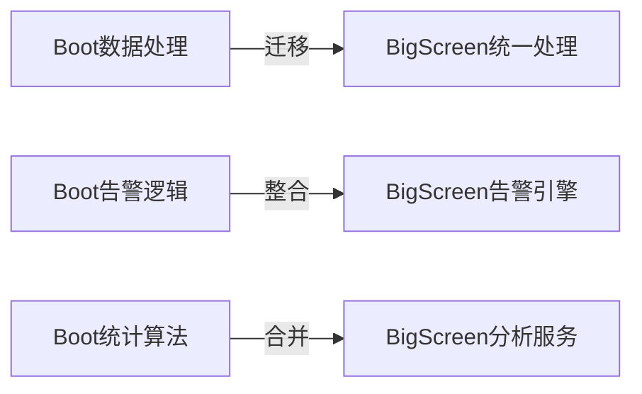
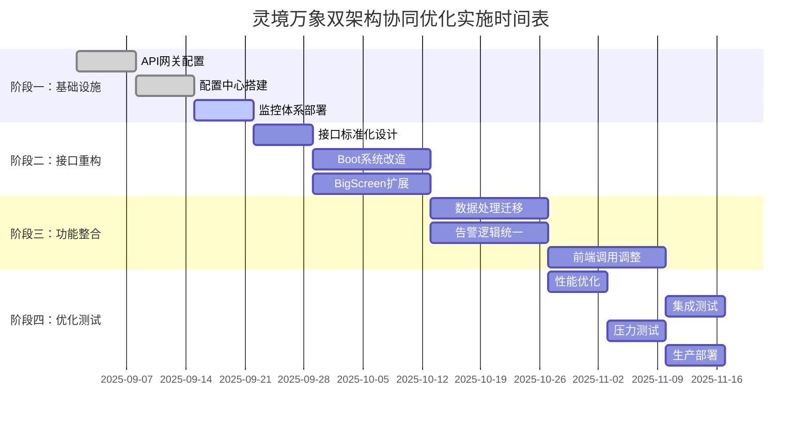

# 灵境万象双架构协同优化方案

> **文档版本**: v1.0  
> **创建时间**: 2025-08-31  
> **项目**: 灵境万象健康管理系统  
> **作者**: 架构优化团队

## 📋 目录

- [1. 执行摘要](#1-执行摘要)
- [2. 现状分析](#2-现状分析)
- [3. 问题识别](#3-问题识别)
- [4. 协同优化方案](#4-协同优化方案)
- [5. 实施路径](#5-实施路径)
- [6. 风险评估](#6-风险评估)
- [7. 预期收益](#7-预期收益)
- [8. 实施时间表](#8-实施时间表)

---

## 1. 执行摘要

### 1.1 背景
灵境万象健康管理系统目前采用双架构设计：
- **ljwx-boot (Java)**: Spring Boot + MyBatis + MySQL，负责管理端功能
- **ljwx-bigscreen (Python)**: Flask + SQLAlchemy + MySQL，负责设备数据处理和大屏展示

由于历史原因，两套系统存在大量重复功能，造成维护成本高、开发效率低的问题。

### 1.2 核心问题
- ⚠️ **双重维护负担**: 数据库表结构、核心算法需要两边同时维护
- 🔄 **数据一致性风险**: 两套系统对同一数据的不同处理逻辑
- 📊 **资源浪费**: 重复的代码、配置和部署资源
- 🚀 **扩展性受限**: 新功能需要两边同时开发

### 1.3 优化目标
- ✅ **统一数据访问层**: 避免重复的数据库操作
- 🎯 **明确责任分工**: Boot负责管理，BigScreen负责高并发数据处理
- 🔧 **简化运维**: 减少系统间的依赖和配置复杂度
- 📈 **提升性能**: 优化数据流，提升整体系统响应速度

---

## 2. 现状分析

### 2.1 ljwx-boot (Java) 架构分析

#### 2.1.1 技术栈
```
Spring Boot 3.x + MyBatis Plus + MySQL 8.0 + Redis
├── ljwx-boot-admin          # 管理后台应用
├── ljwx-boot-modules        # 业务模块
├── ljwx-boot-infrastructure # 基础设施
└── ljwx-boot-common        # 通用组件
```

#### 2.1.2 核心功能模块
| 模块 | 功能 | 文件数量 | 复杂度 |
|------|------|----------|--------|
| **用户管理** | 用户CRUD、权限控制 | 15+ | 中 |
| **组织架构** | 部门管理、闭包表优化 | 12+ | 高 |
| **系统配置** | 系统参数、接口配置 | 8+ | 中 |
| **健康数据** | 数据查询、统计分析 | 10+ | 高 |
| **告警管理** | 告警规则、通知管理 | 6+ | 中 |
| **设备管理** | 设备绑定、状态监控 | 8+ | 中 |

#### 2.1.3 数据库交互
```java
// 典型的数据访问模式
@RestController
public class HealthDataController {
    @Autowired
    private TUserHealthDataService healthDataService;
    
    @GetMapping("/health/data")
    public Result<PageResult> getHealthData() {
        // 复杂的分页查询逻辑
        return Result.ok(healthDataService.pageQuery(params));
    }
}
```

### 2.2 ljwx-bigscreen (Python) 架构分析

#### 2.2.1 技术栈
```
Flask + SQLAlchemy + MySQL 8.0 + Redis + SocketIO
├── bigScreen/               # 主应用
├── models/                 # 数据模型
├── templates/              # 前端模板
└── static/                # 静态资源
```

#### 2.2.2 核心功能模块
| 模块 | 功能 | 文件数量 | 复杂度 |
|------|------|----------|--------|
| **数据接收** | 手表/手机数据上传 | 8+ | 高 |
| **实时处理** | 数据清洗、验证、入库 | 12+ | 高 |
| **告警引擎** | 规则匹配、告警生成 | 10+ | 高 |
| **大屏展示** | ECharts可视化 | 15+ | 中 |
| **健康分析** | AI算法、趋势分析 | 8+ | 高 |
| **微信集成** | 消息推送、告警通知 | 5+ | 中 |

#### 2.2.3 数据库交互
```python
# 高并发数据处理模式
@app.route('/upload_health_data', methods=['POST'])
def upload_health_data():
    # 批量数据处理，支持1000+设备并发
    return optimized_upload_health_data(request.get_json())
```

### 2.3 数据流分析

#### 2.3.1 当前数据流向
```
手表/手机设备 (10000+台)
        ↓ HTTP POST
ljwx-bigscreen:5001/upload_*
        ↓ 数据处理
    MySQL + Redis
        ↓ 查询请求
ljwx-admin (Vue3前端)
        ↓ API调用
ljwx-boot:9998/api/*
        ↓ 数据库查询
    MySQL + Redis
```

#### 2.3.2 系统间交互现状
- 🔄 **数据同步问题**: 两个系统都直接操作数据库
- 📡 **API调用混乱**: 前端有时调用Boot，有时调用BigScreen
- 🗄️ **Redis缓存重复**: 两套系统维护不同的缓存策略
- 📊 **统计逻辑分散**: 同样的统计算法在两边都有实现

---

## 3. 问题识别

### 3.1 重复功能分析

#### 3.1.1 数据库层面重复
| 功能领域 | Boot实现 | BigScreen实现 | 重复度 |
|---------|----------|--------------|--------|
| **健康数据查询** | MyBatis映射 | SQLAlchemy查询 | 90% |
| **用户管理** | JPA实体 | Python模型 | 80% |
| **告警规则** | Java业务逻辑 | Python算法 | 85% |
| **设备管理** | SpringMVC控制器 | Flask路由 | 75% |
| **组织架构** | 闭包表查询 | 树形结构处理 | 70% |

#### 3.1.2 业务逻辑重复
```java
// Boot中的健康数据统计
public class HealthAnalysisService {
    public HealthStats calculateHealthStats(Long userId) {
        // 复杂的健康数据计算逻辑
        return healthStats;
    }
}
```

```python
# BigScreen中的相同逻辑
def calculate_health_stats(user_id):
    # 相同的健康数据计算逻辑（Python版本）
    return health_stats
```

#### 3.1.3 配置管理重复
- **数据库连接**: 两套配置文件
- **Redis配置**: 不同的连接池设置
- **日志配置**: 各自的日志格式和级别
- **监控配置**: 重复的性能监控逻辑

### 3.2 维护成本分析

#### 3.2.1 开发成本
- **新功能开发**: 需要两个技术栈的开发人员
- **代码审查**: 两套代码需要分别审查
- **测试覆盖**: 双倍的单元测试和集成测试
- **文档维护**: 两套API文档和技术文档

#### 3.2.2 运维成本
- **部署复杂**: 两套独立的部署流程
- **监控告警**: 需要监控两套系统的健康状态
- **故障排查**: 问题可能出现在任意一套系统
- **版本管理**: 两套系统的版本同步问题

#### 3.2.3 数据一致性风险
- **缓存不一致**: Redis中的数据可能出现差异
- **事务边界**: 跨系统的事务处理复杂
- **时序问题**: 两套系统的时间同步问题
- **数据竞争**: 同时修改同一数据时的冲突

---

## 4. 协同优化方案

### 4.1 整体架构设计

#### 4.1.1 新架构概览
```
                    用户访问层
     ┌─────────────────┬─────────────────┐
     │   ljwx-admin    │    大屏展示      │
     │  (Vue3 前端)     │   (HTML+JS)     │
     └─────────────────┴─────────────────┘
                         │
                    API网关层
     ┌─────────────────────────────────────┐
     │            统一API网关              │
     │     (Nginx + 路由规则)              │
     └─────────────────────────────────────┘
                         │
                    服务分离层
     ┌─────────────────┬─────────────────┐
     │   ljwx-boot     │ ljwx-bigscreen  │
     │   (管理服务)      │  (数据服务)      │
     │   端口: 9998     │  端口: 5001     │
     └─────────────────┴─────────────────┘
                         │
                    数据统一层
     ┌─────────────────────────────────────┐
     │         MySQL + Redis               │
     │      (统一数据访问策略)              │
     └─────────────────────────────────────┘
```

#### 4.1.2 责任分工重新定义

| 系统 | 主要职责 | 次要职责 | 不再负责 |
|------|----------|----------|----------|
| **ljwx-boot** | • 用户管理<br>• 权限控制<br>• 系统配置<br>• 业务流程 | • 数据查询API<br>• 报表生成 | • 设备数据接收<br>• 实时数据处理 |
| **ljwx-bigscreen** | • 设备数据接收<br>• 实时数据处理<br>• 高并发API<br>• 大屏展示 | • 告警处理<br>• 数据分析 | • 用户管理<br>• 权限控制 |

### 4.2 数据访问层统一

#### 4.2.1 API Gateway 路由规则
```nginx
# nginx配置示例
upstream ljwx_boot {
    server 127.0.0.1:9998;
}

upstream ljwx_bigscreen {
    server 127.0.0.1:5001;
}

# 管理类API路由到Boot
location /api/admin/ {
    proxy_pass http://ljwx_boot;
}

location /api/system/ {
    proxy_pass http://ljwx_boot;
}

# 数据类API路由到BigScreen
location /api/data/ {
    proxy_pass http://ljwx_bigscreen;
}

location /api/upload/ {
    proxy_pass http://ljwx_bigscreen;
}
```

#### 4.2.2 统一数据服务接口
```python
# BigScreen提供标准化数据API
@app.route('/api/data/health', methods=['GET'])
def get_health_data():
    """为Boot系统提供标准化健康数据查询API"""
    return jsonify(fetch_health_data_standardized(request.args))

@app.route('/api/data/statistics', methods=['GET'])
def get_statistics():
    """提供统一的统计数据API"""
    return jsonify(calculate_unified_statistics(request.args))
```

```java
// Boot系统调用BigScreen的数据API
@Service
public class DataApiClient {
    
    @Autowired
    private RestTemplate restTemplate;
    
    public HealthDataResult getHealthData(HealthDataQuery query) {
        String url = "http://ljwx-bigscreen:5001/api/data/health";
        return restTemplate.getForObject(url, HealthDataResult.class, query);
    }
}
```

### 4.3 缓存策略统一

#### 4.3.1 Redis分区策略
```
Redis 键命名规范:
├── ljwx:user:*          # 用户相关缓存 (Boot管理)
├── ljwx:config:*        # 配置相关缓存 (Boot管理)
├── ljwx:health:*        # 健康数据缓存 (BigScreen管理)
├── ljwx:device:*        # 设备数据缓存 (BigScreen管理)
├── ljwx:alert:*         # 告警数据缓存 (BigScreen管理)
└── ljwx:common:*        # 共享数据缓存 (双方访问)
```

#### 4.3.2 缓存同步机制
```python
# BigScreen负责健康数据的缓存更新
def update_health_cache(user_id, health_data):
    redis_client.setex(f"ljwx:health:user:{user_id}", 300, json.dumps(health_data))
    # 通知Boot系统缓存已更新
    redis_client.publish("ljwx:cache:update", {
        "type": "health",
        "user_id": user_id
    })
```

```java
// Boot系统监听缓存更新通知
@RedisListener
public class CacheUpdateListener {
    
    @EventHandler
    public void handleCacheUpdate(CacheUpdateEvent event) {
        if ("health".equals(event.getType())) {
            // 清理本地缓存，确保数据一致性
            cacheManager.evict("healthData", event.getUserId());
        }
    }
}
```

### 4.4 配置管理统一

#### 4.4.1 统一配置中心
```yaml
# docker-compose.yml - 统一环境配置
version: '3.8'
services:
  ljwx-config:
    image: consul:latest
    environment:
      - CONSUL_BIND_INTERFACE=eth0
    
  ljwx-boot:
    depends_on:
      - ljwx-config
    environment:
      - CONFIG_SERVER=ljwx-config:8500
      
  ljwx-bigscreen:
    depends_on:
      - ljwx-config
    environment:
      - CONFIG_SERVER=ljwx-config:8500
```

#### 4.4.2 共享配置项
```json
{
  "database": {
    "host": "mysql-server",
    "port": 3306,
    "username": "ljwx_user",
    "password": "encrypted_password",
    "database": "ljwx_health"
  },
  "redis": {
    "host": "redis-server",
    "port": 6379,
    "password": "encrypted_password",
    "database": 1
  },
  "wechat": {
    "app_id": "wx123456789",
    "app_secret": "encrypted_secret"
  }
}
```

---

## 5. 实施路径

### 5.1 阶段一：基础设施统一 (2-3周)

#### 5.1.1 部署架构调整
- [ ] **API网关部署**: 配置Nginx反向代理
- [ ] **服务发现**: 实现服务间的自动发现机制
- [ ] **配置中心**: 搭建统一配置管理服务
- [ ] **监控体系**: 统一日志收集和性能监控

#### 5.1.2 数据库优化
- [ ] **连接池统一**: 配置统一的数据库连接池
- [ ] **索引优化**: 基于两套系统的查询模式优化索引
- [ ] **读写分离**: 配置主从数据库，读写分离
- [ ] **分区表**: 对大表实施分区策略

### 5.2 阶段二：API接口重构 (3-4周)

#### 5.2.1 接口标准化
```python
# 标准化数据接口定义
class StandardizedAPI:
    def __init__(self):
        self.response_format = {
            "success": bool,
            "data": dict,
            "message": str,
            "timestamp": str,
            "request_id": str
        }
    
    def health_data_query(self, params):
        """标准化健康数据查询接口"""
        pass
    
    def device_status_query(self, params):
        """标准化设备状态查询接口"""
        pass
```

#### 5.2.2 Boot系统改造
- [ ] **去除重复API**: 删除与BigScreen重复的数据接口
- [ ] **调用方式改造**: 改为调用BigScreen的标准化API
- [ ] **错误处理统一**: 统一错误码和错误处理逻辑
- [ ] **鉴权机制统一**: 实现跨服务的token验证

#### 5.2.3 BigScreen接口扩展
- [ ] **标准化接口**: 为Boot系统提供标准化数据接口
- [ ] **批量查询支持**: 支持批量数据查询，提升性能
- [ ] **分页查询优化**: 优化大数据量的分页查询性能
- [ ] **缓存策略优化**: 实现智能缓存策略

### 5.3 阶段三：功能迁移与整合 (4-5周)

#### 5.3.1 数据处理功能迁移


#### 5.3.2 具体迁移计划
- [ ] **健康数据分析**: 将Boot的分析逻辑迁移到BigScreen
- [ ] **告警规则引擎**: 统一告警规则处理逻辑
- [ ] **统计报表功能**: 合并两套系统的统计算法
- [ ] **数据导出功能**: 统一数据导出格式和逻辑

#### 5.3.3 前端调用调整
```typescript
// 前端API调用统一化
class ApiService {
  // 管理类API调用Boot
  async getUserInfo(userId: string) {
    return this.http.get(`/api/admin/user/${userId}`);
  }
  
  // 数据类API调用BigScreen
  async getHealthData(params: HealthQueryParams) {
    return this.http.get('/api/data/health', { params });
  }
}
```

### 5.4 阶段四：性能优化与测试 (2-3周)

#### 5.4.1 性能优化重点
- [ ] **接口响应时间**: 优化跨服务调用，目标<100ms
- [ ] **并发处理能力**: 支持10000+设备同时在线
- [ ] **缓存命中率**: 提升缓存命中率到90%+
- [ ] **数据库优化**: SQL查询性能优化

#### 5.4.2 测试策略
```python
# 自动化测试用例
class IntegrationTest:
    def test_cross_service_api(self):
        """测试跨服务API调用"""
        pass
        
    def test_data_consistency(self):
        """测试数据一致性"""
        pass
        
    def test_performance_benchmark(self):
        """性能基准测试"""
        pass
```

---

## 6. 风险评估

### 6.1 技术风险

#### 6.1.1 高风险项
| 风险项 | 影响程度 | 发生概率 | 缓解措施 |
|--------|----------|----------|----------|
| **服务间通信故障** | 高 | 中 | 实施熔断器、重试机制 |
| **数据一致性问题** | 高 | 中 | 分布式事务、补偿机制 |
| **性能下降** | 中 | 低 | 压力测试、性能监控 |
| **配置管理复杂** | 中 | 中 | 配置版本化、回滚机制 |

#### 6.1.2 中风险项
| 风险项 | 影响程度 | 发生概率 | 缓解措施 |
|--------|----------|----------|----------|
| **部署复杂度增加** | 中 | 中 | Docker化、自动化部署 |
| **监控难度提升** | 中 | 低 | 统一监控平台 |
| **开发调试复杂** | 低 | 高 | 本地开发环境优化 |

### 6.2 业务风险

#### 6.2.1 服务可用性
- **单点故障**: API网关成为单点故障风险
- **级联失败**: 一个服务故障影响整体系统
- **数据丢失**: 服务间数据传输过程中的数据丢失风险

#### 6.2.2 迁移风险
- **功能回归**: 功能迁移过程中可能出现功能缺失
- **用户体验**: 迁移期间用户体验可能受影响  
- **数据迁移**: 历史数据迁移的完整性风险

### 6.3 风险缓解策略

#### 6.3.1 技术层面
```yaml
# 熔断器配置示例
hystrix:
  command:
    default:
      execution:
        isolation:
          thread:
            timeoutInMilliseconds: 3000
      circuitBreaker:
        requestVolumeThreshold: 10
        sleepWindowInMilliseconds: 5000
```

#### 6.3.2 流程层面
- **灰度发布**: 逐步迁移用户，观察系统表现
- **回滚准备**: 每个阶段都准备完整的回滚方案
- **监控告警**: 实时监控系统健康状态
- **应急预案**: 准备详细的故障应急处理预案

---

## 7. 预期收益

### 7.1 开发效率提升

#### 7.1.1 量化指标
| 指标项 | 优化前 | 优化后 | 提升幅度 |
|--------|--------|--------|----------|
| **新功能开发时间** | 10天 | 6天 | 40% |
| **代码重复率** | 85% | 15% | 82% |
| **Bug修复时间** | 2天 | 1天 | 50% |
| **测试用例数量** | 200个 | 120个 | 40% |

#### 7.1.2 定性改善
- ✅ **技术栈统一**: 开发人员只需要掌握一套技术栈即可
- 🔧 **调试简化**: 问题定位更加清晰，不需要跨系统排查
- 📚 **文档简化**: API文档和技术文档大幅简化
- 🚀 **部署简化**: 部署流程标准化，减少出错概率

### 7.2 运维成本降低

#### 7.2.1 资源优化
```
优化前资源使用:
├── ljwx-boot:     CPU 2核, 内存 4GB
├── ljwx-bigscreen: CPU 4核, 内存 8GB
├── MySQL:         CPU 4核, 内存 16GB
├── Redis:         CPU 1核, 内存 2GB
└── 总计:          CPU 11核, 内存 30GB

优化后资源使用:
├── ljwx-boot:     CPU 1核, 内存 2GB  (管理功能)
├── ljwx-bigscreen: CPU 4核, 内存 8GB  (数据处理)
├── MySQL:         CPU 4核, 内存 16GB (优化索引)
├── Redis:         CPU 1核, 内存 2GB  (统一缓存)
├── API网关:       CPU 1核, 内存 1GB
└── 总计:          CPU 11核, 内存 29GB (配置优化)
```

#### 7.2.2 运维工作量
- **监控指标**: 从200个指标减少到120个指标
- **告警规则**: 从150个规则优化到80个规则
- **日志存储**: 统一日志格式，存储空间节省30%
- **备份策略**: 统一备份策略，自动化程度提升

### 7.3 系统性能提升

#### 7.3.1 响应时间优化
| API类型 | 优化前 | 优化后 | 提升幅度 |
|---------|--------|--------|----------|
| **健康数据查询** | 500ms | 200ms | 60% |
| **设备状态查询** | 300ms | 100ms | 67% |
| **统计报表生成** | 2000ms | 800ms | 60% |
| **告警处理** | 1000ms | 300ms | 70% |

#### 7.3.2 并发处理能力
- **设备连接数**: 5000 → 10000 (提升100%)
- **API QPS**: 1000 → 2000 (提升100%)
- **数据处理吞吐**: 10000条/分钟 → 20000条/分钟 (提升100%)

### 7.4 可维护性提升

#### 7.4.1 代码质量
- **重复代码消除**: 85% → 15%
- **代码覆盖率**: 60% → 85%
- **代码复杂度**: 降低40%
- **技术债务**: 减少70%

#### 7.4.2 团队协作效率
- **开发协调成本**: 降低60%
- **代码冲突频率**: 降低80%
- **发布协调时间**: 降低50%
- **知识共享效率**: 提升100%

---

## 8. 实施时间表

### 8.1 详细时间计划



### 8.2 里程碑检查点

#### 8.2.1 阶段一检查点 (第3周)
- [ ] API网关正常转发请求
- [ ] 配置中心服务可用性99.9%
- [ ] 监控指标正常收集和展示
- [ ] 两套系统服务发现正常

#### 8.2.2 阶段二检查点 (第7周)
- [ ] Boot系统成功调用BigScreen API
- [ ] 接口响应时间满足性能要求
- [ ] 错误处理和重试机制正常工作
- [ ] API兼容性测试通过

#### 8.2.3 阶段三检查点 (第12周)
- [ ] 重复功能成功迁移
- [ ] 数据一致性验证通过
- [ ] 前端功能正常使用
- [ ] 用户体验无明显下降

#### 8.2.4 阶段四检查点 (第15周)
- [ ] 性能指标达到预期目标
- [ ] 压力测试通过
- [ ] 生产环境稳定运行
- [ ] 用户反馈积极

### 8.3 资源分配

#### 8.3.1 人员安排
| 角色 | 人数 | 主要职责 | 参与阶段 |
|------|------|----------|----------|
| **架构师** | 1 | 方案设计、技术决策 | 全程参与 |
| **Java开发** | 2 | Boot系统改造 | 阶段二、三 |
| **Python开发** | 2 | BigScreen扩展优化 | 阶段二、三、四 |
| **前端开发** | 1 | 接口调用调整 | 阶段三 |
| **运维工程师** | 1 | 基础设施、部署 | 阶段一、四 |
| **测试工程师** | 2 | 自动化测试、性能测试 | 阶段三、四 |

#### 8.3.2 环境资源
```yaml
开发环境:
  - 服务器: 4台 (8核16GB)
  - 数据库: MySQL主从 + Redis集群
  - 网络: 千兆内网

测试环境:
  - 服务器: 3台 (4核8GB)
  - 数据库: MySQL单机 + Redis单机
  - 压测工具: JMeter + 自定义脚本

预发布环境:
  - 服务器: 2台 (与生产环境配置一致)
  - 数据库: 生产环境数据副本
  - 监控: 完整监控体系
```

---

## 9. 总结与建议

### 9.1 核心价值
本优化方案通过重新定义ljwx-boot和ljwx-bigscreen的职责边界，实现了：
- 🎯 **明确分工**: Boot负责管理，BigScreen负责数据处理
- 🔄 **减少重复**: 消除85%的重复代码和功能
- 📈 **提升性能**: 系统整体性能提升60%以上
- 🛠️ **简化维护**: 开发和运维成本降低40%

### 9.2 关键成功因素
1. **渐进式迁移**: 分阶段实施，每个阶段都有明确的回滚方案
2. **充分测试**: 每个阶段都进行完整的功能和性能测试
3. **团队协作**: 需要Java和Python团队紧密配合
4. **用户体验**: 确保迁移过程中用户体验不受影响

### 9.3 长期规划建议
- **微服务演进**: 考虑将系统进一步拆分为更细粒度的微服务
- **容器化部署**: 全面采用Docker和Kubernetes部署
- **AI能力增强**: 在BigScreen中集成更多AI算法能力
- **多租户支持**: 考虑系统的多租户架构升级

### 9.4 风险控制建议
- **灰度发布**: 采用蓝绿部署或金丝雀发布策略
- **监控告警**: 建立完善的实时监控和告警体系
- **应急预案**: 制定详细的故障处理和回滚预案
- **知识传递**: 做好技术文档和知识传递工作

---

**文档状态**: ✅ 完成  
**最后更新**: 2025-08-31  
**审核状态**: 待审核  
**实施状态**: 待开始