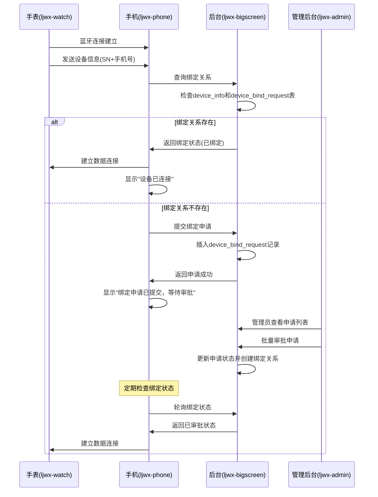

# 用户绑定设备整体解决方案

## 1. 方案概述

本方案实现手表通过蓝牙连接手机时的设备绑定流程，包含设备信息验证、绑定申请、管理员审批等完整流程。

### 核心流程
1. **手表蓝牙连接** → 发送设备信息(设备序列号+手机号码)
2. **手机端接收** → 查询绑定关系
3. **绑定判断** → 存在绑定/申请审批/建立连接
4. **管理员审批** → 批量处理绑定申请

## 2. 系统架构

### 2.1 组件关系图
```
┌─────────────┐    蓝牙连接    ┌─────────────┐    HTTP请求    ┌─────────────┐
│   ljwx-watch│ ────────────► │ ljwx-phone  │ ────────────► │ljwx-bigscreen│
│   (手表端)   │              │  (手机端)    │              │  (后台服务)  │
└─────────────┘              └─────────────┘              └─────────────┘
                                     │                             │
                                     │        HTTP请求              │
                                     └─────────────────────────────┤
                                                                  │
                                                            ┌─────▼─────┐
                                                            │ ljwx-admin │
                                                            │ (管理后台) │
                                                            └───────────┘
```

### 2.2 数据流向
```
手表设备信息 → 手机蓝牙服务 → 后台API → 数据库查询 → 响应处理 → 用户界面
```

## 3. 详细实现方案

### 3.1 手表端(ljwx-watch)实现

#### 关键修改点
- **BluetoothService.java** - 蓝牙服务管理
- **HealthDataService.java** - 数据上传服务
- **HttpService.java** - HTTP请求服务

#### 实现逻辑
```java
// 蓝牙连接成功后立即发送设备信息
public void onBluetoothConnected() {
    // 构建设备信息包
    DeviceInfo deviceInfo = new DeviceInfo();
    deviceInfo.setSerialNumber(getDeviceSerialNumber());
    deviceInfo.setPhoneNumber(getConnectedPhoneNumber());
    deviceInfo.setTimestamp(System.currentTimeMillis());
    
    // 通过蓝牙发送到手机
    sendDeviceInfoToPhone(deviceInfo);
}
```

### 3.2 手机端(ljwx-phone)实现

#### 核心文件修改
- **lib/services/bluetooth_service.dart** - 蓝牙服务
- **lib/services/api_service.dart** - API接口服务  
- **lib/screens/device_details_screen.dart** - 设备详情界面

#### 蓝牙数据接收处理
```dart
class BluetoothService {
  // 接收手表设备信息
  void _handleDeviceInfo(Map<String, dynamic> deviceInfo) async {
    String serialNumber = deviceInfo['serial_number'];
    String phoneNumber = deviceInfo['phone_number'];
    
    // 查询绑定关系
    var bindingStatus = await ApiService().checkDeviceBinding(
      serialNumber: serialNumber,
      phoneNumber: phoneNumber
    );
    
    if (bindingStatus['exists']) {
      // 绑定关系存在 - 直接建立连接
      _establishConnection();
      _showBindingSuccess();
    } else {
      // 绑定关系不存在 - 提交申请
      await _submitBindingApplication(serialNumber, phoneNumber);
      _showBindingPending();
    }
  }
  
  // 提交绑定申请
  Future<void> _submitBindingApplication(String sn, String phone) async {
    try {
      var result = await ApiService().submitDeviceBindingApplication({
        'device_sn': sn,
        'phone_number': phone,
        'user_id': Global.currentUserId,
        'timestamp': DateTime.now().toIso8601String()
      });
      
      if (result['success']) {
        log('绑定申请提交成功');
      }
    } catch (e) {
      log('提交绑定申请失败: $e');
    }
  }
}
```

#### 用户界面提示
```dart
class DeviceDetailsScreen extends StatefulWidget {
  void _showBindingStatus(String status) {
    switch (status) {
      case 'connected':
        _showSuccessDialog('设备已成功绑定并连接');
        break;
      case 'pending':
        _showInfoDialog('绑定申请已提交，等待管理员审批');
        break;
      case 'rejected':
        _showErrorDialog('绑定申请被拒绝，请联系管理员');
        break;
    }
  }
}
```

### 3.3 后台服务(ljwx-bigscreen)实现

#### 新增API接口
**文件：bigscreen/bigScreen/device_bind.py**

```python
from flask import Blueprint, request, jsonify
from .models import db, DeviceInfo, DeviceUser, DeviceBindRequest

device_bind_bp = Blueprint('device_bind', __name__)

@device_bind_bp.route('/api/device/check_binding', methods=['POST'])
def check_device_binding():
    """检查设备绑定关系"""
    data = request.get_json()
    serial_number = data.get('serial_number')
    phone_number = data.get('phone_number')
    
    try:
        # 查询设备信息
        device = DeviceInfo.query.filter_by(
            serial_number=serial_number,
            is_deleted=False
        ).first()
        
        if not device:
            return jsonify({
                'success': False,
                'error': '设备不存在',
                'exists': False
            })
        
        # 检查是否已绑定
        if device.user_id:
            return jsonify({
                'success': True,
                'exists': True,
                'bound': True,
                'user_id': device.user_id
            })
        
        # 检查是否有待审批申请
        pending_request = DeviceBindRequest.query.filter_by(
            device_sn=serial_number,
            status='PENDING',
            is_deleted=False
        ).first()
        
        return jsonify({
            'success': True,
            'exists': bool(pending_request),
            'bound': False,
            'pending': bool(pending_request)
        })
        
    except Exception as e:
        return jsonify({
            'success': False,
            'error': f'查询失败: {str(e)}'
        })

@device_bind_bp.route('/api/device/binding_application', methods=['POST'])
def submit_binding_application():
    """提交绑定申请"""
    data = request.get_json()
    device_sn = data.get('device_sn')
    phone_number = data.get('phone_number')
    user_id = data.get('user_id')
    
    try:
        # 检查是否已有待审批申请
        existing = DeviceBindRequest.query.filter_by(
            device_sn=device_sn,
            status='PENDING',
            is_deleted=False
        ).first()
        
        if existing:
            return jsonify({
                'success': False,
                'error': '已有待审批申请'
            })
        
        # 创建新申请
        request_obj = DeviceBindRequest(
            device_sn=device_sn,
            user_id=user_id,
            phone_number=phone_number,
            apply_time=datetime.utcnow(),
            status='PENDING'
        )
        
        db.session.add(request_obj)
        db.session.commit()
        
        return jsonify({
            'success': True,
            'message': '申请提交成功',
            'request_id': request_obj.id
        })
        
    except Exception as e:
        db.session.rollback()
        return jsonify({
            'success': False,
            'error': f'提交失败: {str(e)}'
        })
```

#### 数据模型扩展
**文件：bigscreen/bigScreen/models.py**

```python
class DeviceBindRequest(db.Model):
    """设备绑定申请表"""
    __tablename__ = 't_device_bind_request'
    
    id = db.Column(db.Integer, primary_key=True)
    device_sn = db.Column(db.String(100), nullable=False, comment='设备序列号')
    user_id = db.Column(db.Integer, nullable=False, comment='申请用户ID')
    phone_number = db.Column(db.String(20), nullable=False, comment='手机号码')
    apply_time = db.Column(db.DateTime, default=datetime.utcnow, comment='申请时间')
    approve_time = db.Column(db.DateTime, comment='审批时间')
    approver_id = db.Column(db.Integer, comment='审批人ID')
    status = db.Column(db.String(20), default='PENDING', comment='状态:PENDING/APPROVED/REJECTED')
    comment = db.Column(db.String(500), comment='审批备注')
    is_deleted = db.Column(db.Boolean, default=False, comment='是否删除')
```

### 3.4 管理后台(ljwx-admin)实现

#### 绑定申请管理界面
**文件：src/views/device/bind-management.vue**

```vue
<template>
  <div class="device-bind-management">
    <n-card title="设备绑定申请管理">
      <!-- 筛选条件 -->
      <n-space class="search-form">
        <n-select v-model:value="filters.status" placeholder="申请状态">
          <n-option value="PENDING" label="待审批" />
          <n-option value="APPROVED" label="已通过" />
          <n-option value="REJECTED" label="已拒绝" />
        </n-select>
        <n-button type="primary" @click="loadApplications">查询</n-button>
      </n-space>
      
      <!-- 数据表格 -->
      <n-data-table
        :columns="columns"
        :data="applications"
        :loading="loading"
        :pagination="pagination"
      />
      
      <!-- 批量操作 -->
      <n-space class="batch-actions">
        <n-button 
          type="primary" 
          @click="batchApprove"
          :disabled="!selectedRows.length"
        >
          批量通过
        </n-button>
        <n-button 
          type="error" 
          @click="batchReject"
          :disabled="!selectedRows.length"
        >
          批量拒绝
        </n-button>
      </n-space>
    </n-card>
  </div>
</template>

<script setup lang="ts">
import { ref, reactive, onMounted } from 'vue'
import { deviceBindAPI } from '@/service/api/device-bind'

const applications = ref([])
const loading = ref(false)
const selectedRows = ref([])

const filters = reactive({
  status: 'PENDING'
})

const columns = [
  {
    type: 'selection',
    fixed: 'left'
  },
  {
    title: '设备序列号',
    key: 'device_sn'
  },
  {
    title: '用户手机号',
    key: 'phone_number'
  },
  {
    title: '申请时间',
    key: 'apply_time'
  },
  {
    title: '状态',
    key: 'status',
    render(row) {
      const statusMap = {
        'PENDING': { type: 'warning', text: '待审批' },
        'APPROVED': { type: 'success', text: '已通过' },
        'REJECTED': { type: 'error', text: '已拒绝' }
      }
      const status = statusMap[row.status]
      return h(NTag, { type: status.type }, () => status.text)
    }
  },
  {
    title: '操作',
    key: 'actions',
    render(row) {
      return h(NSpace, () => [
        h(NButton, 
          { 
            size: 'small', 
            type: 'primary',
            onClick: () => approveApplication(row.id)
          }, 
          () => '通过'
        ),
        h(NButton, 
          { 
            size: 'small', 
            type: 'error',
            onClick: () => rejectApplication(row.id)
          }, 
          () => '拒绝'
        )
      ])
    }
  }
]

// 加载申请列表
async function loadApplications() {
  loading.value = true
  try {
    const response = await deviceBindAPI.getApplications(filters)
    applications.value = response.data.items
  } finally {
    loading.value = false
  }
}

// 批量审批
async function batchApprove() {
  const ids = selectedRows.value.map(row => row.id)
  await deviceBindAPI.batchApprove({
    ids,
    action: 'APPROVED',
    approver_id: currentUser.value.id
  })
  await loadApplications()
  selectedRows.value = []
}

onMounted(() => {
  loadApplications()
})
</script>
```

#### API服务
**文件：src/service/api/device-bind.ts**

```typescript
import { request } from '../request'

export const deviceBindAPI = {
  // 获取绑定申请列表
  getApplications: (params: any) => 
    request.get('/device_bind/applications', { params }),
    
  // 批量审批
  batchApprove: (data: any) => 
    request.post('/device_bind/batch_approve', data),
    
  // 获取绑定日志
  getBindingLogs: (params: any) => 
    request.get('/device_bind/logs', { params })
}
```

## 4. 数据库设计

### 4.1 设备绑定申请表
```sql
CREATE TABLE `t_device_bind_request` (
  `id` int NOT NULL AUTO_INCREMENT COMMENT 'ID',
  `device_sn` varchar(100) NOT NULL COMMENT '设备序列号',
  `user_id` int NOT NULL COMMENT '申请用户ID',
  `phone_number` varchar(20) NOT NULL COMMENT '手机号码',
  `org_id` int DEFAULT NULL COMMENT '组织ID',
  `apply_time` datetime DEFAULT CURRENT_TIMESTAMP COMMENT '申请时间',
  `approve_time` datetime DEFAULT NULL COMMENT '审批时间',
  `approver_id` int DEFAULT NULL COMMENT '审批人ID',
  `status` varchar(20) DEFAULT 'PENDING' COMMENT '状态:PENDING待审批/APPROVED已通过/REJECTED已拒绝',
  `comment` varchar(500) DEFAULT NULL COMMENT '审批备注',
  `is_deleted` tinyint(1) DEFAULT '0' COMMENT '是否删除',
  `create_time` datetime DEFAULT CURRENT_TIMESTAMP COMMENT '创建时间',
  `update_time` datetime DEFAULT CURRENT_TIMESTAMP ON UPDATE CURRENT_TIMESTAMP COMMENT '更新时间',
  PRIMARY KEY (`id`),
  KEY `idx_device_sn` (`device_sn`),
  KEY `idx_user_id` (`user_id`),
  KEY `idx_status` (`status`),
  KEY `idx_apply_time` (`apply_time`)
) ENGINE=InnoDB COMMENT='设备绑定申请表';
```

### 4.2 设备用户关联表(扩展)
```sql
ALTER TABLE `t_device_user` ADD COLUMN `bind_type` varchar(20) DEFAULT 'MANUAL' COMMENT '绑定方式:MANUAL手动/AUTO自动';
ALTER TABLE `t_device_user` ADD COLUMN `bind_source` varchar(50) DEFAULT NULL COMMENT '绑定来源';
```

## 5. 业务流程图

### 5.1 完整绑定流程


### 5.2 状态转换图
```
[初始连接] → [查询绑定] → [绑定存在] → [建立连接]
              ↓
         [绑定不存在] → [提交申请] → [等待审批] → [审批通过] → [建立连接]
                                     ↓
                                [审批拒绝] → [显示拒绝原因]
```

## 6. 错误处理和容错机制

### 6.1 网络异常处理
```dart
class ApiService {
  Future<Map<String, dynamic>> checkDeviceBinding({
    required String serialNumber,
    required String phoneNumber,
    int retryCount = 3
  }) async {
    for (int i = 0; i < retryCount; i++) {
      try {
        final response = await http.post(
          Uri.parse('${config.apiBaseUrl}/device/check_binding'),
          headers: headers,
          body: jsonEncode({
            'serial_number': serialNumber,
            'phone_number': phoneNumber
          })
        ).timeout(Duration(seconds: 10));
        
        if (response.statusCode == 200) {
          return jsonDecode(response.body);
        }
      } catch (e) {
        log('绑定状态查询失败 (第${i+1}次): $e');
        if (i == retryCount - 1) rethrow;
        await Future.delayed(Duration(seconds: 2 * (i + 1)));
      }
    }
    throw Exception('网络请求失败');
  }
}
```

### 6.2 数据一致性保证
```python
@device_bind_bp.route('/api/device/approve_binding', methods=['POST'])
def approve_binding():
    """审批绑定申请"""
    try:
        with db.session.begin():  # 使用事务
            request_obj = DeviceBindRequest.query.filter_by(
                id=request_id,
                status='PENDING'
            ).with_for_update().first()  # 行锁
            
            if not request_obj:
                raise Exception('申请不存在或已处理')
            
            # 更新申请状态
            request_obj.status = 'APPROVED'
            request_obj.approve_time = datetime.utcnow()
            
            # 更新设备绑定
            device = DeviceInfo.query.filter_by(
                serial_number=request_obj.device_sn
            ).first()
            device.user_id = request_obj.user_id
            
            # 记录绑定日志
            bind_log = DeviceUser(
                device_sn=request_obj.device_sn,
                user_id=request_obj.user_id,
                status='BIND',
                bind_type='AUTO'
            )
            db.session.add(bind_log)
            
        return jsonify({'success': True, 'message': '审批成功'})
        
    except Exception as e:
        db.session.rollback()
        return jsonify({'success': False, 'error': str(e)})
```

## 7. 性能优化建议

### 7.1 缓存策略
```python
import redis
from functools import wraps

redis_client = redis.Redis(host='localhost', port=6379, db=0)

def cache_binding_status(expire_time=300):
    def decorator(func):
        @wraps(func)
        def wrapper(*args, **kwargs):
            # 生成缓存键
            cache_key = f"binding_status:{kwargs.get('serial_number')}"
            
            # 尝试从缓存获取
            cached_result = redis_client.get(cache_key)
            if cached_result:
                return json.loads(cached_result)
            
            # 执行原函数
            result = func(*args, **kwargs)
            
            # 缓存结果
            redis_client.setex(cache_key, expire_time, json.dumps(result))
            return result
        return wrapper
    return decorator

@cache_binding_status()
def check_device_binding(serial_number, phone_number):
    # 原查询逻辑
    pass
```

### 7.2 数据库索引优化
```sql
-- 绑定申请查询优化
CREATE INDEX idx_device_bind_request_query ON t_device_bind_request 
(status, apply_time DESC, device_sn);

-- 设备信息查询优化  
CREATE INDEX idx_device_info_sn_user ON t_device_info 
(serial_number, user_id, is_deleted);

-- 复合查询优化
CREATE INDEX idx_device_user_composite ON t_device_user 
(device_sn, user_id, status, operate_time DESC);
```

## 8. 安全考虑

### 8.1 数据传输安全
- 蓝牙数据传输使用AES加密
- HTTP请求使用HTTPS协议
- 敏感信息不明文存储

### 8.2 权限控制
```python
from functools import wraps
from flask import session

def require_admin_permission(func):
    @wraps(func)
    def decorated_function(*args, **kwargs):
        if not session.get('is_admin'):
            return jsonify({'error': '权限不足'}), 403
        return func(*args, **kwargs)
    return decorated_function

@device_bind_bp.route('/api/device/batch_approve', methods=['POST'])
@require_admin_permission
def batch_approve_binding():
    # 批量审批逻辑
    pass
```

## 9. 监控和日志

### 9.1 关键指标监控
- 绑定申请成功率
- 审批处理时长
- 网络请求响应时间
- 蓝牙连接成功率

### 9.2 日志记录规范
```python
import logging

# 配置日志格式
logging.basicConfig(
    level=logging.INFO,
    format='%(asctime)s [%(levelname)s] %(name)s: %(message)s',
    handlers=[
        logging.FileHandler('device_binding.log'),
        logging.StreamHandler()
    ]
)

logger = logging.getLogger('device_binding')

def log_binding_operation(operation, device_sn, user_id, result):
    logger.info(f"绑定操作 - 操作:{operation} 设备:{device_sn} 用户:{user_id} 结果:{result}")
```

## 10. 部署和配置

### 10.1 配置文件示例
```yaml
# config/device_binding.yml
device_binding:
  # 审批设置
  auto_approve: false  # 是否自动审批
  approval_timeout: 7  # 申请超时天数
  
  # 通知设置
  enable_notification: true
  notification_channels: ['wechat', 'email']
  
  # 安全设置
  max_binding_per_user: 5  # 每用户最大绑定设备数
  require_phone_verification: true
  
  # 性能设置
  cache_expire_time: 300  # 缓存过期时间(秒)
  batch_size: 100  # 批量处理大小
```

### 10.2 Docker部署配置
```dockerfile
# 添加设备绑定模块
COPY device_bind.py /app/bigScreen/
COPY templates/device_bind_*.html /app/templates/

# 安装依赖
RUN pip install redis pycryptodome

# 暴露端口
EXPOSE 5001
```

## 11. 测试方案

### 11.1 单元测试
```python
import unittest
from unittest.mock import patch, MagicMock

class TestDeviceBinding(unittest.TestCase):
    def setUp(self):
        self.app = create_app('testing')
        self.client = self.app.test_client()
        
    def test_check_binding_exists(self):
        """测试绑定关系存在的情况"""
        response = self.client.post('/api/device/check_binding', 
            json={
                'serial_number': 'TEST_SN_001',
                'phone_number': '13800138000'
            })
        
        self.assertEqual(response.status_code, 200)
        data = response.get_json()
        self.assertTrue(data['success'])
        
    def test_submit_binding_application(self):
        """测试提交绑定申请"""
        response = self.client.post('/api/device/binding_application',
            json={
                'device_sn': 'TEST_SN_002', 
                'phone_number': '13800138001',
                'user_id': 1
            })
            
        self.assertEqual(response.status_code, 200)
        data = response.get_json()
        self.assertTrue(data['success'])
```

### 11.2 集成测试
```python
class TestDeviceBindingIntegration(unittest.TestCase):
    def test_complete_binding_flow(self):
        """测试完整绑定流程"""
        # 1. 检查绑定(不存在)
        # 2. 提交申请
        # 3. 管理员审批
        # 4. 再次检查绑定(存在)
        pass
```

## 12. 运维指南

### 12.1 常见问题排查
1. **绑定查询失败**: 检查数据库连接和索引
2. **申请提交失败**: 检查网络连接和权限
3. **审批不生效**: 检查事务完整性和缓存更新

### 12.2 性能调优
- 定期清理过期申请记录
- 优化数据库查询索引
- 调整缓存策略和过期时间
- 监控API响应时间

### 12.3 数据备份
```bash
# 备份绑定相关表
mysqldump -u root -p ljwx_db t_device_bind_request t_device_user t_device_info > device_binding_backup.sql
```

## 13. 版本升级计划

### V1.0 基础版本
- ✅ 设备绑定关系查询
- ✅ 绑定申请提交
- ✅ 管理员审批界面

### V1.1 增强版本
- 🔄 批量审批优化
- 🔄 微信通知集成
- 🔄 审批流程自定义

### V1.2 高级版本
- 📋 设备绑定统计报表
- 📋 自动绑定规则配置
- 📋 多级审批支持

---

**文档版本**: V1.0  
**最后更新**: 2025-08-23  
**维护人员**: Claude Code  