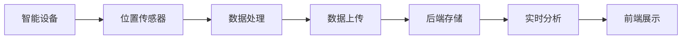
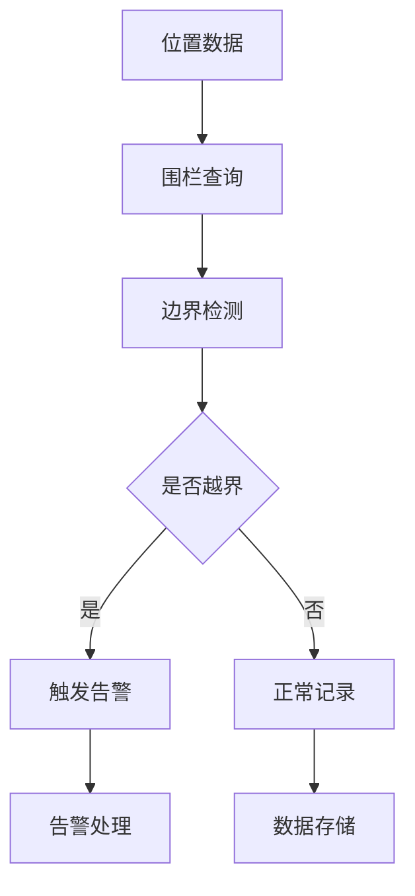

# 灵境万象运动轨迹与电子围栏功能分析文档

## 概述

本文档详细分析了灵境万象系统中运动轨迹追踪和电子围栏功能的实现机制、核心组件和数据流。该系统实现了完整的位置监控、轨迹记录、地理围栏管理和实时追踪功能。

---

## 1. 运动轨迹追踪系统

### 1.1 系统架构

运动轨迹追踪系统采用多层架构设计：

```
设备层 (ljwx-watch) → 数据上传层 → 后端服务层 (ljwx-boot) → 前端展示层 (ljwx-admin/ljwx-bigscreen)
```

### 1.2 核心数据结构

#### 健康数据实体 (TUserHealthData)
位置：`ljwx-boot/ljwx-boot-modules/src/main/java/com/ljwx/modules/health/domain/entity/TUserHealthData.java:80-89`

```java
@TableName("t_user_health_data")
public class TUserHealthData extends BaseEntity {
    private Double latitude;        // 纬度
    private Double longitude;       // 经度  
    private Double altitude;        // 海拔高度
    private Double distance;        // 运动距离
    private Double calorie;         // 消耗卡路里
    private LocalDateTime timestamp; // 时间戳
    private String deviceSn;        // 设备序列号
    private String uploadMethod;    // 上传方式：wifi、bluetooth、common_event
}
```

#### 轨迹点接口定义 (TrackPoint)
位置：`ljwx-bigscreen-vue3/src/components/track/TrackMapComponent.vue:154-160`

```typescript
interface TrackPoint {
  lat: number        // 纬度
  lng: number        // 经度  
  timestamp: Date    // 时间戳
  altitude?: number  // 海拔（可选）
  speed?: number     // 速度（可选）
}
```

#### 轨迹记录接口 (Track)
位置：`ljwx-bigscreen-vue3/src/components/track/TrackMapComponent.vue:162-171`

```typescript
interface Track {
  id: string                              // 轨迹唯一标识
  name: string                           // 轨迹名称
  type: 'walking' | 'running' | 'cycling' | 'other'  // 运动类型
  date: Date                             // 记录日期
  distance: number                       // 总距离
  duration: number                       // 持续时间
  status: 'completed' | 'paused' | 'recording'  // 状态
  points: TrackPoint[]                   // 轨迹点数组
}
```

### 1.3 前端轨迹组件

#### TrackMapComponent (Vue3大屏)
位置：`ljwx-bigscreen-vue3/src/components/track/TrackMapComponent.vue`

**主要功能：**
- 地图展示与控制
- 轨迹数据可视化
- 时间范围筛选（今日、昨日、本周、本月）
- 运动统计信息展示
- 轨迹类型分类（步行、跑步、骑行等）

**核心方法：**
```typescript
// 更新轨迹数据
const updateTrackData = () => {
  console.log('更新轨迹数据:', selectedTimeRange.value)
}

// 选择轨迹记录
const selectTrack = (track: Track) => {
  ElMessage.info(`已选择轨迹: ${track.name}`)
}

// 地图定位和全屏控制
const centerMap = () => { /* 定位到当前位置 */ }
const fullScreen = () => { /* 全屏模式切换 */ }
```

**轨迹统计数据：**
```typescript
const trackStats = reactive({
  duration: '1小时32分',    // 运动时长
  distance: '8.5公里',      // 运动距离  
  avgSpeed: '5.5km/h',      // 平均速度
  calories: '520卡'         // 消耗卡路里
})
```

#### TrackView (完整轨迹页面)
位置：`ljwx-bigscreen-vue3/src/views/secondary/TrackView.vue`

**功能特性：**
1. **实时追踪控制**
   - 开启/暂停实时追踪
   - 数据自动刷新机制
   
2. **多维度分析**
   - 用户列表管理
   - 热力图分析（人员密度、停留时长、访问频次）
   - 统计报告生成
   - 轨迹详情查看

3. **交互控制**
   - 时间范围筛选
   - 用户筛选
   - 地图图例说明
   - 轨迹点详情展示

**核心状态管理：**
```typescript
const selectedTimeRange = ref('today')    // 时间范围
const selectedUser = ref('all')           // 用户筛选
const isRealtime = ref(false)             // 实时追踪状态
const activeTab = ref('users')            // 当前激活标签
const heatmapType = ref('density')        // 热力图类型
```

**分析标签配置：**
```typescript
const analysisTabs = [
  { key: 'users', label: '用户列表', icon: UserIcon },
  { key: 'heatmap', label: '热力图', icon: MapIcon },
  { key: 'statistics', label: '统计报告', icon: CalendarIcon },
  { key: 'details', label: '轨迹详情', icon: MapPinIcon }
]
```

### 1.4 后端数据处理

#### 位置数据查询优化
位置：`ljwx-boot/ljwx-boot-modules/src/main/java/com/ljwx/modules/health/service/UnifiedHealthDataQueryService.java`

系统实现了高性能的位置数据批量查询优化：

```java
// 批量转换轨迹数据，避免N+1查询
private void addLocationData(Map<String, Object> map, TUserHealthData data, 
                            FieldConfigCache configCache) {
    if (configCache.isLocationEnabled()) {
        map.put("latitude", data.getLatitude());
        map.put("longitude", data.getLongitude()); 
        map.put("altitude", data.getAltitude());
        map.put("distance", data.getDistance());
    }
}
```

**性能优化特性：**
- 预缓存字段配置，避免重复解析
- 批量查询用户信息，减少数据库访问
- 智能字段映射，提升转换效率

### 1.5 数据上传机制

#### 多种上传方式支持
在 `TUserHealthData` 实体中定义了三种上传方式：

```java
private String uploadMethod; // wifi、bluetooth、common_event
```

**上传方式说明：**
- **wifi**: WiFi网络上传，适用于室内环境
- **bluetooth**: 蓝牙上传，适用于设备间近距离传输
- **common_event**: 通用事件上传，适用于系统事件触发

---

## 2. 电子围栏系统

### 2.1 系统架构

电子围栏系统基于地理信息系统(GIS)技术，实现区域边界定义和越界监控：

```
地图绘制 → 坐标采集 → GeoJSON存储 → 边界检测 → 告警触发
```

### 2.2 数据模型

#### 围栏实体 (TGeofence)
位置：`ljwx-boot/ljwx-boot-modules/src/main/java/com/ljwx/modules/geofence/domain/entity/TGeofence.java:43-65`

```java
@TableName("t_geofence")
public class TGeofence extends BaseEntity {
    private String name;        // 电子围栏名称
    private String area;        // 围栏区域(GeoJSON格式)
    private String description; // 围栏描述
    private String status;      // 围栏状态
}
```

#### GeoJSON处理器
位置：`ljwx-boot/ljwx-boot-modules/src/main/java/com/ljwx/modules/geofence/util/GeoJsonTypeHandler.java`

```java
public class GeoJsonTypeHandler extends BaseTypeHandler<String> {
    @Override
    public void setNonNullParameter(PreparedStatement ps, int i, String parameter, JdbcType jdbcType) throws SQLException {
        ps.setString(i, parameter); // 插入GeoJSON字符串
    }
    
    @Override
    public String getNullableResult(ResultSet rs, String columnName) throws SQLException {
        return rs.getString(columnName); // 读取GeoJSON数据
    }
}
```

### 2.3 前端围栏管理

#### 围栏创建界面
位置：`ljwx-admin/src/views/geofence/index.vue`

**核心功能：**
1. **地图集成**
   - 高德地图API集成
   - 多边形绘制工具
   - 实时坐标采集

2. **围栏操作**
   ```typescript
   function createPolygon() {
     polygon.value = new AMap.Polygon({
       path: [[116.397428, 39.90923], [116.407428, 39.90923], [116.407428, 39.91923]],
       strokeColor: '#1b38d3',
       strokeOpacity: 1,
       strokeWeight: 3,
       fillColor: '#1b38d3',
       fillOpacity: 0.5,
       zIndex: 50
     });
   }
   ```

3. **坐标转换**
   ```typescript
   function handleKeep() {
     const path = polygon.value.getPath();
     PolygonoArr.value = path.map((point: any) => [point.lng, point.lat]);
     
     // 转换为WKT格式
     const wktCoordinates = PolygonoArr.value.map(coord => coord.join(' ')).join(', ');
     const wktPolygon = `POLYGON((${wktCoordinates}))`;
     
     // 构建围栏数据
     const geofenceData = {
       name: 'My Geofence',
       area: wktPolygon,
       description: 'Description of the geofence',
       status: 'active'
     };
   }
   ```

4. **围栏编辑**
   ```typescript
   function polyEditorStart() {
     if (polygon.value) {
       polyEditor.value?.setTarget(polygon.value);
       polyEditor.value?.open();
     }
   }
   
   function polyEditorEnd() {
     polyEditor.value?.close();
   }
   ```

### 2.4 后端服务层

#### 控制器接口
位置：`ljwx-boot/ljwx-boot-admin/src/main/java/com/ljwx/admin/controller/geofence/TGeofenceController.java`

**REST API端点：**
```java
@RestController
@RequestMapping("t_geofence")
public class TGeofenceController {
    
    @GetMapping("/page")
    @SaCheckPermission("t:geofence:page")
    public Result<RPage<TGeofenceVO>> page(@Valid PageQuery pageQuery, TGeofenceSearchDTO searchDTO);
    
    @GetMapping("/{id}")  
    @SaCheckPermission("t:geofence:get")
    public Result<TGeofenceVO> get(@PathVariable("id") Long id);
    
    @PostMapping("/")
    @SaCheckPermission("t:geofence:add") 
    public Result<Boolean> add(@RequestBody TGeofenceAddDTO addDTO);
    
    @PutMapping("/")
    @SaCheckPermission("t:geofence:update")
    public Result<Boolean> update(@RequestBody TGeofenceUpdateDTO updateDTO);
    
    @DeleteMapping("/")
    @SaCheckPermission("t:geofence:delete")
    public Result<Boolean> batchDelete(@RequestBody TGeofenceDeleteDTO deleteDTO);
}
```

#### 服务实现
位置：`ljwx-boot/ljwx-boot-modules/src/main/java/com/ljwx/modules/geofence/service/impl/TGeofenceServiceImpl.java:47-61`

```java
@Override
public IPage<TGeofence> listTGeofencePage(PageQuery pageQuery, TGeofenceBO tGeofenceBO) {
    LambdaQueryWrapper<TGeofence> queryWrapper = new LambdaQueryWrapper<TGeofence>()
        .eq(ObjectUtils.isNotEmpty(tGeofenceBO.getName()), TGeofence::getName, tGeofenceBO.getName())
        .eq(ObjectUtils.isNotEmpty(tGeofenceBO.getStatus()), TGeofence::getStatus, tGeofenceBO.getStatus())
        .orderByDesc(TGeofence::getCreateTime);
        
    IPage<TGeofence> page = baseMapper.listGeofence(pageQuery.buildPage(), queryWrapper);
    
    // 调试输出GeoJSON数据
    page.getRecords().forEach(record -> {
        System.out.println("Area GeoJSON: " + record.getArea());
    });
    
    return page;
}
```

### 2.5 数据格式标准

#### GeoJSON格式规范
围栏区域数据使用标准GeoJSON格式存储：

```json
{
  "type": "Polygon",
  "coordinates": [
    [
      [116.397428, 39.90923],
      [116.407428, 39.90923], 
      [116.407428, 39.91923],
      [116.397428, 39.90923]
    ]
  ]
}
```

#### WKT格式支持
系统同时支持WKT (Well-Known Text) 格式：

```
POLYGON((116.397428 39.90923, 116.407428 39.90923, 116.407428 39.91923, 116.397428 39.90923))
```

---

## 3. 系统集成与数据流

### 3.1 数据采集流程



1. **设备端采集**：智能手表等设备通过GPS/北斗获取位置信息
2. **数据处理**：设备端进行数据预处理和压缩
3. **多方式上传**：支持WiFi、蓝牙、事件触发等多种上传方式
4. **后端存储**：统一存储到 `t_user_health_data` 表
5. **实时分析**：后台服务进行轨迹分析和围栏检测
6. **前端展示**：多终端展示轨迹和围栏信息

### 3.2 围栏检测机制



**检测算法：**
- 点在多边形内算法 (Point-in-Polygon)
- 射线投射法 (Ray Casting)
- 缓冲区检测 (Buffer Zone Detection)

### 3.3 性能优化策略

#### 数据查询优化
```java
// 批量查询避免N+1问题
Set<Long> userIds = dataList.stream().map(TUserHealthData::getUserId).collect(Collectors.toSet());
Map<Long, String> userNameCache = getUserNameCache(userIds);

// 预缓存字段配置
private static class FieldConfigCache {
    private final Map<String, String> supportedFields;
    private final boolean locationEnabled;
    private final Set<String> fieldNames;
}
```

#### 前端渲染优化
- 轨迹点聚合显示
- 按需加载历史数据
- 虚拟滚动处理大量轨迹
- 地图瓦片缓存

---

## 4. 功能特性

### 4.1 运动轨迹功能

#### 核心特性
1. **多类型运动支持**
   - 步行轨迹记录
   - 跑步路径追踪
   - 骑行路线记录
   - 其他运动类型

2. **实时追踪**
   - 位置实时更新
   - 运动状态监控
   - 轨迹动态绘制

3. **历史数据分析**
   - 多时间维度查询（今日/昨日/本周/本月）
   - 运动统计分析
   - 个人运动报告

4. **数据可视化**
   - 地图轨迹展示
   - 运动热力图
   - 统计图表

### 4.2 电子围栏功能

#### 核心特性
1. **围栏管理**
   - 多边形围栏创建
   - 围栏区域编辑
   - 围栏状态控制

2. **实时监控**
   - 越界检测
   - 告警触发
   - 状态通知

3. **数据格式支持**
   - GeoJSON标准格式
   - WKT格式兼容
   - 坐标系转换

4. **地图集成**
   - 高德地图支持
   - 可视化绘制工具
   - 实时坐标采集

---

## 5. 技术栈

### 5.1 前端技术
- **Vue 3**: 现代化组件开发
- **TypeScript**: 类型安全保障
- **Element Plus**: UI组件库
- **高德地图API**: 地图服务集成
- **ECharts**: 数据可视化

### 5.2 后端技术  
- **Spring Boot**: 微服务框架
- **MyBatis Plus**: ORM数据访问
- **Sa-Token**: 权限认证
- **MySQL**: 关系型数据库
- **GeoJSON**: 地理数据格式

### 5.3 设备端技术
- **HarmonyOS**: 华为鸿蒙系统
- **Java**: 设备端开发语言
- **蓝牙协议**: 设备通信
- **GPS/北斗**: 位置定位

---

## 6. 部署架构

### 6.1 系统部署图

```
┌─────────────────┐    ┌──────────────────┐    ┌─────────────────┐
│   智能设备层     │    │     服务端层      │    │    前端展示层    │
│                │    │                 │    │                │
│  ljwx-watch    │◄──►│   ljwx-boot     │◄──►│  ljwx-admin    │
│  (鸿蒙设备)     │    │   (Spring Boot) │    │  (管理端)       │
│                │    │                 │    │                │
│  - 位置采集     │    │  - 数据存储      │    │  - 轨迹展示     │
│  - 数据上传     │    │  - 围栏管理      │    │  - 围栏管理     │
│  - 蓝牙通信     │    │  - 实时分析      │    │  - 实时监控     │
└─────────────────┘    └──────────────────┘    └─────────────────┘
                                │
                       ┌──────────────────┐
                       │  ljwx-bigscreen  │
                       │   (大屏展示)      │
                       │                 │
                       │  - 轨迹追踪     │
                       │  - 热力图分析   │
                       │  - 统计报表     │
                       └──────────────────┘
```

### 6.2 数据库设计

#### 核心表结构
```sql
-- 健康数据表 (包含位置信息)
CREATE TABLE t_user_health_data (
    id bigint PRIMARY KEY,
    user_id bigint,
    org_id bigint,
    customer_id bigint,
    latitude double,      -- 纬度
    longitude double,     -- 经度
    altitude double,      -- 海拔
    distance double,      -- 距离
    calorie double,       -- 卡路里
    timestamp datetime,   -- 时间戳
    device_sn varchar(255),
    upload_method varchar(50),
    create_time datetime,
    update_time datetime
);

-- 电子围栏表
CREATE TABLE t_geofence (
    id bigint PRIMARY KEY,
    name varchar(255),           -- 围栏名称
    area text,                   -- 围栏区域(GeoJSON)
    description varchar(500),    -- 描述信息
    status varchar(50),          -- 状态
    create_time datetime,
    update_time datetime
);
```

---

## 7. 安全与权限

### 7.1 权限控制
系统采用Sa-Token进行细粒度权限控制：

```java
@SaCheckPermission("t:geofence:page")    // 围栏列表查看
@SaCheckPermission("t:geofence:add")     // 围栏创建
@SaCheckPermission("t:geofence:update")  // 围栏更新
@SaCheckPermission("t:geofence:delete")  // 围栏删除
```

### 7.2 数据安全
- 位置数据加密存储
- 传输层TLS加密
- 访问日志记录
- 敏感数据脱敏

### 7.3 多租户支持
通过 `customerId` 字段实现多租户数据隔离：

```java
private Long customerId; // 租户ID，0表示全局数据
```

---

## 8. 监控与运维

### 8.1 性能监控
- 数据上传频率监控
- 查询响应时间统计
- 设备在线状态监控
- 围栏检测性能监控

### 8.2 告警机制
- 设备离线告警
- 围栏越界告警
- 数据异常告警
- 系统性能告警

### 8.3 数据备份
- 定时数据备份
- 增量备份策略
- 数据恢复机制
- 灾备切换方案

---

## 9. 未来规划

### 9.1 功能增强
1. **AI轨迹分析**
   - 运动模式识别
   - 异常行为检测
   - 健康建议生成

2. **围栏智能化**
   - 自适应围栏
   - 动态围栏调整
   - 行为预测

3. **数据分析**
   - 大数据分析平台
   - 用户画像生成
   - 趋势预测分析

### 9.2 技术升级
- 边缘计算支持
- 5G网络优化
- 区块链数据溯源
- 物联网设备接入

---

## 结论

灵境万象的运动轨迹与电子围栏系统具备完整的端到端解决方案，从设备端数据采集、后端服务处理到前端可视化展示，形成了闭环的位置监控体系。系统在性能优化、安全保障和可扩展性方面都有良好的设计，为智能穿戴设备的位置服务应用提供了可靠的技术支撑。

系统的主要优势：
1. **完整的技术栈覆盖**：从鸿蒙设备到云端服务的全栈解决方案
2. **高性能数据处理**：批量查询优化，支持大规模用户并发
3. **灵活的数据格式**：支持GeoJSON和WKT等标准地理数据格式
4. **可视化用户体验**：直观的地图界面和丰富的数据分析功能
5. **企业级安全保障**：多租户隔离、权限控制和数据加密

该系统为智慧城市、企业安全、健康管理等领域的位置服务应用提供了坚实的技术基础。