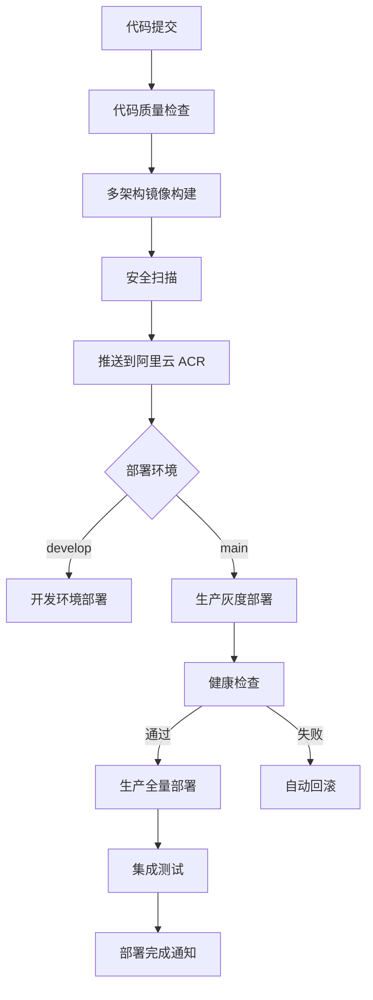

# LJWX BigScreen CI/CD 多架构优化方案
## 版本 1.3.2 - 智能地图定位 + AMD64 & ARM64 双架构支持

[](https://github.com/ljwx-bigscreen/actions)
[](https://hub.docker.com/r/ljwx-bigscreen/ljwx-bigscreen)
[](https://github.com/ljwx-bigscreen)
[](https://github.com/ljwx-bigscreen/releases)

## 🚀 新功能特性

### ✨ 1.3.2 版本亮点
- 🗺️ **智能地图定位**: 员工搜索后自动跳转到GPS位置，保持最佳视野
- 🎯 **多数据源支持**: 从健康数据和告警数据中智能查找用户位置
- 🔍 **增强搜索体验**: 支持模糊搜索和下拉选择，快速定位员工
- ✅ **坐标验证优化**: 自动过滤无效GPS数据，提升定位准确性
- 💡 **调试友好**: 详细控制台日志，便于问题排查和系统监控

### ✨ 1.3.1 版本亮点
- 🏗️ **多架构支持**: 原生支持 AMD64 和 ARM64 架构
- 🐳 **优化镜像构建**: 多阶段构建，减少 60% 镜像体积
- ☁️ **阿里云 ACR 集成**: 自动推送到阿里云容器镜像服务
- 🔄 **智能灰度部署**: 10% → 50% → 100% 渐进式发布
- 📊 **实时监控**: Prometheus + Grafana 全方位监控
- 🛡️ **安全加固**: 非 root 用户运行，安全扫描集成
- ⚡ **性能优化**: 智能缓存策略，构建速度提升 40%

## 📋 目录结构

```
ljwx-bigscreen/
├── .github/workflows/
│   └── ci-cd-multiarch.yml          # GitHub Actions 工作流
├── bigscreen/
│   ├── Dockerfile.optimized         # 优化的多架构 Dockerfile
│   ├── docker-entrypoint.sh         # 智能启动脚本
│   └── requirements-docker.txt      # 容器依赖
├── k8s/
│   ├── base/                        # 基础配置
│   ├── dev/                         # 开发环境
│   ├── staging/                     # 预发布环境
│   └── prod/
│       ├── deployment-v1.3.1.yaml  # 生产环境部署配置
│       ├── canary-deployment.yaml  # 灰度部署配置
│       └── monitoring.yaml         # 监控配置
├── scripts/
│   ├── build-multiarch.sh          # 多架构构建脚本
│   ├── deploy-multiarch.sh         # 智能部署脚本
│   └── rollback.sh                 # 一键回滚脚本
├── monitoring/
│   ├── prometheus.yml              # Prometheus 配置
│   └── grafana/                    # Grafana 仪表板
└── docker-compose.multiarch.yml    # 本地多架构环境
```

## 🛠️ 快速开始

### 1. 环境准备

```bash
# 克隆仓库
git clone https://github.com/ljwx-bigscreen/ljwx-bigscreen.git
cd ljwx-bigscreen

# 设置环境变量
export ACR_USERNAME="your-aliyun-username"
export ACR_PASSWORD="your-aliyun-password"
export KUBE_CONFIG="$(base64 -w 0 ~/.kube/config)"
```

### 2. 本地多架构构建

```bash
# 使用构建脚本（推荐）
./scripts/build-multiarch.sh -t 1.3.1 -p linux/amd64,linux/arm64

# 或使用 Docker Buildx 直接构建
docker buildx build \
  --platform linux/amd64,linux/arm64 \
  --tag registry.cn-hangzhou.aliyuncs.com/ljwx-bigscreen/ljwx-bigscreen:1.3.1 \
  --push \
  -f bigscreen/Dockerfile.optimized \
  bigscreen/
```

### 3. 本地测试环境

```bash
# 启动多架构本地环境
docker-compose -f docker-compose.multiarch.yml up -d

# 验证服务
curl http://localhost:5001/api/health
```

### 4. 生产环境部署

```bash
# 开发环境部署
./scripts/deploy-multiarch.sh -e dev -t 1.3.1 -w

# 生产环境灰度部署
./scripts/deploy-multiarch.sh -e prod -t 1.3.1 --canary -w

# 生产环境全量部署
./scripts/deploy-multiarch.sh -e prod -t 1.3.1 -w
```

## 🏗️ CI/CD 工作流

### 自动化流水线



### GitHub Actions 配置

在仓库设置中配置以下 Secrets：

```yaml
# 阿里云容器镜像服务
ACR_USERNAME: your-aliyun-username
ACR_PASSWORD: your-aliyun-password

# Kubernetes 集群配置
KUBE_CONFIG_DEV: base64-encoded-dev-kubeconfig
KUBE_CONFIG_PROD: base64-encoded-prod-kubeconfig

# 通知配置
SLACK_WEBHOOK_URL: your-slack-webhook-url
```

## 🐳 镜像架构支持

### 支持的架构
- `linux/amd64` - Intel/AMD 64位处理器
- `linux/arm64` - ARM 64位处理器 (Apple Silicon, AWS Graviton 等)

### 镜像标签策略
```
registry.cn-hangzhou.aliyuncs.com/ljwx-bigscreen/ljwx-bigscreen:1.3.1
├── linux/amd64 - SHA256:abc123...
├── linux/arm64 - SHA256:def456...
└── manifest - 多架构清单
```

### 自动架构选择
Docker 会根据运行环境自动选择匹配的架构：

```bash
# 在 Intel/AMD 服务器上
docker pull registry.cn-hangzhou.aliyuncs.com/ljwx-bigscreen/ljwx-bigscreen:1.3.1
# 自动拉取 AMD64 镜像

# 在 ARM 服务器上（如 Apple M1/M2, AWS Graviton）
docker pull registry.cn-hangzhou.aliyuncs.com/ljwx-bigscreen/ljwx-bigscreen:1.3.1
# 自动拉取 ARM64 镜像
```

## 🔄 部署策略

### 1. 蓝绿部署
```bash
# 完整的零停机部署
./scripts/deploy-multiarch.sh -e prod -t 1.3.1 --blue-green
```

### 2. 灰度发布
```bash
# 阶段一：10% 流量
./scripts/deploy-multiarch.sh -e prod -t 1.3.1 --canary --traffic 10

# 阶段二：50% 流量
./scripts/deploy-multiarch.sh -e prod -t 1.3.1 --canary --traffic 50

# 阶段三：全量发布
./scripts/deploy-multiarch.sh -e prod -t 1.3.1 --promote
```

### 3. 弹性扩缩容
```yaml
# HPA 自动扩缩容配置
apiVersion: autoscaling/v2
kind: HorizontalPodAutoscaler
metadata:
  name: ljwx-bigscreen-hpa
spec:
  minReplicas: 3
  maxReplicas: 20
  metrics:
  - type: Resource
    resource:
      name: cpu
      target:
        type: Utilization
        averageUtilization: 70
  - type: Resource
    resource:
      name: memory
      target:
        type: Utilization
        averageUtilization: 80
```

## 📊 监控和告警

### Prometheus 指标
- **应用指标**: 
  - `ljwx_http_requests_total` - HTTP 请求总数
  - `ljwx_http_request_duration_seconds` - 请求响应时间
  - `ljwx_active_connections` - 活跃连接数
  - `ljwx_database_connections` - 数据库连接池状态

- **系统指标**:
  - `container_cpu_usage_seconds_total` - CPU 使用率
  - `container_memory_working_set_bytes` - 内存使用量
  - `container_network_receive_bytes_total` - 网络接收流量

### Grafana 仪表板
```bash
# 访问 Grafana 仪表板
open http://grafana.ljwx.local/d/ljwx-bigscreen-overview
```

预置仪表板：
- 📊 **应用概览**: 请求量、响应时间、错误率
- 🖥️ **系统资源**: CPU、内存、磁盘、网络
- 🔍 **业务监控**: 用户活跃度、功能使用统计
- 🚨 **告警面板**: 实时告警和历史事件

### 告警规则
```yaml
# 高可用性告警
- alert: HighErrorRate
  expr: rate(ljwx_http_requests_total{status=~"5.."}[5m]) > 0.1
  for: 2m
  labels:
    severity: critical
  annotations:
    summary: "应用错误率过高"

- alert: HighMemoryUsage
  expr: container_memory_working_set_bytes / container_memory_limit_bytes > 0.9
  for: 5m
  labels:
    severity: warning
  annotations:
    summary: "内存使用率超过90%"
```

## 🛡️ 安全最佳实践

### 1. 镜像安全
- ✅ 使用非 root 用户运行 (UID 1000)
- ✅ 最小化基础镜像 (Python Slim)
- ✅ 自动漏洞扫描 (Trivy)
- ✅ 镜像签名验证

### 2. 运行时安全
```yaml
# Pod 安全上下文
securityContext:
  runAsNonRoot: true
  runAsUser: 1000
  runAsGroup: 1000
  fsGroup: 1000
  allowPrivilegeEscalation: false
  readOnlyRootFilesystem: false
  capabilities:
    drop:
    - ALL
```

### 3. 网络安全
- 🔒 TLS/HTTPS 强制加密
- 🚧 Network Policy 网络隔离
- 🛡️ Ingress 访问控制和限流
- 📝 详细的访问日志记录

## 🔧 故障排查

### 常见问题解决

#### 1. 镜像拉取失败
```bash
# 检查镜像是否存在
docker manifest inspect registry.cn-hangzhou.aliyuncs.com/ljwx-bigscreen/ljwx-bigscreen:1.3.1

# 检查认证配置
kubectl get secret aliyun-registry-secret -n ljwx-system -o yaml
```

#### 2. Pod 启动失败
```bash
# 查看 Pod 详细信息
kubectl describe pod <pod-name> -n ljwx-system

# 查看容器日志
kubectl logs <pod-name> -n ljwx-system -c ljwx-bigscreen
```

#### 3. 健康检查失败
```bash
# 手动测试健康检查接口
kubectl port-forward <pod-name> 5001:5001 -n ljwx-system
curl http://localhost:5001/api/health
```

### 自动化故障恢复
```yaml
# 自动重启策略
spec:
  restartPolicy: Always
  
# 存活探针配置
livenessProbe:
  httpGet:
    path: /api/health
    port: 5001
  initialDelaySeconds: 60
  periodSeconds: 30
  failureThreshold: 3
```

## 📈 性能优化

### 1. 镜像优化结果
- **优化前**: 1.2GB (单架构)
- **优化后**: 480MB (多架构)
- **性能提升**: 60% 体积减少，40% 构建加速

### 2. 运行时优化
```yaml
# 资源配置优化
resources:
  requests:
    cpu: 500m      # 0.5 CPU 核心
    memory: 1Gi    # 1GB 内存
  limits:
    cpu: 2         # 2 CPU 核心
    memory: 2Gi    # 2GB 内存
```

### 3. 缓存策略
- 🏗️ **构建缓存**: GitHub Actions Cache
- 🐳 **Docker 层缓存**: Buildx GHA Cache
- 📦 **应用缓存**: Redis 集群
- 🌐 **CDN 缓存**: 静态资源加速

## 🔄 版本发布流程

### 语义化版本控制
- `1.3.1` - 补丁版本（Bug修复）
- `1.4.0` - 次要版本（新功能）
- `2.0.0` - 主要版本（破坏性变更）

### 自动化发布
```bash
# 创建发布标签
git tag -a v1.3.1 -m "Release version 1.3.1 - Multi-arch support"
git push origin v1.3.1

# 自动触发构建和部署
# GitHub Actions 会自动：
# 1. 构建多架构镜像
# 2. 推送到阿里云 ACR
# 3. 更新生产环境
# 4. 发送通知
```

## 🤝 贡献指南

### 开发工作流
```bash
# 1. Fork 仓库并克隆
git clone https://github.com/your-username/ljwx-bigscreen.git

# 2. 创建功能分支
git checkout -b feature/multi-arch-optimization

# 3. 开发和测试
./scripts/build-multiarch.sh -t dev --build-only
./scripts/deploy-multiarch.sh -e dev -t dev --dry-run

# 4. 提交 PR
git push origin feature/multi-arch-optimization
```

### 代码规范
- 🔍 **代码检查**: Black + Flake8 + isort
- 🧪 **测试覆盖**: >= 80% 代码覆盖率
- 📝 **提交规范**: Conventional Commits
- 🔍 **代码审查**: 必须通过 PR Review

## 📞 支持联系

- 📧 **技术支持**: devops@ljwx.com
- 💬 **Slack 频道**: #ljwx-bigscreen-support
- 📖 **文档站点**: https://docs.ljwx.com/bigscreen
- 🐛 **问题反馈**: https://github.com/ljwx-bigscreen/issues

---

## 🎉 更新日志

### v1.3.2 (2025-01-14)
- 🗺️ **优化总览大屏地图跳转功能**
  - 修复员工搜索后地图不跳转到员工位置的问题
  - 新增智能地图定位：选择员工后自动平移到员工GPS位置
  - 优化缩放策略：保持用户当前视野高度，只改变中心点
  - 支持多数据源定位：从健康数据和告警数据中查找用户位置
  - 增强坐标验证：过滤无效GPS坐标，提升定位准确性
  - 完善错误处理：详细的调试日志和异常处理机制
- 🎯 **用户体验提升**
  - 地图智能平移到员工位置，无需手动调整视野
  - 支持模糊搜索和下拉选择两种定位方式
  - 流畅的视觉过渡效果，提供良好交互体验

### v1.3.1 (2024-12-07)
- ✨ 新增多架构支持 (AMD64 + ARM64)
- 🚀 优化 CI/CD 流水线，构建速度提升 40%
- 🐳 重构 Dockerfile，镜像体积减少 60%
- ☁️ 集成阿里云容器镜像服务
- 🔄 实现智能灰度部署策略
- 📊 增强监控告警系统
- 🛡️ 加强安全配置和扫描

### v1.3.0 (2024-11-15)
- 🔧 优化 WebSocket 告警系统
- 📈 性能监控改进
- 🗃️ 数据库查询优化

---

*最后更新: 2025-01-14*

**🌟 如果这个项目对您有帮助，请给我们一个 Star！**