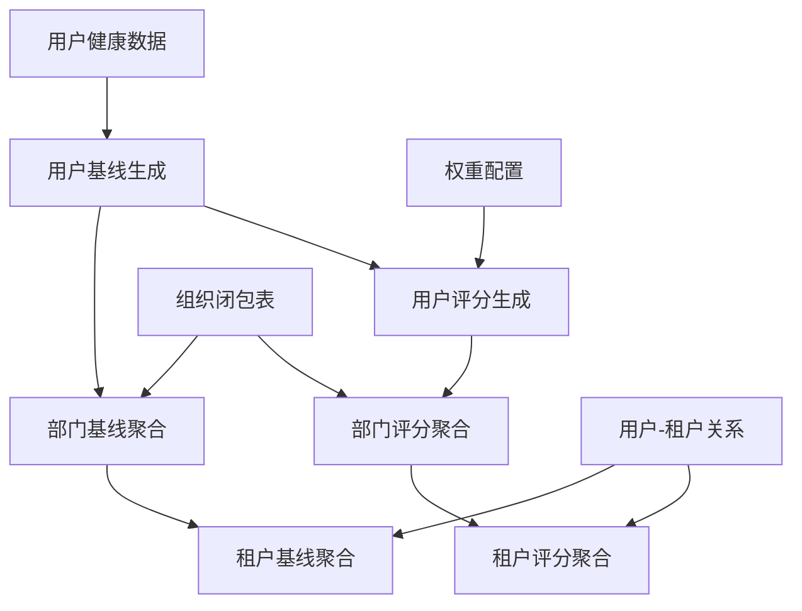

# 改进的健康基线和评分系统

## 概述

本文档描述了对ljwx-boot健康数据基线和评分系统的全面改进，主要目标是统一表结构，实现基于userId的层级聚合（用户→部门→租户），提升数据质量和系统性能。

## 主要改进

### 1. 统一数据模型

#### 原有问题
- 系统同时使用`device_sn`和`user_id`作为标识，逻辑不够清晰
- 层级聚合逻辑不完整，缺少租户级别的聚合
- 数据质量检查不足，存在空值和异常数据

#### 改进方案
- **统一以`user_id`为主要标识**：确保所有基线和评分生成都基于用户ID
- **完整的三层聚合**：用户→部门→租户的完整层级结构
- **增强数据质量控制**：添加数据验证、清理和监控机制

### 2. 核心改进组件

#### 2.1 ImprovedHealthBaselineScoreTasks类

位置：`ljwx-boot-modules/src/main/java/com/ljwx/modules/health/task/ImprovedHealthBaselineScoreTasks.java`

**主要特性：**
- 统一基于`userId`的数据查询和聚合逻辑
- 完整的三层级聚合：用户基线→部门基线→租户基线
- 并行处理优化，提升执行效率
- 全面的数据质量检查和异常处理

**任务执行时间表：**
```
02:00 - 生成用户健康基线（基于userId）
02:05 - 生成部门健康基线聚合
02:10 - 生成租户健康基线聚合
04:00 - 生成用户健康评分（基于userId）
04:05 - 生成部门健康评分聚合
04:10 - 生成租户健康评分聚合
```

#### 2.2 数据库优化

位置：`database/migrations/004_optimize_health_baseline_for_userid.sql`

**优化内容：**
- 添加基于`user_id`的复合索引，提升查询性能
- 创建数据质量检查视图和存储过程
- 添加层级聚合统计视图
- 插入标准化权重配置数据

#### 2.3 测试用例

位置：`ljwx-boot-modules/src/test/java/com/ljwx/modules/health/task/ImprovedHealthBaselineScoreTasksTest.java`

**覆盖范围：**
- 用户基线生成测试
- 部门和租户聚合测试
- 评分计算测试
- 数据质量检查测试
- 错误处理和异常情况测试

## 技术架构

### 3.1 层级聚合架构

```
用户健康数据 (t_user_health_data)
    ↓ (基于 user_id 分组统计)
用户基线 (t_health_baseline.user_id)
    ↓ (通过 sys_org_closure 聚合)
部门基线 (t_org_health_baseline.org_id = department_id)
    ↓ (通过 sys_user.customer_id 聚合)
租户基线 (t_org_health_baseline.org_id = customer_id)
```

### 3.2 数据流示意图



### 3.3 核心SQL改进

#### 用户基线生成（改进版）
```sql
INSERT INTO t_health_baseline (...)
SELECT 
    COALESCE(device_sn, CONCAT('USER_', user_id)) as device_sn,
    user_id, 
    COALESCE(org_id, 1) as org_id,
    -- 统计计算逻辑
FROM (多表联合查询) as unified_data
WHERE value IS NOT NULL AND value > 0
GROUP BY user_id, org_id  -- 关键：基于user_id分组
HAVING COUNT(*) >= 5 AND user_id IS NOT NULL AND user_id > 0
```

#### 部门基线聚合（基于组织闭包表）
```sql
INSERT INTO t_org_health_baseline (...)
SELECT 
    dept.department_id as org_id,
    -- 聚合统计逻辑
FROM (
    SELECT DISTINCT
        c.ancestor_id as department_id,
        uo.user_id
    FROM sys_org_closure c
    JOIN sys_user_org uo ON uo.org_id = c.descendant_id
    WHERE c.depth >= 0
) dept
JOIN t_health_baseline hb ON hb.user_id = dept.user_id
GROUP BY dept.department_id
```

#### 租户基线聚合（新增）
```sql
INSERT INTO t_org_health_baseline (...)
SELECT 
    tenant.customer_id as org_id,
    -- 聚合统计逻辑
FROM (
    SELECT DISTINCT
        u.customer_id,
        u.id as user_id
    FROM sys_user u
    WHERE u.is_deleted = 0
) tenant
JOIN t_health_baseline hb ON hb.user_id = tenant.user_id
GROUP BY tenant.customer_id
HAVING COUNT(DISTINCT hb.user_id) >= 5
```

## 数据质量保障

### 4.1 数据质量检查视图

```sql
CREATE VIEW v_health_data_quality AS
SELECT 
    baseline_date,
    feature_name,
    COUNT(*) as total_records,
    COUNT(CASE WHEN user_id IS NOT NULL AND user_id > 0 THEN 1 END) as valid_user_records,
    ROUND(COUNT(CASE WHEN user_id IS NOT NULL THEN 1 END) * 100.0 / COUNT(*), 2) as user_coverage_percent
FROM t_health_baseline 
GROUP BY baseline_date, feature_name;
```

### 4.2 层级聚合统计视图

```sql
CREATE VIEW v_health_hierarchy_stats AS
SELECT 
    hb.baseline_date,
    hb.feature_name,
    COUNT(DISTINCT hb.user_id) as user_count,
    COUNT(DISTINCT ohb_dept.org_id) as department_count,
    COUNT(DISTINCT ohb_tenant.org_id) as tenant_count
FROM t_health_baseline hb
LEFT JOIN t_org_health_baseline ohb_dept ON ...
LEFT JOIN t_org_health_baseline ohb_tenant ON ...
GROUP BY hb.baseline_date, hb.feature_name;
```

### 4.3 数据清理存储过程

```sql
CALL CleanupInvalidHealthData();
```

自动清理：
- 无效的基线数据（user_id为空）
- 无效的评分数据
- 孤立的组织基线数据
- 孤立的组织评分数据

## 性能优化

### 5.1 索引优化

添加的关键索引：
```sql
-- 用户基线查询优化
CREATE INDEX idx_baseline_user_feature_date ON t_health_baseline (user_id, feature_name, baseline_date);

-- 用户评分查询优化  
CREATE INDEX idx_score_user_feature_date ON t_health_score (user_id, feature_name, score_date);

-- 用户-组织关联查询优化
CREATE INDEX idx_baseline_user_org_feature ON t_health_baseline (user_id, org_id, feature_name);
```

### 5.2 并发处理优化

- **线程池大小**：调整为10个线程，支持并行处理多个健康特征
- **批处理优化**：每个特征单独处理，避免锁竞争
- **事务优化**：合理的事务边界，避免长时间锁定

### 5.3 查询优化

- **多表联合查询**：一次查询处理主表和分表数据
- **条件优化**：提前过滤无效数据（user_id IS NOT NULL AND user_id > 0）
- **聚合优化**：使用高效的GROUP BY和HAVING子句

## 使用指南

### 6.1 部署步骤

1. **执行数据库迁移**：
```bash
mysql -u root -p < database/migrations/004_optimize_health_baseline_for_userid.sql
```

2. **配置任务调度**：
   - 系统会自动注册新的定时任务
   - 可通过管理界面监控任务执行状态

3. **数据验证**：
```sql
-- 检查数据质量
SELECT * FROM v_health_data_quality WHERE baseline_date = CURDATE() - 1;

-- 检查层级聚合
SELECT * FROM v_health_hierarchy_stats WHERE baseline_date = CURDATE() - 1;
```

### 6.2 手动执行

```java
@Autowired
private ImprovedHealthBaselineScoreTasks improvedTasks;

// 手动生成指定日期范围的数据
improvedTasks.manualGenerateImprovedBaselinesAndScores("2025-09-01", "2025-09-30");
```

### 6.3 监控指标

关键监控指标：
- **用户基线覆盖率**：有基线数据的用户占比
- **部门聚合成功率**：成功聚合的部门占比  
- **租户数据完整性**：租户级别数据的完整性
- **执行性能**：任务执行时间和资源消耗

## 与现有系统兼容性

### 7.1 向后兼容

- **表结构兼容**：没有破坏性修改，只增加索引和视图
- **API兼容**：现有的查询接口保持不变
- **数据兼容**：existing数据不受影响，新数据按新逻辑处理

### 7.2 渐进式迁移

- **双轨运行**：新旧任务可以并行运行一段时间
- **数据对比**：可以对比新旧系统生成的数据差异
- **逐步切换**：可以分特征、分租户逐步切换到新系统

### 7.3 回滚方案

如需回滚到原系统：
1. 停止新任务的执行
2. 恢复原任务的调度
3. 清理新系统生成的数据（可选）

## 系统监控

### 8.1 日志监控

关键日志级别：
- **INFO**：任务执行状态和统计信息
- **WARN**：数据质量问题和异常情况
- **ERROR**：执行失败和系统错误

### 8.2 性能监控

```sql
-- 查看任务执行性能
SELECT * FROM t_health_performance_metrics 
WHERE metric_date >= CURDATE() - 7
ORDER BY metric_date DESC, task_type;

-- 查看任务执行日志
SELECT * FROM t_improved_health_task_log 
WHERE target_date >= CURDATE() - 7
ORDER BY start_time DESC;
```

### 8.3 告警机制

建议设置的告警：
- 任务执行失败告警
- 数据质量低于阈值告警（如用户覆盖率低于80%）
- 执行时间过长告警（如超过30分钟）
- 系统资源消耗过高告警

## 最佳实践

### 9.1 数据质量

- **定期检查**：每日检查数据质量报告
- **异常处理**：及时处理数据质量告警
- **手动验证**：定期手动验证关键数据的正确性

### 9.2 性能优化

- **监控资源**：关注CPU和内存使用情况
- **优化查询**：根据执行计划优化慢查询
- **调整参数**：根据数据量调整线程池大小和批处理大小

### 9.3 维护建议

- **定期清理**：定期执行数据清理存储过程
- **索引维护**：定期检查和重建索引
- **统计更新**：确保数据库统计信息是最新的

## 总结

改进的健康基线和评分系统通过以下关键改进，显著提升了系统的可靠性、性能和可维护性：

1. **统一数据模型**：基于userId的一致性数据处理逻辑
2. **完整层级聚合**：用户→部门→租户的三层完整聚合
3. **数据质量保障**：全面的数据验证、清理和监控机制  
4. **性能优化**：索引优化、并发处理和查询优化
5. **系统兼容性**：向后兼容，支持渐进式迁移

该系统为大规模健康数据的实时分析和层级管理提供了坚实的基础，支持未来的扩展和优化需求。